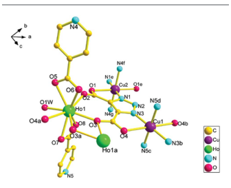
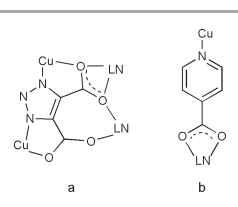
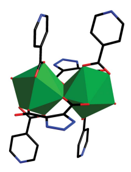
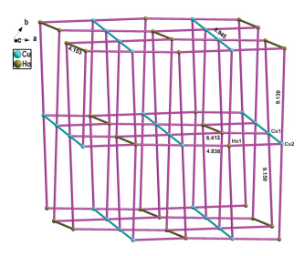
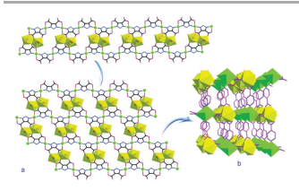
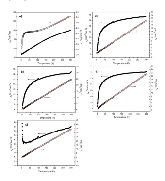

# Crystengcomm Communication

 View Journal | View Issue Cite this: CrystEngComm, 2013, 15, 4611 Received 25th February 2013, Accepted 12th April 2013 DOI: 10.1039/c3ce40346g Series of novel 3D microporous heterometallic 3d–4f coordination frameworks with (5,6)-connected topology: synthesis, crystal structure and magnetic properties3 www.rsc.org/crystengcomm ChuJun Chen,a Ning Wang,b Yi Long,b JinYing Gao,a WeiPing Xie,a XingRui Rana and ShanTang Yue*a The hydrothermal reaction of rare earth nitrates, CuCN, 1H-1,2,3triazole-4,5-dicarboxylic acid (H3tda), and isonicotinic acid (Hina)
resulted in the formation of a new series of 3d–4f heterometallic coordination polymers [LnCu(tda)(ina)2(H2O)]?3H2O (Ln = Eu (1),
Tb (2), Gd (3), Dy (4), Ho (5)], H3tda = 1H-1,2,3-triazole-4,5dicarboxylic acid, Hina = isonicotinic acid). Complexes 1–5 are isostructural and structurally characterized by elemental analysis, FT-IR spectroscopy, thermogravimetric analysis (TGA), and singlecrystal powder X-ray diffraction (PXRD). Single-crystal X-ray diffraction analysis reveals that the metal cations in these compounds are firstly interconnected by H3tda ligands to produce a carpet-shaped heterometallic ring [Ln2(tda)2Cu4], and then pillared by bridging Hina molecules to form the 3D layer-pillared porous Ln(III)–Cu(II) heterometallic coordination polymers. In addition, the magnetic properties of 1–5 were also investigated in detail.

## Introduction

The rational design and synthesis of lanthanide-transition 3d–4f heterometallic coordination polymers are currently drawing a mass of interest because of the potential synergic effects of different metals within one assembly, fascinating structural topologies and a variety of advanced applications in molecular magnets,1,2 molecular recognition,3 luminescent materials,4 molecular adsorption,5 and semiconductors.6 Considering the fact that multidentate ligands of N and O
atoms have different affinities to transition and lanthanide metal ions, a typical approach to the construction of 3d–4f hetero-

aSchool of Chemistry and Environment, South China Normal University, Guangzhou, China. E-mail: yuesht@scnu.edu.cn; Fax: +86 20-393-10187; Tel: +86 20-393-10187 bSchool of Materials Science and Engineering, Nanyang Technological University, 50 Nanyang Avenue, 639798, Singapore 3 Electronic supplementary information (ESI) available: TG curves, PXRD patterns, X-ray crystallographic data in CIF format and tables of selected bond distances and angles for 1–5, and the FTIR spectra figures for 1–5. CCDC 888436–888440. For ESI and crystallographic data in CIF or other electronic format see DOI: 10.1039/ c3ce40346g
metallic frameworks can be the reaction of a mixture of 3d and 4f metallic ions with a multidentate bridging ligand containing both N- and O-donor atoms. Additionally, to construct new 3d–4f heterometallic complexes with miscellaneous structural types, the auxiliary multidentate ligands embracing either N- or O-donor atoms are introduced to the reaction system and further behave as a proper bridge between 3d and 4f metal ions. So far, a variety of organic ligands with hybrid nitrogen and oxygen donor atoms have been employed and nicotinic acid,7 isonicotinic acid,8 imidazolecarboxylate9 and pyridinecarboxylate10 are several typical examples.

However, due to the flexible geometries and high coordination numbers of lanthanide ions, as well as the struggle between lanthanide and transition ions, the preparation of novel 3d–4f coordination frameworks is still a challenging task.11 The key to constructing desirable frameworks of 3d–4f heterometallic complexes is the selection of organic building blocks and central metal cations.

H3tda can be used to construct 3d–4f heterometallic coordination frameworks because of the following reasons: (1) it is very soluble in water; (2) it is a semirigid and multidentate ligand that contains nitrogen and oxygen donors, where the nitrogen atoms of the triazole possess a strong tendency to coordinate with the transition metal ions, while the oxygen atoms of the carboxyl group prefer to bond to the lanthanide metal ions according to the hard–soft acid–base model.

However, up to now, we find that the H3tda has been used to construct ordinary monometallic 3d, 4f or heterometallic 3d–3d complexes,12 whereas a 3d–4f heterometallic framework has never been reported. Inspired by the above-mentioned aspects and our previous work on d–f heterometallic coordination polymers,13 herein, we report the synthesis, structure and magnetic properties of the first examples of Ln(III)–Cu(II) layer-pillared 3d–4f heterometallic compounds based on H3tda, namely, [LnCu(tda)(ina)2
(H2O)]?3H2O [Ln = Eu (1), Tb (2), Gd (3), Dy (4), Ho (5); H3tda =
1H-1,2,3-triazole-4,5-dicarboxylic acid, Hina = isonicotinic acid].

## Experimental Section Material And Methods

All reagents needed for the experiments were commercially available and used as received without further purification. The C, H, and N elemental analysis was carried out with a PerkinElmer 2400 elemental analyzer. The FT-IR spectra were recorded from KBr pellets in the 4000–400 cm21 ranges on a Nicolet 5DX
spectrometer. Thermogravimetric analyses were performed on a Perkin-Elmer TGA7 analyzer with a heating rate of 10 uC min21 in flowing air atmosphere. The magnetic susceptibility data were collected from polycrystalline samples at an external field of 0.1 T
on a MPMS XL-7 magnetometer (Quantum Design) in the temperature range 2–300 K. The output data were corrected for the diamagnetism of the sample holder and of the samples calculated from their Pascal constants. Powder X-ray diffraction (PXRD) patterns were recorded on a X-pert diffractometer or Rigaku D/M-2200T automated diffractometer for Cu Ka radiation
(l = 1.54056 Å), with a scan speed of 4u min21 and a step size of 0.02u in a 2h range of 5–50u.

## Syntheses Of Complexes 1–5

Complexes 1–5 were prepared under hydrothermal conditions. A
mixture of isonicotinic acid (0.0616 g, 0.5 mmol), H3tda (0.157 g, 1 mmol), Eu(NO3)3?6H2O for 1 (0.223 g, 0.5 mmol), Tb(NO3)3?6H2O for 2 (0.2265 g, 0.5 mmol), Gd(NO3)3?6H2O for 3 (0.2255 g, 0.5 mmol), Dy(NO3)3?6H2O for 4 (0.2283 g, 0.5 mmol), Ho(NO3)3?6H2O
for 5 (0.2295 g, 0.5 mmol), CuCN (0.0448 g, 0.5 mmol) and H2O (10 mL) was heated to 160 uC for 72 h in a 23 mL Teflon-lined stainless-steel autoclave and then cooled to room temperature at a rate of 5 uC h21. The resulting crystals with purple prism were isolated after washing with distilled water and ethanol, and allowed to dry in air.

[EuCu(tda)(ina)2(H2O)]?3H2O (1). Yield: 53% based on Eu.

Anal. calcd for C16H16CuEuN5O12: C, 28.02; H, 2.35; N, 10.21%.

Found: C, 28.00; H, 2.31; N, 10.18%. IR frequencies (KBr, cm21):
3527w, 3431w, 1600m, 1558w, 1427m, 1388s, 1296s, 1219s, 1188s, 1062vs, 1031s, 866vs, 817s, 779s, 706vs.

[TbCu(tda)(ina)2(H2O)]?3H2O (2). Yield: 51% based on Tb.

Anal. calcd for C16H16CuTbN5O12: C, 27.74; H, 2.335; N, 10.11%.

Found: C, 27.69; H, 2.29; N, 10.09%. IR frequencies (KBr, cm21):
3518w, 3441w, 1599m, 1558w, 1427m, 1389s, 1297s, 1213s, 1180s, 1063vs, 1032s, 868vs, 816s, 777s, 705vs.

[GdCu(tda)(ina)2(H2O)]?3H2O (3). Yield: 47% based on Gd.

Anal. calcd for C16H16CuGdN5O12: C, 27.81; H, 2.33; N, 10.13%.

Found: C, 27.79; H, 2.30; N, 10.119%. IR frequencies (KBr, cm21):
3435w, 1601m, 1557w, 1427m, 1385s, 1297s, 1221s, 1182s, 1065vs, 1026s, 871vs, 814s, 770s, 705vs.

[DyCu(tda)(ina)2(H2O)]?3H2O (4). Yield: 45% based on Dy.

Anal. calcd for C16H16CuDyN5O12: C, 27.60; H, 2.32; N, 10.06%.

Found: C, 27.54; H, 2.29; N, 10.03%. IR frequencies (KBr, cm21):
3441w, 3419w, 1601m, 1553w, 1429m, 1390s, 1298s, 1217s, 1190s, 1066vs, 1037s, 868vs, 818s, 777s, 705vs.

[HoCu(tda)(ina)2(H2O)]?3H2O (5). Yield: 40% based on Ho.

Anal. calcd for C16H16CuHoN5O12: C, 27.50; H, 2.31; N, 10.02%.

Found: C, 27.47; H, 2.29; N, 9.99%. IR frequencies (KBr, cm21):
3433w, 3416w, 1603m, 1560w, 1431m, 1389s, 1298s, 1215s, 1154s, 1063vs, 1032s, 868vs, 814s, 777s, 706vs.

## X-Ray Crystallographic Measurements

Diffraction intensities for samples 1–5 were collected with a Bruker Apex II CCD diffractometer operating at 50 kV and 30 mA
using Mo Ka radiation (l = 0.71073 Å) at room temperature. Data collection and reduction were performed using the SMART and SAINT software, respectively. Structural solutions of all the compounds and full-matrix least-squares refinements based on F2 were performed with the SHELXS-97 and SHELXL-97 program packages.14,15 All non-hydrogen atoms were refined anisotropically. The positions of hydrogen atoms were generated geometrically. The organic hydrogen atoms were placed in geometrically idealized positions and refined using a riding model. Hydrogen atoms attached to water molecules were located from difference Fourier maps and were also refined using a riding model. The crystallographic data and refinement details of 1–5 are shown in Table 1. Selected bond lengths and angles are listed in Table S1, ESI.3 Further crystallographic details for the structures reported here may be obtained free of charge from the Cambridge Crystallographic Data Center, quoting the depository numbers CCDC 888437 (1), 888440 (2), 888438 (3), 888436 (4), 888439 (5).

The crystal quality of compound 4 is not very good, but it is isostructural with other compounds, which has been further approved by powder X-ray diffraction patterns.

## Results And Discussion Crystal Structure Descriptions

Single crystal X-ray diffraction studies revealed that compounds 1– 5 are isostructural and crystallize in the same triclinic space group P¯1. Thus, we select polymer 5 as the representative example to describe here in detail. Both H3tda and Hina ligands have contributed to the molecular structure, forming mixed-ligand complexes with a pillared-layer 3D structure, in which the 2D
layers are further connected via long ina2 pillars.

As shown in Fig. 1, there is one crystallographically independent Ho(III) ion, one Cu(II) ion, one full deprotonated H3tda ligand, two full deprotonated Hina ligands, one coordinated and three free water molecules in the asymmetric unit.

The Ho(III) atom is nine-coordinated with a tricapped trigonal prism geometry by four oxygen atoms from two different H3tda ligands, four oxygen atoms from two different Hina ligands, together with one oxygen from a coordinated water molecule, respectively, where O2, O3, O4, O5, O6 and O8 occupy the distorted trigonal prism positions while O7, O3\# (1 2 x, 2y, 2 2 z) and O1W
occupy the three cap positions. The Ho–O bond distances range from 2.284(4) to 2.544(4) Å and the O–Ho–O bond angles vary from 51.54(12) to 155.82(11)u. As far as the Cu(II) ion in the coordination framework is concerned, the coordination number is six and its coordination geometry is elongated octahedron, being coordinated by two nitrogen atoms and two oxygen atoms from different tda32 ligands, and the other two nitrogen atoms from two ina2 ligands. The Cu–O and Cu–N bond lengths fall into the range of 2.420(4)–2.437(4) Å and from 1.971(4) Å to 2.061(4) Å, respectively, which are similar to those found in the related Cu(II) complexes.16 For 1–5, all the lanthanide ions are nine-coordinated, and the average Ln–O distances are 2.483(4), 2.471(5), 2.464(7), 2.448(3) and 2.445(4) Å, respectively. The average Ln–O distances decrease

| Table 1 Crystal data and structure refinements for compounds 1–5 Compound 12   | 3               | 4               | 5               |                 |                 |
|--------------------------------------------------------------------------------|-----------------|-----------------|-----------------|-----------------|-----------------|
| Empirical formulaa                                                             | C16H16CuEuN5O12 | C16H16CuTbN5O12 | C16H16CuGdN5O12 | C16H16CuDyN5O12 | C16H16CuHoN5O12 |
| Formula weight                                                                 | 685.86          | 692.82          | 691.14          | 696.39          | 698.82          |
| Crystal system                                                                 | Triclinic       | Triclinic       | Triclinic       | Triclinic       | Triclinic       |
| Space group                                                                    | P¯1             | P¯1             | P¯1             | P¯1             | P¯1             |
| a/Å                                                                            | 10.7491(16)     | 10.6720(16)     | 10.725(4)       | 10.6761(16)     | 10.6390(16)     |
| b/Å                                                                            | 10.7585(16)     | 10.7194(16)     | 10.747(4)       | 10.7356(16)     | 10.6982(16)     |
| c/Å                                                                            | 11.8901(18)     | 11.9351(18)     | 11.917(4)       | 11.9637(18)     | 11.9375(18)     |
| a/u                                                                            | 70.146(2)       | 70.341(2)       | 70.146(4)       | 69.991(2)       | 70.078(2)       |
| b/u                                                                            | 78.016(2)       | 77.928(2)       | 77.912(5)       | 77.562(2)       | 77.610(2)       |
| c/u                                                                            | 61.030(1)       | 60.854(10)      | 60.967(4)       | 60.8412(10)     | 60.7997(10)     |
| V/Å3                                                                           | 1129.9(3)       | 1121.3(3)       | 1127.9(7)       | 1123.2(3)       | 1113.1(3)       |
| Z                                                                              | 2               | 2               | 2               | 2               | 2               |
| T/K                                                                            | 293(2)          | 293(2)          | 293(2)          | 293(2)          | 293(2)          |
| l/Å                                                                            | 0.71073         | 0.71073         | 0.71073         | 0.71073         | 0.71073         |
| Dc/g cm23                                                                      | 2.016           | 2.052           | 2.035           | 2.059           | 2.085           |
| m (Mo Ka)/mm21                                                                 | 3.764           | 4.149           | 3.930           | 4.320           | 4.557           |
| Obs refl [I . 2s(I)]                                                           | 3594            | 3479            | 3915            | 3105            | 3480            |
| wR2 bc                                                                         | 0.0751          | 0.0958          | 0.1380          | 0.2726          | 0.1083          |
| cd                                                                             | 0.0284          | 0.0395          | 0.0577          | 0.1300          | 0.0434          |
| R1 GOOF on F2                                                                  | 1.090           | 1.064           | 1.017           | 1.261           | 1.031           |
| Drmax,min/e Å23                                                                | 1.862, 20.688   | 1.784, 20.990   | 1.021, 21.002   | 6.082, 26.843   | 2.022, 21.968   |

with an increase in atomic number due to the lanthanide

contraction effect.17 In complex 5, the H3tda ligand only adopts one m4-g2-g2-g1-g1g1-g1 coordination mode, as depicted in Scheme 1a. Two carboxylic oxygen atoms coordinate to two Ho(III) centers and one Cu center with the tetradentate chelating–bridging mode, another two carboxylic oxygen atoms coordinates to the Ho center and Cu center separately with the monodentate mode, while two nitrogen atoms coordinate to different Cu centers via a bridging coordinated fashion.

In light of these connection modes, two Ho(III) centers, Ho1 and

Ho1\# (1 2 x, 2y, 2 2 z), are linked by two bridging tetradentate tda32 ligands to construct a dimeric subunit [Ho2(tda)2(ina)4]
(Fig. 2) with a Ho…Ho distance of 4.153 Å and the Ho1–O3–Ho1A
bond angle is 116.34u (Table S1, ESI3). If the coordination interactions between the Cu–Hina are neglected, the neighboring binuclear subunits are connected via the Cu(II) ions to form a twodimensional (2D) heterometallic layer fabric lying in the ac plane
(Fig. 3a).

Such 2D nets are further connected together by the ina2 ligands to give rise to a 3D layer-pillared framework as illustrated in Fig. 3b. Hina ligands, however, adopt the same m2-g1-g1-g1 bridging mode: the nitrogen atom coordinates to the Cu center and two carboxylic oxygen atoms coordinate to one Ho center with the chelating bridging mode (Scheme 1b). The Cu atom has a nearly linear conformation defined by two N atoms from two bridging Hina ligands. Although Cu(I) salts were used as starting materials, the Cu center in the product is in the +2 oxidation state,

Fig. 1 The asymmetric unit of 5. The thermal ellipsoids are drawn at 30% probability. All H atoms and non-coordinated water molecules are omitted for clarity. Symmetry code: (a: 1 2 x, 2y, 2 2 z; b: 2 2 x, 2y, 2 2 z; c: 2 2 x, 21 2 y, 2 2 z; d: x,1+ y, z; e: 2 2 x, 2y, 1 2 z; f: 1 2 x, 1 2 y, 1 2 z; g: 1 + x, 21 + y, z). Scheme 1 Coordination modes of the H3tda and Hina ligands in the complexes.

Fig. 2 View of the dimeric subunit [Ho2(tda)2(ina)4] in complex 5.
which may be attributed to an oxidation reaction occurring under the hydrothermal conditions caused by the high temperature used. It should be noted that when the CuCN was replaced by CuSO4, the title compound could also be attained in this experiment. All carboxyl groups of these ligands are full deprotonated, in agreement with the IR data in which no strong absorption peaks around 1700 cm21 (–COOH) are observed.

The final three-dimensional frameworks are built up from twodimensional lanthanide–transition heterometallic layers
[Ln2Cu4tda2]n and Hina pillars. One new bridging mode
(Scheme 1a) of the H3tda ligand is observed, which proves that it can be used as an effective bridging ligand in the assembly of MOFs.

In order to better understand the structure of polymers, the topological analysis approach is adopted. As shown in Fig. 4, the H3tda and Hina ligands can be simplified as connectors, while Ho1, Cu1/Cu2 can be seen as 5-connected and 6-connected nodes, respectively. The bond length for Cu1–Cu2 and the adjacent Ho

Fig. 3 (a) A polyhedral view of the 2D heterometallic layered network based on

[Ho2(tda)2] and Cu(II) in complex 5. (b) View of the 3D layer-pillared architecture in the ab plane of complex 5. All H atoms and water molecules are omitted for clarity.

Fig. 4 The 5,6-connected network of compound 5 calculated with TOPOS 4.0.
atoms is 5.945 Å and 4.153 Å, respectively. The bond length for Cu–Ho is in the range of 4.838 Å to 9.150 Å.

Consequently, according to the calculation of TOPOS 4.0,18 the framework of 5 belongs to tcj/hc type 5,6-connected binodal network with Schla¨fli symbol of {48?62}c{48?66?8}.

## Powder X-Ray Diffraction (Pxrd)

The powder X-ray diffraction (PXRD) patterns of complexes 1–5 in the region of 2h = 5–50u are shown in Fig. S1, ESI.3 For these complexes, the experimental XRD peaks are consistent with the XRD peaks that are simulated from the single-crystal X-ray data, indicating the high purity of the synthesized samples.

## Thermal Stabilities

To examine the thermal stabilities of all five compounds, thermogravimetric analyses (TGA) were carried out at a heating rate of 10 uC min21 under a dry air atmosphere at the temperature from 30 to 800 uC as shown in Fig. S2, ESI.3 Owing to all five compounds exhibiting similar thermal stabilities, compound 1 was selected to be discussed in detail. In the temperature range of 46–90 uC, there is only one stage of weight loss of approximately 10.16%, being consistent with three free water molecules and one coordinated water molecule (calcd. 10.49%). It can be seen from the TG curve of 1 that there is a plateau in the temperature range of 90–300 uC, hinting that the skeleton of 1 is thermally stable up to 300 uC. Further heating above 300 uC causes the framework to collapse accompanied by the decomposition of the organic ligands. The remaining weight of 49.96% corresponds to the final products of Eu2O3 (calcd. 51.31%).

## Ftir Spectra

In the IR spectra of complexes 1–5, the features at 1539–1637 cm21 and 1383–1427 cm21 are associated with the asymmetric and symmetric stretching vibrations of carboxylate groups. The strong and broad band in 3130–3452 cm21 can be ascribed to the O–H
stretching vibrations of water molecules in the complexes. Bands

Fig. 5 The xMT vs. T and 1/xM vs. T curves for compounds 1–5 (a–e). The solid line represents the Curie–Weiss fitting result.
in the range of 1000–1430 cm21 are attributed to C–N and C–C
vibration. The absence of strong absorption bands around 1700 cm21 indicates the ligands are completely deprotonated. The dO–
C–O vibration in the plane occurs in the middle intensity peaks within the range of 706–865 cm21. The IR spectra of 1–5 are in accordance with the results of the X-ray diffraction analysis.

## Magnetic Properties

The solid state direct current magnetic susceptibilities for compounds 1–5 have been recorded in the range of 2 K–300 K
under a field of 1000 Oe as plots of xMT vs. T and 1/xM vs. T shown in Fig. 5. For compound 1, the room temperature xMT value is 2.30 cm3 K mol21 which is inconsistent with the calculated value for a one spin-only Cu(II) (0.375 cm3 K mol21, S = 1/2) and one groundstate Eu(III) (0 cm3 K mol21, 7F0) incorporated into one molecule, which should be ascribed to the thermal population of Eu(III)
exited states. The xMT vs. T curve is similar to that reported by YuePeng Cai et al.

19 When the temperature decreased from 300 K to 2 K, the xMT value steadily decreased from 2.30 cm3 K mol21 to 0.04 cm3 K mol21 (Fig. 4a). The 1/xM data above 200 K obey the Curie–
Weiss law [x = C/(T 2 h) with C = 5.37 cm3 K mol21, h = 2402.5 K].

The large negative Weiss constant may reveal the antiferromagnetic couplings within the molecule. Compounds 2, 4 and 5 have similar magnetic properties (Fig. 4b, d and e), and the Curie–
Weiss fitting result based on the 1/xM data is C = 12.22 cm3 K
mol21, h = 24.43 K; C = 14.81 cm3 K mol21, h = 26.13 K; C = 14.52 cm3 K mol21, h = 211.52 K, respectively. The negative h value reveals their antiferromagnetic coupling and the thermal depopulation of the Stark sublevels of Tb(III), Dy(III) and Ho(III). However, the magnetic property of compound 3 is different from the above; it has the lowest xMT value around 20 K, which may be due to the

increase of the correlation length with the SGd = 7/2 spins aligned along the field direction and the SCu = 1/2 spins aligned along the opposite direction.20

## Conclusions

In summary, five novel 3D 3d–4f layer-pillared heterometallic complexes that are built up by dimeric [Ln2(tda)2] cores and ina ligands by sharing Cu(II) ions have been successfully synthesized through the self-assembly of H3tda–Hina mixed ligands and Ln–
Cu mixed metal salts under hydrothermal conditions. They are isostructural and exhibit the (5,6)-connected network with
{48?62}{48?66?8} topology. They are the first series of 3d–4f heterometallic complexes based on the H3tda ligands, and these results not only enrich the 3D layer-pillared frameworks, but also provide a broad road for the construction of other neoteric lanthanide–transition metal coordination polymers with engaging structures and beneficial physical–chemical properties.

## Notes And References

1 R. Koner, G. H. Lee, Y. Wang, H. H. Wei and S. Mohanta, Eur. J.

Inorg. Chem., 2005, 8, 1500.

2 M. Fang, P. F. Shi, B. Zhao, D. X. Jiang, P. Cheng and W. Shi, Dalton Trans., 2012, 41, 6820.

3 B. Zhao, P. Cheng, X. Y. Chen, C. Cheng, W. Shi, D. Z. Liao, S.

P. Yan and Z. H. Jiang, J. Am. Chem. Soc., 2004, 126, 3012.

4 Y. Ma, G. F. Xu, X. Yang, L. C. Li, J. K. Tang and S. P. Yan, Chem.

Commun., 2010, 46, 8264.

5 M. Andrun, Chem. Commun., 2011, 47, 3025.

6 J. W. Cheng, S. T. Zheng, W. Liu and G. Y. Yang, CrystEngComm, 2008, 10, 1047.

7 J. W. Cheng, S. T. Zheng, W. Liu and G. Y. Yang, CrystEngComm, 2008, 10, 765.

8 (a) X. Hu, Y. F. Zeng, Z. Chen, E. C. Sanudo, F. C. Liu, J. Ribas and X. H. Bu, Cryst. Growth Des., 2009, 9, 421; (b) J. W. Cheng, S.

T. Zheng and G. Y. Yang, Inorg. Chem., 2008, 47, 4930.

9 X. F. Li, Y. B. Huang and R. Cao, Dalton Trans., 2012, 41, 6195–6205.

10 (a) M. Li, J. F. Xiang, L. J. Yuan, S. M. Wu, S. P. Chen and J.

T. Sun, Cryst. Growth Des., 2006, 6, 2036; (b) Y. S. Song, B. Yan and L. H. Weng, Inorg. Chem. Commun., 2006, 9, 567; (c) Y. Y. Bai, Y. Huang, B. Yan, Y. S. Song and L. H. Weng, Inorg.

Chem. Commun., 2008, 11, 1030; (d) Y. G. Huang, M. Y. Wu, W. Wei, Q. Gao, D. Q. Yuan, F. L. Jiang and M. C. Hong, J. Mol.

Struct., 2008, 885, 23; (e) R. Feng, L. Chen, Q. H. Chen, X.

C. Shan, Y. L. Gai, F. L. Jiang and M. C. Hong, Cryst. Growth Des., 2011, 11, 1705.

11 (a) J. C. G. Bunzli and C. Piguct, Chem. Rev., 2002, 102, 1897; (b)
J. Inanaga, H. Furuno and T. Hayano, Chem. Rev., 2002, 102, 2211.

12 (a) W. X. Zhang, W. Xue, J. B. Lin, Y. Z. Zheng and X. M. Chen, CrystEngComm, 2008, 10, 1770; (b) Y. F. Yue, B. W. Wang, E.

Q. Gao, C. J. Fang, C. He and C. H. Yan, Chem. Commun., 2007, 2034; (c) W. Shi, X. Y. Chen, N. Xu, H. B. Song, B. Zhao, P. Cheng, D. Z. Liao and S. P. Yan, Eur. J. Inorg. Chem., 2006, 4931; (d) Y. F. Yue, J. Liang, E. Q. Gao, C. J. Fang, Z. G. Yan and C. H. Yan, Inorg. Chem., 2008, 47, 6115; (e) G. Yuan, K. Z. Shao, X. L. Wang, Y. Q. Lan, D. Y. Du and Z. M. Su, CrystEngComm, 2010, 12, 1147; (f) W. X. Zhang, W. Xue and X. M. Chen, Inorg.

Chem., 2011, 50, 309.

13 (a) N. Wang, S. T. Yue, Y. L. Liu, H. Y. Yang and H. Y. Wu, Cryst.

Growth Des., 2009, 9, 368; (b) S. T. Yue, Z. Q. Wei, N. Wang, W.

J. Liu, X. Zhao, L. M. Chang, Y. L. Liu, H. H. Mo and Y. P. Cai, Inorg. Chem. Commun., 2011, 14, 1396; (c) W. J. Liu, Z. Y. Li, N. Wang, X. X. Li, Z. Q. Wei, S. T. Yue and Y. L. Liu, CrystEngComm, 2011, 13, 138; (d) N. Wang, S. T. Yue, H. Y. Wu, Z. Y. Li, X. X. Li and Y. L. Liu, Inorg. Chim. Acta, 2010, 363, 10082; (e) Z. Y. Li, J. W. Dai, S. T. Yue and Y. L. Liu, CrystEngComm, 2010, 12, 2014; (f) Z. Y. Li, J. W. Dai, N. Wang, H. H. Qiu, S. T. Yue and Y. L. Liu, Cryst. Growth Des., 2010, 10, 2746; (g) Z. Y. Li, J. W. Dai, H. H. Qiu, S. T. Yue and Y. L. Liu, Inorg. Chem. Commun., 2010, 13, 452; (h) N. Wang, S. T. Yue, Y. L. Liu, H. Y. Yang and H. Y. Wu, Cryst. Growth Des., 2009, 9, 368; (i) Z. Y. Li, N. Wang, J. W. Dai, S. T. Yue and Y. L. Liu, CrystEngComm, 2009, 11, 2003; (j) N. Wang, S. T. Yue and Y.

L. Liu, Z. Anorg. Allg. Chem., 2008, 634, 1597.

14 G. M. Sheldrick, SHELXL97, Germany, 1997.

15 (a) D. S. Perez, A. Vegas, C. Mu¨hle and M. Jansen, Acta Crystallogr., Sect. B: Struct. Sci., 2011, 67, 109; (b) G.

M. Sheldrick, Acta Crystallogr., Sect. A: Found. Crystallogr., 1990, 46, 467.

16 W. Haberditzl, Angew. Chem., 1966, 78, 277, (Angew. Chem., Int.

Ed. Engl., 1966, 5, 288).

17 M. Fang, B. Zhao, Y. Zuo, J. Chen, W. Shi, J. Liang and P. Cheng, Dalton Trans., 2009, 7765.

18 V. A. Blatov, IUCr CompComm Newsletter, 2006, 7, 4.

19 Y. P. Cai, Q. Y. Yu, Z. Y. Zhou, Z. J. Hu, H. C. Fang, N. Wang, Q.

G. Zhan, L. Chen and C. Y. Su, CrystEngComm, 2009, 11, 1006.

20 (a) O. Kahn, Chem.–Eur. J., 1999, 5, 1486; (b) N. Wang, S. T. Yue and Y. L. Liu, Z. Anorg. Allg. Chem., 2008, 634, 1597.