# Data-Driven Design Of Metal–Organic Frameworks For Wet Flue Gas Co2 Capture

| https://doi.org/10.1038/s41586-019-1798-7                                               | Peter G. Boyd1,10, Arunraj Chidambaram1,10, Enrique García-Díez2,10, Christopher P. Ireland1 ,  Thomas D. Daff3,8, Richard Bounds4 , Andrzej Gładysiak1 , Pascal Schouwink5 ,  Seyed Mohamad Moosavi1 , M. Mercedes Maroto-Valer2 , Jeffrey A. Reimer4,7,  Jorge A. R. Navarro6 , Tom K. Woo3 *, Susana Garcia2 *, Kyriakos C. Stylianou1,9* & Berend Smit1 *   |
|-----------------------------------------------------------------------------------------|-----------------------------------------------------------------------------------------------------------------------------------------------------------------------------------------------------------------------------------------------------------------------------------------------------------------------------------------------------------------|
| Received: 24 August 2018 Accepted: 18 September 2019 Published online: 11 December 2019 | Limiting the increase of CO2 in the atmosphere is one of the largest challenges of our  generation1 . Because carbon capture and storage is one of the few viable technologies  that can mitigate current CO2 emissions2 , much efort is focused on developing solid  adsorbents that can efciently capture CO2 from fue gases emitted from  anthropogenic sources3 . One class of materials that has attracted considerable  interest in this context is metal–organic frameworks (MOFs), in which the careful  combination of organic ligands with metal-ion nodes can, in principle, give rise to  innumerable structurally and chemically distinct nanoporous MOFs. However, many  MOFs that are optimized for the separation of CO2 from nitrogen4–7  do not perform  well when using realistic fue gas that contains water, because water competes with  CO2 for the same adsorption sites and thereby causes the materials to lose their  selectivity. Although fue gases can be dried, this renders the capture process  prohibitively expensive8,9 . Here we show that data mining of a computational  screening library of over 300,000 MOFs can identify diferent classes of strong CO2- binding sites—which we term 'adsorbaphores'—that endow MOFs with CO2/N2 selectivity that persists in wet fue gases. We subsequently synthesized two waterstable MOFs containing the most hydrophobic adsorbaphore, and found that their  carbon-capture performance is not afected by water and outperforms that of some  commercial materials. Testing the performance of these MOFs in an industrial setting  and consideration of the full capture process—including the targeted CO2 sink, such as  geological storage or serving as a carbon source for the chemical industry—will be  necessary to identify the optimal separation material.                                                                                                                                                                                                                                                                                                                                                                 |
| Different strategies have been developed to mitigate the negative                       | is not. We therefore generated a library of 325,000 hypothetical MOFs,                                                                                                                                                                                                                                                                                          |

Different strategies have been developed to mitigate the negative effects of water on the CO2/N2 separation selectivity in MOF materials. 

For example, some MOFs have open metal sites at which amines can be attached, taking advantage of the specific amine chemistry that is also used in conventional amine scrubbing10–13. A previous screening study14 investigated whether MOFs could adsorb CO2 in the presence of water, and the results suggested that such MOFs could be de novo designed. In this work, we develop a systematic strategy for the design and preparation of custom-made MOFs that can capture carbon from wet flue gases. Our design methodology is inspired by the rational design of drug molecules, in which organic molecules that fit well into the binding pocket of a protein are mined from databases of known chemicals15,16. The difference in our case is that the 'drug molecule' is known (that is, CO2), but the substrate that binds it optimally (the MOF) 
is not. We therefore generated a library of 325,000 hypothetical MOFs, and screened each material for its CO2/N2 selectivity and its CO2 working capacity. The chemical building blocks used in the generation of these materials are shown in Extended Data Figs. 1 and 2. Figure 1a shows that 8,325 hypothetical materials possess a working capacity for CO2 greater than 2 mmol g−1 and a CO2/N2 selectivity greater than 50—performance that surpasses that of zeolite 13X under dry conditions17.

A key part of drug design is to analyse the optimally binding molecules for a common feature or spatial arrangement of atoms at the binding site, which is known as the pharmacophore15. In analogy with this, we coin the term 'adsorbaphore' to describe the common pore shape and chemistry of a binding site in a MOF that provides optimal interactions to preferentially bind to a particular guest molecule, in this case CO2. From our top-ranked 8,325 materials, we identified 1 Laboratory of Molecular Simulation (LSMO), Institut des Sciences et Ingénierie Chimiques, Valais (ISIC), École Polytechnique Fédérale de Lausanne (EPFL), Sion, Switzerland. 2Research Centre for Carbon Solutions (RCCS), School of Engineering and Physical Sciences, Heriot-Watt University, Edinburgh, UK. 3Department of Chemistry and Biomolecular Science, University of Ottawa, Ottawa, Ontario, Canada. 4Department of Chemical and Biomolecular Engineering, University of California, Berkeley, Berkeley, CA, USA. 5Institut des Sciences et Ingénierie Chimiques (ISIC), École Polytechnique Fédérale de Lausanne (EPFL), Lausanne, Switzerland. 6Departamento de Química Inorgánica, Universidad de Granada, Granada, Spain. 7Materials Science Division, Lawrence Berkeley National Laboratory, Berkeley, CA, USA. 8Present address: Department of Engineering, University of Cambridge, Cambridge, UK. 9Present address: Department of Chemistry, Oregon State University, Corvallis, OR, US. 10These authors contributed equally: Peter G. Boyd, Arunraj Chidambaram, Enrique García-Díez. *e-mail: twoo@uottawa.ca; S.Garcia@hw.ac.uk; kyriakos.stylianou@oregonstate.edu; berend.smit@epfl.ch

106,680 such CO2-binding sites (see Extended Data Fig. 3 for examples). 

A similarity analysis of these binding sites revealed three main classes of adsorbaphore: A1, two parallel aromatic rings with interatomic spacings of approximately 7 Å (31% of all binding sites); A2, metal–oxygen–
metal bridges (32%); and A3, open metal sites (21%) (see Supplementary Information for details). Subsequently, we screened the materials that possessed these adsorbaphores for their affinity for water. Figure 1b

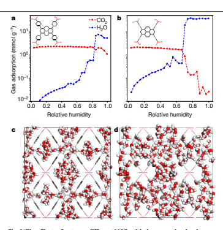

shows the Henry coefficient for water in these high-performing materials. Analysis of the data shows that the materials with the parallel aromatic rings (A1) have a low Henry coefficient for H2O, whereas those with metal–oxygen bridges (A2) and open metal sites (A3) tend to have higher Henry coefficients (Fig. 1b). A graphical representation of the different adsorbaphores is presented in Extended Data Fig. 4. Comparison of the binding energies—computed using density functional theory—for the adsorbaphore shown in Fig. 1c indicates a preference for CO2 (−10.2 kcal mol−1) over N2 and H2O by 2.7 and 1.5 kcal mol−1, respectively (see Extended Data Table 1). The parallel aromatic rings provide a nearoptimum interaction with all three atoms of CO2, whereas for H2O the lack of hydrogen-bonding sites limits its binding energy.

The next step was to identify a subclass of MOFs in our library that contains the preferred adsorbaphore. From an experimental point of view, MOFs with the frz topology—characterized by tetra-carboxylated organic ligands coordinated to one-dimensional metal–oxygen rodsare an attractive starting point. One such example has been synthesized with indium as a metal node, resulting in a structurally stable, non-breathing MOF18. In this topology, the metal rods provide an ideal scaffolding to which we can attach our adsorbaphore. By varying the metal ion we have some flexibility to tune the distance between the aromatic rings. Our calculations predict that the ideal adsorbaphore distance of 6.5–7.0 Å—which was determined by adjusting the spacing of the aromatic rings incrementally (Extended Data Fig. 5)—can be approached if In(iii) is replaced by Al(iii) (Extended Data Table 2). In addition, aluminium is an attractive choice because it is an abundant metal and it ensures a strong bond with the carboxylate O-atoms of the ligands19; this considerably improves the thermal and hydrolytic stability of a MOF20,21.

We generated a library of 35 isoreticular materials using our MOF-generation algorithm22, and from the mixture isotherms we computed the 

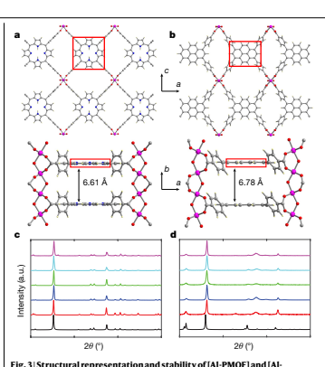

Fig. 3 | Structural representation and stability of [Al-PMOF] and [AlPyrMOF]. a, b, Ball-and-stick representation of the structures of **[Al-PMOF]** (a) 
and **[Al-PyrMOF]** (b). The orientation of the tetracarboxylate ligands around the Al(iii) rods results in the generation of the three-dimensional noninterpenetrated structures containing the adsorbaphore (red box). Atom colour code: pink, Al; grey, C; blue, N; red, O; pale yellow, H. c, d, Laboratory powder X-ray diffraction patterns of **[Al-PMOF]** (c) and **[Al-PyrMOF]** (d). Black, simulated; red, as-synthesized material; blue, acetone-exchanged material; green, activated material; sky blue, activated material immersed in liquid water for 7 days; pink, activated material exposed to a controlled atmosphere of nitric acid vapour for 3 h.

CO2/N2 selectivity of the materials in dry and wet flue gases (Extended Data Figs. 6 and 7). Our calculations show that all of our predicted materials maintain an excellent selectivity at low pressures, and in about 75% 
of these materials the selectivity was not influenced by the presence of water under flue-gas conditions. The concept of an adsorbaphore focuses on the design of an adsorption site that optimizes selectivities at low pressure. At higher partial pressures of water, its adsorption is dominated by the energetics of hydrogen-bond formation. Further analyses showed that, for the materials that maintain a high CO2 uptake at high humidity, it is the pore shape that frustrates the formation of these hydrogen bonds. This is illustrated in Fig. 2a, b, which compares the effect of water on the CO2 uptake of two materials that have the same adsorbaphore but different pore structures (hypothetical MOFs m8o67 and **m8o71**). Figure 2a shows that **m8o67** is resistant to H2O 
flooding: even at a relative humidity of approximately 85%, we find that H2O has only a small effect on CO2 capacity. Conversely, **m8o71**
completely loses its CO2 capacity at 60% relative humidity (Fig. 2b). 

In Fig. 2c, d we visualize the hydrogen-bond network that is formed at 100% relative humidity in both materials. For **m8o71** we see a complete hydrogen-bonding network (Fig. 2d), whereas for **m8o67** (Fig. 2c) we observe a less extensive network; the benzoate groups that separate the adsorbaphores frustrate the formation of a complete hydrogenbonding network.

On the basis of these predictions, we synthesized two frz-based MOFs using organic ligands that possess the water-frustrating properties reported above: **Al-PMOF**19 (**m8o66**) and Al-PyrMOF (**m8o67**). 

These MOFs are based on one-dimensional rods of Al(iii) linked by TCPP (tetrakis(4-carboxyphenyl)porphyrin) and TBAPy (1,3,6,8-tetrakis
(p-benzoic acid)pyrene) ligands, respectively (Fig. 3a, b). Figure 3c, d shows no loss of crystallinity upon activation as well as upon exposure to different harsh conditions, including immersion in water for 7 days. 

By identifying adsorbaphores in these hypothetical materials, we assume that our in silico screening method can correctly predict the structure of a MOF, its adsorption properties, and the nature of the binding sites of CO2 and H2O. We are able to test these assumptions for **Al-PMOF** and **Al-PyrMOF**. In Fig. 4a we show that the experimental and predicted CO2 and N2 adsorption isotherms are in good agreement. 

The CO2 binding positions in the adsorbaphore and the effect of H2O 
are more challenging to observe experimentally. The siting of CO2 was studied using in situ CO2-loading powder X-ray diffraction. Upon loading, we observed a considerable change in the intensity and peak position of the Bragg reflections (see Supplementary Fig. 2.1). Subsequent Rietveld refinement and Fourier analysis23 revealed the preferred locations of CO2 in the pores of **Al-PMOF**, as shown in Fig. 4b. These results confirm that CO2 preferentially adsorbs in the adsorbaphore.

The effect of water on the siting of CO2 has been further addressed by solid-state nuclear magnetic resonance (NMR) analysis. Under magicangle spinning (MAS), high-resolution 13C NMR chemical shifts are very sensitive to changes in the chemical environment. The 13C NMR spectra of **Al-PyrMOF** and **Al-PMOF** are provided in Extended Data Fig. 8, which also shows the assignment of the peaks to specific atoms on the MOF. 

The chemical shifts associated with the atoms of the adsorbophore 
(inset) are shown in Fig. 4c as a function of the water concentration. At low levels the adsorbophore atoms experience no change in chemical environment with water loading, whereas at the highest water loadings there are modest changes in the carbon-13 chemical shifts of only those atoms that are close to the aluminium-coordinated carboxylate groups next to the adsorbaphore (carbons B and F in Fig. 4c). This broadening is consistent with dipolar broadening from proximate water molecules, thus confirming that the adsorbaphore itself is not a preferential adsorption site for H2O.

Our simulations predict that CO2 adsorbed in the adsorbaphore is insulated from the adsorption of water. Because the 13C NMR spectrum of adsorbed 13CO2 is extremely sensitive to the proximity of water molecules in terms of chemical shift and line broadening, any disruption of the chemical environment of adsorbed CO2 by water should be immediately apparent. Figure 4d shows that the chemical shift of the adsorbed 13CO2 is independent of water content, although a broadening of the 13C NMR peak is observed with increasing humidity. 

If this broadening is due to the proximity of the protons in water, it should disappear if the experiments are repeated using D2O; however, it does not (Fig. 4d). This observation corroborates our simulation results (Fig. 2c), confirming that water has only a limited effect on CO2 adsorption in **Al-PyrMOF**.

The ability of these materials to capture CO2 from wet flue gases is of important practical concern. We therefore used a breakthrough experiment to determine the capture capacity of both **Al-PMOF** and Al-PyrMOF for a mixture of CO2/N2 under dry- and humid-conditions24
(Fig. 4e). These results confirm the predictions of the simulations 
(Extended Data Fig. 7): humidity in the flue gases has only a minimal influence on the capture capacity of **Al-PMOF**, whereas for **Al-PyrMOF** the capture capacity is in fact enhanced. Furthermore, repeated cycling25 (Fig. 4f) does not result in degradation of the material or a change in separation performance. It is instructive to compare the performance of our materials with that of a set of reference materials, including those that are commercially available—such as zeolite 13X 
and activated carbon—and a water stable, amino-functionalized MOF, 
UiO-66-NH2. The capture capacity of these reference materials lies between that of **Al-PyrMOF** and **Al-PMOF** in dry flue gases; however, unlike our MOFs, their performance reduces considerably in humid flue gases. Although our materials do not have the highest reported 

Article

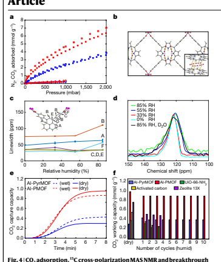

experiments for [Al-PMOF] and [Al-PyrMOF]. a, Experimental (filled) and computational (open) single-component adsorption isotherms for CO2
(squares) and N2 (circles) adsorption collected on activated **[Al-PMOF]** (red) 
and **[Al-PyrMOF]** (blue) at 313 K. b, Rietveld refinement of the X-ray diffraction data (Supplementary Information) revealed that CO2 binding in **[Al-PMOF]**
occurs between the porphyrin cores—that is, in the adsorbaphore. c, The linewidth of each carbon peak of the TBAPy ligand in **[Al-PyrMOF]** in the 13C 
cross-polarization MAS spectrum, plotted as a function of relative humidity. 

Each carbon atom in the ligand is labelled in the inset. d, Linewidths extracted from the 13C static NMR spectra of 13CO2 loaded in **[Al-PyrMOF]**, plotted against relative humidity (RH). e, CO2 capture capacity profiles for **[Al-PyrMOF]** and 
[Al-PMOF] during breakthrough experiments under dry and humid (85% 
relative humidity) conditions, with 85/15 v/v of N2/CO2 (313 K and 1 bar). f, Benchmarking the CO2 working capacity of **[Al-PyrMOF]** and **[Al-PMOF]**
against UiO-66-NH2, activated carbon and zeolite 13X under dry and humid (85% relative humidity) conditions, with 85/15 v/v of N2/CO2 (313 K and 1 bar). 

For wet flue gases, we studied the performance stability after 3 cycles for reference materials, and after 10 cycles for **[Al-PyrMOF]** and **[Al-PMOF]**.

working capacities14, it is encouraging to see that, in wet flue gases, Al-PMOF outperforms commercial materials such as zeolite 13X and activated carbon.

Large-scale screening of databases of hypothetical MOFs for various gas separation and storage applications has been reported previously26–29; however, here we have focused on identifying binding pockets—or structural motifs termed adsorbaphores—as synthetic targets, rather than whole materials. This enhances the synthetic viability of the approach, as demonstrated by the identification of one new material with the targeted adsorbaphore that was synthesized and shown to adsorb CO2 as predicted. The concept of linking computational screening with the synthesis of the corresponding materials through such adsorbaphores should be applicable to other gas separations of increasing complexity.

## Online Content

Any methods, additional references, Nature Research reporting summaries, source data, extended data, supplementary information, acknowledgements, peer review information; details of author contributions and competing interests are available at https://doi.

org/10.1038/s41586-019-1798-7.

1. Smit, B., Reimer, J. R., Oldenburg, C. M. & Bourg, I. C. *Introduction to Carbon Capture and* Sequestration (Imperial College Press, 2014).

2. Bui, M. et al. Carbon capture and storage (CCS): the way forward. *Energy Environ. Sci*. 11, 1062–1176 (2018).

3. D'Alessandro, D. M., Smit, B. & Long, J. R. Carbon dioxide capture: prospects for new materials. *Angew. Chem. Int. Ed*. 49, 6058–6082 (2010).

4. Sumida, K. et al. Carbon dioxide capture in metal–organic frameworks. *Chem. Rev*. 112, 724–781 (2012).

5. Furukawa, H., Cordova, K. E., O'Keeffe, M. & Yaghi, O. M. The chemistry and applications of metal–organic frameworks. *Science* 341, 1230444 (2013).

6. Huck, J. M. et al. Evaluating different classes of porous materials for carbon capture. 

Energy Environ. Sci. 7, 4132–4146 (2014).

7. Mason, J. A., Sumida, K., Herm, Z. R., Krishna, R. & Long, J. R. Evaluating metal–organic frameworks for post-combustion carbon dioxide capture via temperature swing adsorption. *Energy Environ. Sci*. 4, 3030–3040 (2011).

8. Li, G. et al. Capture of CO2 from high humidity flue gas by vacuum swing adsorption with zeolite 13X. *Adsorption* 14, 415–422 (2008).

9. Merel, J., Clausse, M. & Meunier, F. Experimental investigation on CO2 post-combustion capture by indirect thermal swing adsorption using 13X and 5A zeolites. Ind. Eng. Chem. Res. 47, 209–215 (2008).

10. Milner, P. J. et al. A diaminopropane-appended metal–organic framework enabling efficient CO2 capture from coal flue gas via a mixed adsorption mechanism. *J. Am. Chem.* 
Soc. 139, 13541–13553 (2017).

11. McDonald, T. M. et al. Cooperative insertion of CO2 in diamine-appended metal–organic frameworks. *Nature* 519, 303–308 (2015).

12. Flaig, R. W. et al. The chemistry of CO2 capture in an amine-functionalized metal–organic framework under dry and humid conditions. *J. Am. Chem. Soc*. 139, 12125–12128 (2017).

13. Couck, S. et al. An amine-functionalized MIL-53 metal–organic framework with large separation power for CO2 and CH4. *J. Am. Chem. Soc*. 131, 6326–6327 (2009).

14. Chanut, N. et al. Screening the effect of water vapour on gas adsorption performance: 
application to CO2 capture from flue gas in metal–organic frameworks. *ChemSusChem* 10, 1543–1553 (2017).

15. Wolber, G., Seidel, T., Bendix, F. & Langer, T. Molecule-pharmacophore superpositioning and pattern matching in computational drug design. *Drug Discov. Today* 13, 23–29 (2008).

16. Sliwoski, G., Kothiwale, S., Meiler, J. & Lowe, E. W., Jr. Computational methods in drug discovery. *Pharmacol. Rev*. 66, 334–395 (2013).

17. Ho, M. T., Allinson, G. W. & Wiley, D. E. Reducing the cost of CO2 capture from flue gases using pressure swing adsorption. *Ind. Eng. Chem. Res*. 47, 4883–4890 (2008).

18. Stylianou, K. C. et al. A guest-responsive fluorescent 3D microporous metal–organic framework derived from a long-lifetime pyrene core. *J. Am. Chem. Soc*. 132, 4119–4130 (2010).

19. Fateeva, A. et al. A water-stable porphyrin-based metal–organic framework active for visible-light photocatalysis. *Angew. Chem. Int. Ed*. 51, 7440–7444 (2012).

20. Loiseau, T. et al. A rationale for the large breathing of the porous aluminum terephthalate 
(MIL-53) upon hydration. *Chem. Eur. J*. 10, 1373–1382 (2004).

21. Reinsch, H. & Stock, N. High-throughput studies of highly porous Al-based MOFs. 

Microporous Mesoporous Mater. 171, 156–165 (2013).

22. Boyd, P. G. & Woo, T. K. A generalized method for constructing hypothetical nanoporous materials of any net topology from graph theory. *CrystEngComm* 18, 3777–3792 (2016).

23. Carrington, E. J., Vitórica-Yrezábal, I. J. & Brammer, L. Crystallographic studies of gas sorption in metal–organic frameworks. *Acta Crystallogr. B* 70, 404–422 (2014).

24. García, S. et al. Breakthrough adsorption study of a commercial activated carbon for precombustion CO2 capture. *Chem. Eng. J*. 171, 549–556 (2011).

25. García, S., Gil, M. V., Pis, J. J., Rubiera, F. & Pevida, C. Cyclic operation of a fixed-bed pressure and temperature swing process for CO2 capture: experimental and statistical analysis. *Int. J. Greenhouse Gas Control* 12, 35–43 (2013).

26. Lin, L.-C. et al. In silico screening of carbon-capture materials. *Nat. Mater*. 11, 633–641 
(2012).

27. Wilmer, C. E. et al. Large-scale screening of hypothetical metal–organic frameworks. Nat. 

Chem. 4, 83–89 (2012).

28. Boyd, P. G., Lee, Y. & Smit, B. Computational development of the nanoporous materials genome. *Nat. Mater. Rev*. 2, 17037 (2017).

29. Yazaydin, A. O. et al. Screening of metal–organic frameworks for carbon dioxide capture from flue gas using a combined experimental and modeling approach. *J. Am. Chem. Soc*. 

131, 18198–18199 (2009).

Publisher's note Springer Nature remains neutral with regard to jurisdictional claims in published maps and institutional affiliations. © The Author(s), under exclusive licence to Springer Nature Limited 2019

## Data Availability

The computed data and hypothetical materials that were used in this Article are provided free of charge on the Materials Cloud (https://doi.

org/10.24435/materialscloud:2018.0016/v3). An interactive version of Fig. 1a, b can also be found on this site. Data that are not included in the paper are available upon reasonable request to the corresponding authors.

## Code Availability

Topology Based Crystal Constructor (ToBasCCo), the Python program used to build hypothetical MOFs, is hosted on GitHub at https://github.

com/peteboyd/tobascco. The Python code that compares common chemical features between fragments is also provided on GitHub at https://github.com/peteboyd/adsorbaphore and is dependent on a C library called MCQD which performs the maximum clique detection of the chemical graphs. An interface between Python and C for this is provided here at https://github.com/peteboyd/mcqd_api. The Automatic Binding Site Locator (ABSL) program, used to identify CO2 binding sites in each MOF, is part of a broader Python-based code used to facilitate simulations of porous materials called Fully Automated Adsorption Analysis in Porous Solids (FA3PS). This is available on BitBucket at https://bitbucket.org/tdaff/automation.

Acknowledgements K.C.S. was supported by the Swiss National Science Foundation (SNF) under the Ambizione Energy Grant n.PZENP2_166888, P.G.B. and B.S. by the European Research Council (ERC) Advanced Grant (grant agreement no. 666983, MaGic) and the National Center of Competence in Research (NCCR), Materials' Revolution: Computational Design and Discovery of Novel Materials (MARVEL). A.C., C.P.I., and S.M.M. were supported by European Union's Horizon 2020 research and innovation programme under grant agreement no. 760899 (GENESIS). R.B. and J.A.R. were supported by the Center for Gas Separations Relevant to Clean Energy Technologies, an Energy Frontier Research Center funded by the Department of Energy (DOE), Office of Science, Office of Basic Energy Sciences under award DE-SC0001015. E.G.-D. is supported by the European Commission under the Research Fund for Coal and Steel (RFCS) Programme (project no. 709741). M.M.M.-V. and S.G. acknowledge the financial support from the Engineering and Physical Sciences Research Council (EP/N024540/1) and the Research Centre for Carbon Solutions (RCCS) at Heriot-Watt University. The authors thank the Swiss Norwegian Beamlines of ESRF 
for beamtime allocation at BM31 for the in-situ CO2 loading and variable temperature powder X-ray diffraction experiments. This work was supported by a grant from the Swiss National Supercomputing Center (CSCS) under project no. s761, as well as resources from the National Energy Research Scientific Computing Center, a DOE Office of Science User Facility supported by the Office of Science of the US Department of Energy under contract no. DE-AC02-05CH11231. J.A.R.N. acknowledges Spanish MINECO (CTQ2017-84692-R) and EU Feder funding. P.G.B., T.D.D. and T.K.W. would like to thank NSERC of Canada for financial support and Compute Canada for computing resources. S.G., J.A.R., and B.S. acknowledge support during the final stage of the work of the ACT-PrISMa project, which has received joint funding from BEIS, NERC and EPSRC (UK), funding from the Division of CCS R&D, US 
Department of Energy (USA), and funding from the Office Fédéral de l'Energie 
(Switzerland). Author contributions P.G.B. and T.K.W. developed the adsorbaphore similarity algorithm and developed the library of hypothetical MOFs. P.G.B., T.K.W. and B.S. characterised the adsorbaphores; T.D.D. carried out the initial computational screening and developed the MOFCO2 binding site identification algorithm. S.M.M. carried out the pore similarity analysis; A.C., 
C.P.I. and K.C.S. synthesized and characterized the materials. The breakthrough experiments were carried out by E.G.-D., C.P.I., A.C., M.M.M.-V., J.A.R.N. and S.G. The NMR experiments were carried out by R.B. and J.A.R; X-ray analysis was carried out by A.G. and P.S. All authors contributed to the analysis of the data and the writing of the manuscript. Competing interests K.C.S., B.S., A.C., P.G.B. and T.K.W. have filed an international patent application (no. 18 168 544.7) that relates to water-stable polyaromatic MOF materials for CO2 separation from flue gas and natural gas streams. Additional information Supplementary information is available for this paper at https://doi.org/10.1038/s41586-0191798-7. Correspondence and requests for materials should be addressed to T.K.W., S.G., K.C.S. or B.S. Peer review information *Nature* thanks Philip Llewellyn and the other, anonymous, reviewer(s) for their contribution to the peer review of this work. Reprints and permissions information is available at http://www.nature.com/reprints.

| Article                                                                                                                                                 | ls   | .       |      |     |    |    |
|---------------------------------------------------------------------------------------------------------------------------------------------------------|------|---------|------|-----|----|----|
| 10                                                                                                                                                      | 1    | 12      | 13   | 14  |    |    |
| 18                                                                                                                                                      | 19   | 20      | 21   | 2   | 24 |    |
| 30                                                                                                                                                      | 32   |         |      |     |    |    |
| 25                                                                                                                                                      | 26   | 31      |      |     |    |    |
| 3                                                                                                                                                       | 34   | 35      | 36   | 38  | 39 |    |
| 37                                                                                                                                                      |      |         |      |     |    |    |
| l                                                                                                                                                       | A    |         |      |     |    |    |
| W                                                                                                                                                       | a    |         |      |     |    |    |
|                                                                                                                                                         |      | 42      | 3    | 4   | 45 | 46 |
| 49                                                                                                                                                      | 50   | 51      | 5252 | 55  | 56 |    |
|                                                                                                                                                         |      |         |      |     |    |    |
| 58                                                                                                                                                      | 59   | eo      | .61  | 63  | 64 |    |
| e                                                                                                                                                       |      |         |      |     |    |    |
| e                                                                                                                                                       | e    | e       | e    |     |    |    |
| e                                                                                                                                                       |      |         |      |     |    |    |
| o                                                                                                                                                       | e    | o       | 3    |     |    |    |
| p                                                                                                                                                       |      |         |      |     |    |    |
| 65                                                                                                                                                      | 66   | 67      | 68   | 69  | 72 |    |
| O                                                                                                                                                       | lll  |         |      |     |    |    |
| e                                                                                                                                                       |      |         |      |     |    |    |
| 3                                                                                                                                                       | e    |         |      |     |    |    |
|                                                                                                                                                         | e    | o       |      |     |    |    |
| e                                                                                                                                                       | c    | G       | g    | h   |    |    |
| 78                                                                                                                                                      | 79   |         |      |     |    |    |
| 73                                                                                                                                                      | 174  | 75      | 76   | 777 | 80 |    |
| n                                                                                                                                                       |      | h       |      |     |    |    |
| )                                                                                                                                                       |      |         |      |     |    |    |
| »                                                                                                                                                       |      |         |      |     |    |    |
|                                                                                                                                                         | l    |         |      |     |    |    |
| l                                                                                                                                                       |      | 85      |      |     |    |    |
| 83                                                                                                                                                      | 84   | 86      | 87   | 88  |    |    |
| PhA                                                                                                                                                     |      |         |      |     |    |    |
| AP                                                                                                                                                      |      |         |      |     |    |    |
| e                                                                                                                                                       | a    | ar reco |      |     |    |    |
| (2)                                                                                                                                                     | e    | API     | PhA  |     |    |    |
| 89                                                                                                                                                      | 90   | 91      | 92   | 93  | 94 |    |
| Ph/                                                                                                                                                     | AP   | PhA     |      |     |    |    |
| PhA                                                                                                                                                     | O    |         |      |     |    |    |
| APH                                                                                                                                                     |      |         |      |     |    |    |
| Extended Data Fig. 1 | Hypothetical material generation (1). The organic secondary building units (SBUs) used in the generation of the hypothetical MOF |      |         |      |     |    |    |

database.

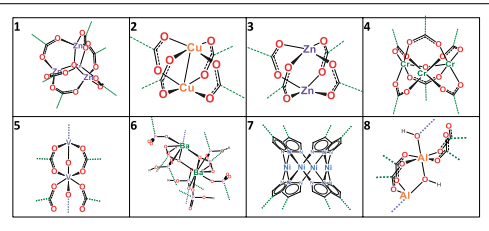

b

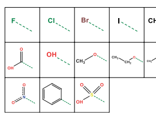

| CH3    |     |    |
|--------|-----|----|
| l,     | CH2 |    |
| ch     | 8   |    |
| NH 2 . | NN  |    |
| CH 3 . | C   | CH |

Extended Data Fig. 2 | Hypothetical material generation (2). a , Metal SBUs used in the generation of the hypothetical MOF database. b, Functional groups used to decorate the unfunctionalized hypothetical MOFs in the database. We denote a hypothetical material as mXoYY, where X refers to the metal SBU
shown in a and YY refers to the organic SBU shown in Extended Data Fig. 1.

Functional groups were decorated onto the base hypothetical materials using an internal numbering system.

a

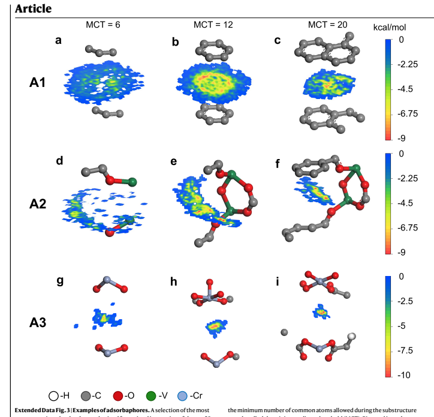

representative adsorbaphores obtained from visual inspection of the top 50 most frequent adsorbaphores found from the random pairing method described in the Supplementary Information. There are three major trends in the molecular fragments-labelled A1, A2 and A3-which can be observed upon descending each column. The number of chemical features of the fragments increases from left to right across each row. This is accomplished by increasing search, called the minimum clique threshold (MCT). Pictured in each adsorbaphore is a representative contour map of the energy produced from CO, binding with the adsorbaphore atoms from each original CO, binding site.

a-c, Al, planar aromatic systems, in which CO2 binds in between the stacked rings; d-f, A2, CO, binds near the bridging oxygen of a pillared vanadium SBU;
g-i, A3, CO, binds between open-metal Cr SBUs.

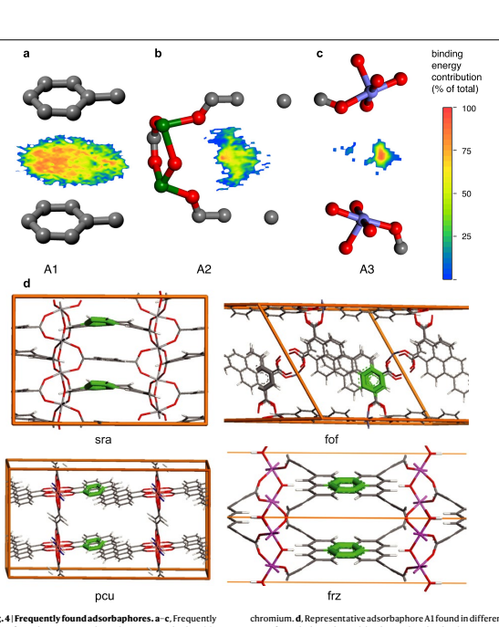

highlighted in green.

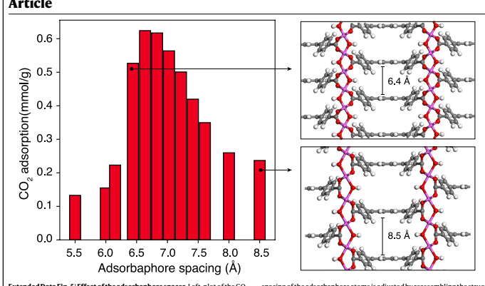

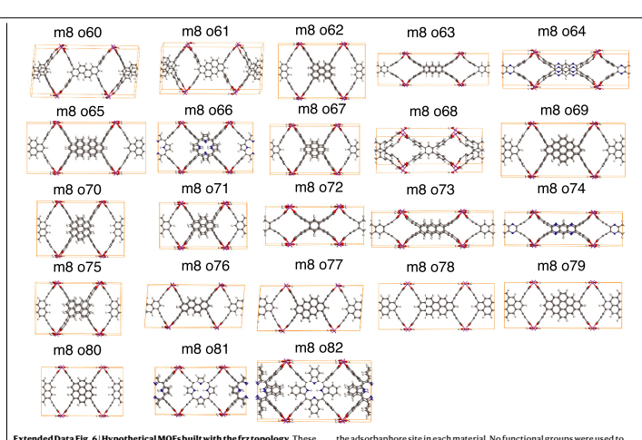

the adsorbaphore site in each material. No functional groups were used to
decorate these materials. We refer to the synthesized versions of m8066 and m8067 as Al-PMOF (Al 2 (OH) 2 (H 2 TCPP)) and Al-PyrMOF (Al 2 (OH) 2 (TBAPy)),
respectively.

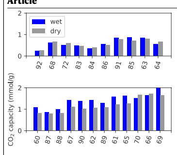

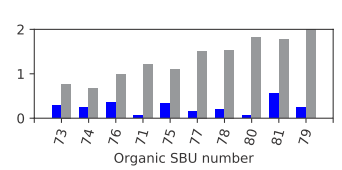

Extended Data Fig. 7 | CO, adsorption capacity of a class of frz-based hypothetical MOFs at 0.15 bar and 313K under 'wet' (85% relative humidity)
and 'dry' flue gas conditions. Top, middle, hypothetical MOFs in which the organic ligand is connected to the Al ion via 4 benzoate moieties; bottom, hypothetical MOFs in which the organic ligand is connected to the Al metal ion via 4 acetylenic carboxylate moieties. The materials are ranked from lowest adsorbaphore density to highest, and the number on the xaxis corresponds to the organic linker number (YY) in m80YY (see Extended Data Fig. 6).

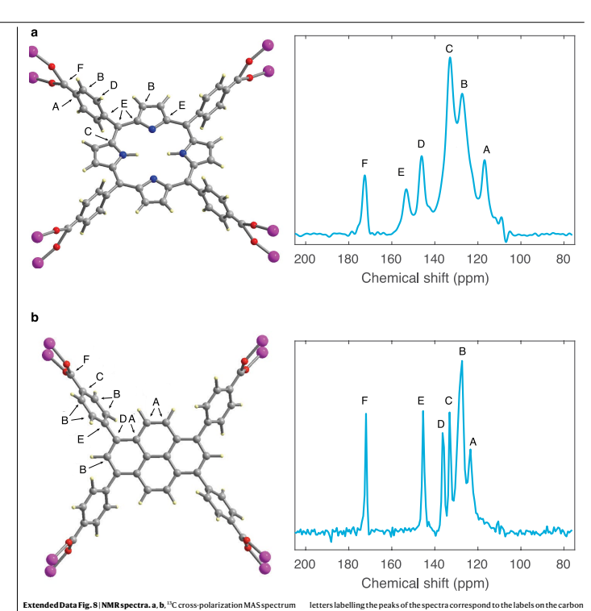

Article Extended Data Table 1|DFT binding energies of gas particles in the adsorbaphore pocket of each MOF synthesized in this work

| Adsorbaphore Binding Energy (kcal/mol)   |       |       |      |
|------------------------------------------|-------|-------|------|
| MOF                                      | CO 2  | H2O   | N2   |
| AI-PMOF                                  | -12.6 | -10.4 | -7.9 |
| Al-PyrMOF                                | -10.2 | -8.7  | -7.5 |

Extended Data Table 2 | DFT optimized cell parameters of hypothetical MOFs

| Metal species   | a (A)   | b (Å)   |
|-----------------|---------|---------|
| A(III)          | 15.84   | 30.33   |
| Fe(III)         | 15.96   | 30.47   |
| Ga(III)         | 15.97   | 30.56   |
| In(III)         | 16.23   | 30.88   |
| Sc(III)         | 16.12   | 30.70   |
| 16.43           |         |         |
| Y(III)          | 30.72   |         |

| c (Å)   |
|---------|
| 6.65    |
| 6.83    |
| 6.77    |
| 7.27    |
| 7.34    |
| 7.70    |

The MOFs are built with the frz topology and organic linker number 67 (m8o67) and various trivalent metal species. The c axis corresponds to the spacing between aromatic rings in the adsorbaphore.