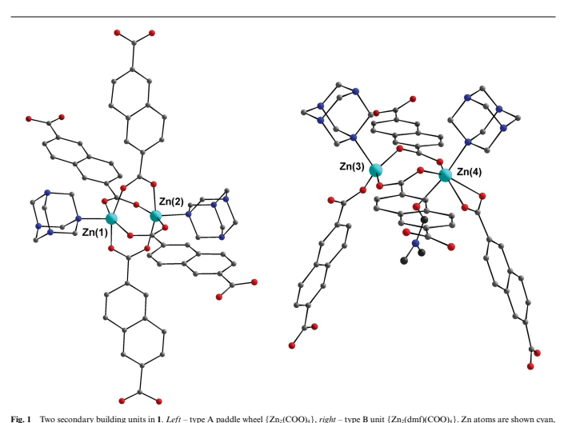
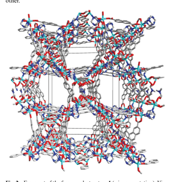
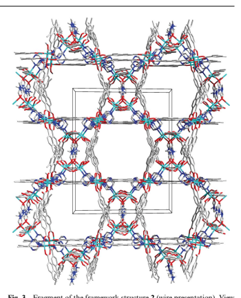
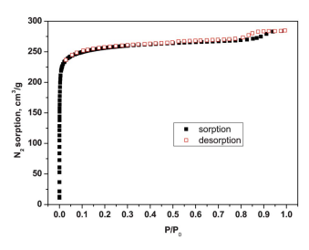
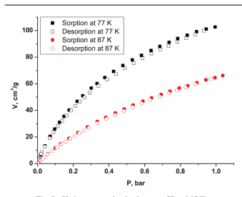
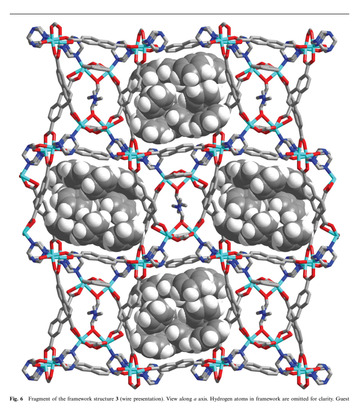
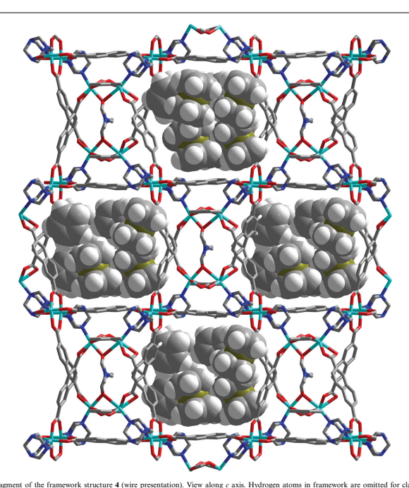
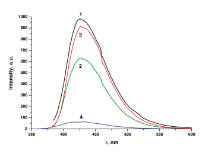

This article is published as part of the *Dalton Transactions* **themed issue entitled:** 

# New Talent Asia

Highlighting the excellent work being carried out by younger members of the inorganic academic community in Asia Guest Editor Masahiro Yamashita Tohoku University, Japan Published in issue 10, 2011 of *Dalton Transactions*

Image reproduced with permission of Kenneth Kam-Wing Lo Articles in the issue include: PERSPECTIVES: Pyrazolin-4-ylidenes: a new class of intriguing ligands Yuan Han and Han Vinh Huynh, *Dalton Trans*., 2011, DOI: 10.1039/C0DT01037E Solvent induced molecular magnetic changes observed in single-crystal-to-single-crystal transformation Zheng-Ming Hao and Xian-Ming Zhang, *Dalton Trans*., 2011, DOI: 10.1039/C0DT00979B, ARTICLES: 
Negative thermal expansion emerging upon structural phase transition in ZrV2O7 and HfV2O7 Yasuhisa Yamamura, Aruto Horikoshi, Syuma Yasuzuka, Hideki Saitoh and Kazuya Saito Dalton Trans., 2011, DOI: 10.1039/C0DT01087A 
Preparation of surface molecularly imprinted Ru-complex catalysts for asymmetric transfer hydrogenation in water media Zhihuan Weng, Satoshi Muratsugu, Nozomu Ishiguro, Shin-ichi Ohkoshi and Mizuki Tada Dalton Trans., 2011, DOI: 10.1039/C0DT00950D 
Visit the *Dalton Transactions* website for more cutting-edge inorganic and organometallic research www.rsc.org/dalton

# Microporous Sensor: Gas Sorption, Guest Exchange And Guest-Dependant Luminescence Of Metal–Organic Framework†

Sergey A. Sapchenko,a Denis G. Samsonenko,*a,b Danil N. Dybtsev,a,c Maxim S. Melgunovd and Vladimir P. Fedina,b Received 12th August 2010, Accepted 14th October 2010 DOI: 10.1039/c0dt00999g Zn(II)-containing metal–organic framework (MOF) [Zn4(dmf)(ur)2(ndc)4] (ndc2- =
2,6-naphtalenedicarboxylate, ur = urotropin, dmf = N,N¢-dimethylformamide) was synthesized and characterized by X-ray crystallography and gas sorption analysis. Host MOF retains its crystallinity after guest removal and exchange. Single-crystal to single-crystal formation of different host–guest systems with benzene and ferrocene was investigated. Interesting guest-depended luminescence properties of the porous host framework were observed.

## Introduction

Metal–organic coordination polymers constructed from metal ions and organic bridging ligands have attracted considerable attention in recent years.1 The wide variety of organic ligands and practically infinite number of ways to unite metal coordination complexes into extended metal–organic framework lead to a vast number of novel compounds with unique sorption, catalytic activity, luminescence, magnetism.2,3 While gas sorption or catalytic activity of metal–organic frameworks mainly depends on the structure, some other properties, *e.g.* luminescence, depend also on the guest composition, which could be directly applied for chemical sensing. Therefore the synthesis of porous metal–organic frameworks, which are capable of switching their functional characteristics upon guest-related transitions, is an important but challenging task. Other than luminescence itself, such sensor materials should feature at least two essential properties. Firstly, the size of porous channels must be sufficient for accommodation of functional guest species. Secondly, the metal–organic framework should be robust enough to maintain its porosity during the guest removal or exchange. Only several examples of porous coordination polymers with luminescence-based sensing of various guest molecules have been reported to date,4 therefore this highly promising area mainly remains underdeveloped. A
particularly important issue here is an unambiguous structural characterization of such host–guest complexes because it allows detailed investigation of interactions between guest molecule and porous framework as well as elucidates the sensing mechanism.

Single-crystal X-ray diffraction technique is often limited here, because of guest disorder problem or fragility of metal-organic single crystals during the guest exchange.5 In this work we describe the synthesis and characterization of a novel porous metal–organic coordination polymer
[Zn4(dmf)(ur)2(ndc)4]·5DMF·H2O (1), which meets the abovementioned requirements for potential sensor applications. The solvent molecules can be removed from this MOF without loss of the sample's crystallinity. The resulting permanently porous framework demonstrates a reversible gas sorption as well as an uptake of various guests. The corresponding guest-free and guest-exchanged samples were characterized by a single-crystal X-ray diffraction analysis. Most interestingly, the luminescent properties of open framework [Zn4(dmf)(ur)2(ndc)4] are highly depended on the guest molecules, accommodated in the pores. The benzene molecules enhance the framework luminescence, while ferrocene effectively quenches it. Such pronounced guestdepended response could be applied for sensing of organic or organometallic molecules, many of which are very dangerous both to Nature and to human health.

## Results And Discussion

Compound 1 was obtained by heating a mixture of Zn(NO3)2·6H2O, 2,6-naphtalenedicarboxylic acid (H2ndc) and urotropin (ur) in DMF at 100 ◦C for 10 h. Compound 1 crystallizes in the monoclinic system with the space group P21/n. Asymmetric unit of 1 comprises four crystallographically independent zinc atoms forming two different binuclear carboxylate complexes as secondary building units (Fig. 1). In the first building unit (type A) the tetragonal-pyramidal Zn(1) and Zn(2) centers are similar.

Each metal cation is coordinated by four O atoms of four ndc2- and one N atom of urotropin, such as these cations are interconnected via four bridging bidentate m2-RCOO-O,O¢ groups. This binuclear carboxylate complex {Zn2(COO)4}, known as "paddle-wheel",
is very typical and common in metal carboxylate coordination structures. The Zn–O (2.006(5)–2.069(6) A˚ ) and Zn–N (2.065(6), 2.067(6) A˚ ) bond lengths found fall within the common values for Zn(II) complexes with coordination number 5. The structure of the second carboxylate secondary building unit (type B), to our best

knowledge, has never been described before and unprecedented in coordination frameworks. Contrary to the binuclear complex A, the coordination environments of Zn(3) and Zn(4) cations in B are different (Fig. 1). The distorted tetrahedral Zn(3) center is coordinated by three O atoms of three ndc2- ligands and one N atom of urotropin. The Zn(3)–O (1,899(9)–1,962(7) A˚ ) and Zn(3)–N(12) (2.111(7) A˚ ) bond lengths found fall within the common values for tetrahedral Zn(II) complexes. The distorted octahedral geometry of Zn(4) cation is composed of five O atoms of two monodentate ndc2-, one chelating bidentate ndc2- ligands and one coordinated dmf molecule, as well as one N atom of urotropin ligand. The Zn(4)–N(22) bond length is 2.143(7) A˚ .

There are two type of Zn(4)–O distances. The first one includes two bonds with bridging ndc2- ligands (1.982(7), 1.997(6) A˚ )
and one of two bonds with bidentate ndc2- ligand (2.161(16)
A˚ ). The residual bond with bidentate ndc2- ligand and bond with dmf molecule form the second type. Thereby, coordination number of Zn(4) atom can be assigned as 4 + 2. In the type B
building unit two metal cations Zn(3) and Zn(4) are interlinked via two bridging m2-RCOO-O,O¢ groups, so the overall formula of the coordination complex is {Zn2(dmf)(COO)4}. The metal–
ligand distances in both carboxylate binuclear complexes lie within typical corresponding ranges with some acceptable deviations, indicating apparent distortion.

In the structure 1 the organic ligands act as ditopic connectors between the binuclear secondary building units. Therefore, both binuclear complexes A and B could be simplified as six-connected nodes, each with distorted 4 + 2 octahedral geometry of four linear ndc2- and two angular urotropin linkers. The main difference is that urotropins are located in *trans*-positions in type A but in cis-positions in the type B node (Fig. 1). The ndc2- bridges connect nodes A and A, B and B, as well as A and B. At the same time urotropin ligands link only nodes A and B. Each type A node is connected through ndc2- to two nodes A and two nodes B
and through urotropin to two nodes B. Similarly, each B node is connected through ndc2- to two nodes A and two B and through urotropin to two nodes A. The overall three-dimensional (3D)
topology of the binodal 6-connected net in the metal–organic framework 1 is very complicated (Fig. S1†), one may refer to its point symbol (3244.68.8)(3.44.53.66.8).

The interstitial space between inorganic carboxylate complexes and organic ligands in as-synthesized 1 is occupied by solvent guest molecules. The single-crystal X-ray diffraction analysis revealed five DMF and one H2O molecules per asymmetric unit of 1. The formula [Zn4(dmf)(ur)2(ndc)4]·5DMF·H2O was independently confirmed by elemental and thermogravimetrical
(TG) analyses. The phase purity of 1 was also proved by powder X-ray diffraction method (See SI for the details). In particular, the TG analysis on the as-synthesized 1 indicated a gradual weight loss of 21% in the temperature range 25–300 ◦C, which is consistent with evacuation of one H2O and 5 DMF molecules. The following decrease of mass can be associated with the destruction of the metal–organic framework (Fig. S2). The guest molecules occupy distorted hexagonal channels with characteristic dimensions 9.5
¥ 11 A˚ 2, running along a axis of 3D framework (Fig. 2). A space within channels is occupied by DMF and disordered H2O guest molecules, which form a weak H-bonding with CH or CH2 groups of ndc2- or urotropin ligands respectively, as well as with each

To prepare guest-free framework [Zn4(dmf)(ur)2(ndc)4] (2) the DMF molecules was exchanged with readily volatile CH2Cl2 solvent, followed by slight heating in the dynamic vacuum. A structure of guest-free compound 2 is generally similar to 1, but there are some distinct differences. Whereas the compound 1 crystallizes in *P21/n* space group, compound 2 has slightly higher Cc symmetry. Such difference does not affect significantly Zn– O and Zn–N interatomic distances. The channels running along c axis in 2 adopt more symmetric shape than in 1 and have characteristic dimensions 10.5 ¥ 10.5 A˚ (Fig. 3). The free solvent accessible volume in 2, derived from PLATON 6 routine analysis
(filling of the cavities with probe spheres of radius 1.2 A˚ ) was found to be 43%. Interestingly, framework 2 is not centrosymmetric
(sp. group Cc has no inversion center) that leads to racemic merohedral twinning of the crystals 2 contrary to 1. Attempts to apply centrosymmetric space group C2/c during the refinement of 2 leads to disorder of coordinated dmf molecules over two symmetrically related positions. In case of non centrosymmetric group Cc, the disordering is not observed.

The high stability of the guest-free metal–organic framework was further confirmed by N2 sorption isotherm at 77 K for 2
(Fig. 4), which shows type I behavior with small hysteresis and

thus ensuring permanent microporosity of the bulk sample. The formally calculated Brunauer–Emmett–Teller (BET) surface area is 820 m2 g-1. Channels volume-size distribution diagram (Fig. S3†)
shows the only intense peak at 0.9 nm and agrees quantitatively with the result of X-ray analysis. The volume of these pores was calculated to be 0.2 cm3 g-1. The maximum H2 uptake for 2 at 1 atm and 77 K is 0.92 wt.% H2 (Fig. 5). Knowing pore volume, one can estimate the density of H2 in pores as 0.04 g cm-3. For comparison, density of liquid H2 at 14 K is 0.07 g cm-3. The storage density of hydrogen in the bulk sample at 1 bar is 0.009 g cm-3, which is equivalent to the density of H2 at 2.7 MPa (estimated according

to ideal gas equation) at 77 K. Additional hydrogen isotherm was measured at 87 K to determine enthalpy of adsorption derived from the Clausius–Clapeyron equation (see Fig. S4 and S5 in ESI† for details). In the interval of 0.1–1.0 wt. % of adsorbed H2, value of D*Hads* lies in the range 4.7–5.2 kJ mol-1, which is typical to other zinc–organic frameworks.2a Microporous framework 2 can form different host–guest complexes with various species ranging from diatomic molecules to organometallics. Immersing single crystals of 2 in liquid benzene at room temperature for 16 h leads to single crystals of inclusion compound [Zn4(dmf)(ur)2(ndc)4]·6C6H6 (3). The framework structure of benzene adduct 3 is practically identical to one in 1. In both cases, a presence of guest molecules distorts the framework symmetry and space group is changed back to P21/n. A space within the channels is occupied by benzene molecules (Fig. 6).

There are no strong contacts between guest benzene molecules except for specific C–H ◊◊◊p interactions (Fig. S6†), which are common in such aryl molecules packing.7 We also found some weak H-bonds between CH group of benzene and carboxyl group of ndc2- ligand. The host–guest adduct with ferrocene was prepared by heating a mixture of single crystals of 2 and solid ferrocene in an evacuated sealed glass tube at 100 ◦C for 10 h. After slow cooling to room temperature, yellow crystals of
[Zn4(dmf)(ur)2(ndc)4]·4Fe(C5H5)2 (4) were separated from excess of the ferrocene. Noteworthy, the corresponding ferrocene adduct cannot be obtained by a reaction of 2 with ferrocene solution in cyclohexane. As identified from the single-crystal X-ray diffraction data, the ferrocene-imbued framework of host–guest system 4 has less distorted monoclinic Cc space group symmetry compared to that in 3 (Fig. 7). The most significant difference in 4 is that the all three ndc2- ligands are coordinated to Zn(4) atom on monodentate manner, whereas in 1–3 one ndc2- ligand is always bidentate. As a result, Zn(4) in structure 4 has distorted trigonal bipyramidal coordination environment in contrast to distorted octahedral one in 1–3 (Fig. S7†). A space within the channels is occupied by ferrocene molecules of four crystallographically independent types. Interestingly, one of them is disordered over two positions with the site occupancy factors being 0.32 and 0.68 (Fig. S8†). Except for van-der-Waals contacts, we could not identify any specific interactions between ferrocene molecules and the framework, as well as between guest molecules. We note here, that the framework stability and phase purity of guest-exchange compounds 3 and 4 were independently confirmed by X-ray powder diffraction method (Fig. S9†).

The solid-state photoluminescence properties of complexes 1–4 were investigated at room temperature (Fig. 8, Fig. S10†).

Their emissions spectra were collected from 380 nm to 600 nm with excitation wavelength at l = 370 nm. The positions of maxima of the photoluminescence spectra for the materials 1–3 are the identical. Some deviations in the luminescence intensities for these materials could be attributed to the method errors. All compounds 1–3 exhibit strong blue emission with broad maximum at l = 430 nm which can be assigned to naphtalenedicarboxylate (ndc2-) intraligand emission p–p*. However, the presence of ferrocene in the host–guest compound 4 essentially quenches the photoluminescence of the framework. In fact, the ferrocene molecule and its derivatives have been widely used as a luminescence quenchers,8 particularly, because of their high stability under visible irradiation and capacity to inhibit the lowest energy excited states (generally, the triplet state).9 Such photoluminescence quenching led to numerous applications in the areas of analytical chemistry, molecular organized systems and biology.10 The excitation energy is transferred to the ferrocene FeCp2, followed by the thermal relaxation of the excited FeCp2* state. There are two possible luminescence quenching mechanisms, known as energy transfer and electron transfer.9 The later is unlikely, because it should involve electron transfer from the ferrocene to exited anionic ligand, forming intermediate radical species ndc3-∑, which should be very unstable. The energy transfer mechanism requires the luminescence radiation energy to be higher, than the energy of the first exited state of ferrocene FeCp2*, which is 21800 cm-1. As mentioned above, the emitted radiation wavelength of p–p* transitions in ndc2- has maximum at l = 430 nm (or 23250 cm-1), which is just enough to promote the ferrocene excitation and effectively absorb the framework photoluminescence. Therefore, we believe that observed quenching of the metal–organic framework luminescence by the ferrocene follows the energy transfer mechanisms. The unique combination of the pronounced guest-dependant photoluminescence, great framework stability and potent sorption capability of microporous metal–organic material [Zn4(dmf)(ur)2(ndc)4] makes is very strong candidate for practical sensing applications for aromatic or other compounds. More experiments are currently under way in order to investigate the relations between host–guest interactions and luminescence properties of such supramolecular compounds.

## Conclusions

A novel microporous Zn(II) metal–organic framework with permanent porosity has been synthesized and structurally characterized. It is shown that as-synthesized form of this MOF-material retains its single crystallinity after guest molecules removal or exchange. The permanent porosity was further confirmed by nitrogen and hydrogen sorption data. Additionally, the pronounced guest-depended photoluminescence properties have been demonstrated, which open great possibilities to use this material for practical sensing applications.

## Experimental General Remarks

All chemicals purchased were of reagent grade and were used as received without further purification. Methylene chloride was purified according to standard procedure. FTIR spectra (KBr pellets) were recorded in the range of 4000–400 cm-1 on a Scimitar FTS 2000 Fourier-transform infrared spectrometer. Powder X-ray diffraction (PXRD) data were collected with Cu-Ka radiation on a Philips PW 1830 instrument equipped with a PW 1820 vertical Bragg–Brentano powder goniometer and a PW 1710 control unit.

Thermogravimetric analysis (TGA) was carried out at a ramp rate of 10 ◦C min-1 in a helium atmosphere with a NETZSCH
TG 209 F1 instrument. Elemental analyses on C, H, and N
were performed on a Euro EA 3000 CHN Elemental Analyzer.

Fluorescence emission spectra were collected on a Varian Cary Eclipse spectrofluorimeter.

## Synthesis

[Zn4(dmf)(ur)2(ndc)4]·5DMF·**H2O (1).** A mixture of Zn(NO3)2·6H2O (0.300 g, 1.00 mmol), 2,6-naphtalenedicarboxylic acid (0.216 g, 1.00 mmol), and urotropine (0.070 g, 0.50 mmol)
in DMF (25 mL) was heated at 100 ◦C for 10 h in teflon-lined capped container under autogenous pressure. After slow cooling to room temperature, colorless crystals of 1 were separated by filtration, washed with DMF, and then diethylether and dried on air. Yield 0.434 g (28%). Anal: Calc. for C78H92N14O23Zn4 (%) C
50.5; H 5.0; N 10.6. Found (%): C 49.9; H 5.2; N 10.6. IR (KBr, cm-1): 3435 (w), 3060 (w), 2928 (w), 1666 (s), 1616 (m), 1585 (m),
1496 (w), 1408 (s), 1356 (m), 1251 (w), 1227 (w), 1196 (w), 1096 (w), 1027 (m), 993 (m), 922 (w), 836 (w), 784 (s), 730 (w), 660 (w),
588 (w), 481 (m). TGA data: calc. weight loss for 5DMF + H2O:
21%; found: 21%.

[Zn4(dmf)(ur)2(ndc)4] (2). The crystals of 1 (0.100 g, 0.056 mmol) were immersed into dried CH2Cl2 (15 mL) for 72 h,

| Table 1                                  | Crystal data and structure refinement for 1–4   |                                          |                    |                    |
|------------------------------------------|-------------------------------------------------|------------------------------------------|--------------------|--------------------|
| Compounds                                | 1                                               | 2                                        | 3                  | 4                  |
| Empirical formula                        | C78H92N14O23Zn4                                 | C63H55N9O17Zn4                           | C99H91N9O17Zn4     | C103H95N9O17Zn4Fe4 |
| Formula weight                           | 1855.14                                         | 1471.64                                  | 1940.29            | 2215,76            |
| T/K                                      | 150(2)                                          | 150(2)                                   | 150(2)             | 130(2)             |
| Crystal system                           | Monoclinic                                      | Monoclinic                               | Monoclinic         | Monoclinic         |
| Space group                              | P21/n                                           | Cc                                       | P21/n              | Cc                 |
| a/A˚                                     | 12.3274(5)                                      | 24.8414(6)                               | 12.2527(2)         | 24.6659(7)         |
| b/A˚                                     | 30.5413(19)                                     | 31.1031(8)                               | 31.2515(5)         | 31.3085(12)        |
| c/A˚                                     | 24.7472(15)                                     | 12.3400(3)                               | 24.7184(4)         | 12.2751(5)         |
| b/◦                                      | 98.232(1)                                       | 97.318(1)                                | 97.023(1)          | 96.306(1)          |
| Volume/A˚ 3                              | 9221.2(9)                                       | 9456.8(4)                                | 9394.0(3)          | 9422.1(6)          |
| Z                                        | 4                                               | 4                                        | 4                  | 4                  |
| Dcalc/g cm-3                             | 1.336                                           | 1.034                                    | 1.372              | 1.562              |
| Absorbtion coefficient/mm-1              | 1.103                                           | 1.054                                    | 1.080              | 1.672              |
| F(000)                                   | 3848                                            | 3008                                     | 4016               | 4544               |
| Crystal size/mm                          | 0.32 ¥ 0.11 ¥ 0.07                              | 0.36 ¥ 0.16 ¥ 0.14                       | 0.20 ¥ 0.18 ¥ 0.12 | 0,09 ¥ 0,08 ¥ 0,06 |
| q for data collection/◦                  | 1.79–26.39                                      | 2.11–30,54                               | 2.06–30.52         | 2.12–27.53         |
| Limiting indices                         | -15 £ h £ 8, -38 £ k £ 38, -30 £ l £ 30         | -31 £ h £ 18, -40 £ k £ 40, -15 £ l £ 15 |                    |                    |
| Reflns collected/unique                  | 57408/18509                                     | 61839/25216                              | 125023/28654       | 36506/17100        |
| Rint                                     | 0.0555                                          | 0.0171                                   | 0.0279             | 0.0335             |
| Goodness-of-fit on F2                    | 1.104                                           | 1.097                                    | 1.037              | 1.023              |
| Absolute structure parameter             | -                                               | 0.472(8)                                 | -                  | 0.488(7)           |
| Final R indices [I > 2s(I)]              | R1 = 0.1079                                     | R1 = 0.0374                              | R1 = 0.0367        | R1 = 0.0349        |
| wR2 = 0.2833                             | wR2 = 0.1271                                    | wR2 = 0.0879                             | wR2 = 0.0672       |                    |
| R indices (all data)                     | R1 = 0.1451                                     | R1 = 0.0423                              | R1 = 0.0492        | R1 = 0.0482        |
| wR2 = 0.2973                             | wR2 = 0.1311                                    | wR2 = 0.0916                             | wR2 = 0.0706       |                    |
| Largest diff. peak and hole/e A˚ -3      | 1.704/-0.950                                    | 1.230/-0.406                             | 0.980/-0.795       | 0.811/-0.850       |
| -35 £ h £ 31, -44 £ k £ 40, -16 £ l £ 17 | -17 £ h £ 17, -44 £ k £ 39, -35 £ l £ 32        |                                          |                    |                    |

and then heated under dynamic vacuum at 65 ◦C for 24 h. Anal:
Calc. for C63H55N9O17Zn4 (%): C 51.4; H 3.8; N 8.6. Found (%): C
51,7; H 3,8; N 8,7.

[Zn4(dmf)(ur)2(ndc)4]·6C6H6 **(3).** The crystals of 2 (0.100 g, 0.068 mmol) were immersed in benzene (10 ml) for 72 h. After that, colorless crystals of 3 was separated by filtration, and dried on air. Anal: Calc. for C99H91N9O17Zn4 (%): C 61.3; H 4.7; N 6.5.

Found (%): C 60.9; H 4.4; N 6.7.

[Zn4(dmf)(ur)2(ndc)4]·4Fe(C5H5)2 **(4).** A mixture of crystals of 2 (0.050 g, 0.034 mmol), and ferrocene (0.025 g, 0.136 mmol) was heated in evacuated sealed glass tube at 100 ◦C for 10 h. After slow cooling to room temperature, yellow crystals of 4 were separated from excess of ferrocene crystallized on the inner side wall of glass tube. Anal: Calc. for C103H95N9O17Zn4Fe4 (%): C 55.8; H 4.3; N
5.7. Found (%): C 55.7; H 4.4; N 5.7.

## Gas Sorption Measurements

The dichloromethylene-exchanged sample 1 was activated in vacuum at 100 ◦C for 14 h. Nitrogen adsorption at 77 K was studied by means of Autosorb-6B-Kr (Quantachrome) instrument. Prior to experiment the MOF was degassed under dynamic vacuum (30 mTorr) at 80 ◦C overnight. Adsorption isotherm was measured in a range of 10-5 < P/P0 < 0.995. Pore volume-size distribution was calculated using standard regularization procedure with kernel functions, calculated using NLDFT for silica cylindrical pores. Despite on obvious model restrictions, the calculated isotherm fitted well the experimental one, and the characteristic sizes from pore volume-size distributions correlate with the sizes from X-ray diffraction data. The hydrogen sorption isotherms were measured on BELSORP-max instrument using high-purity gas (99.9999%)
in the range 0.0–1.0 bar at 77 K (liq. N2 bath) and 87 K (liq. Ar bath). Enthalpies of H2 adsorption were calculated using a variant of the Clausius–Clapeyron equation: ln(P1/P2) = DHads(T2 - T1)/(RT1T2), where Pn - pressure for isotherm n, Tn - temperature for isotherm n, R = 8.3145 J/(mol K). Pressure as a function of the amount adsorbed was determined using the Langmuir–Freundlich fit for each isotherm (see ESI† for details).11

## X-Ray Crystallography

Single-crystal XRD data collections of 1–4 were performed by using an automated four circle Bruker–Nonius X8Apex CCD
diffractometer with Mo-Ka radiation (l = 0.71073 A˚ ). An absorbtion correction was applied based on the intensities of equivalent reflections with the use of the SADABS 12 program.

The structures were solved by direct method and refined on F2 by full-matrix least-squares method in the anisotropic approximation (for non-hydrogen atoms) using SHELX-97 program package.13 Positions of the hydrogen atoms of 2,6-naphtalenedicarboxylate, and urotropine ligands, guest benzene, ferrocene and DMF
molecules were calculated geometrically and refined by the rigid model. The hydrogen atoms of disordered guest water molecules in 1 were not located. In the case of 2 and 4 a racemic merohedral twinning was found with the twinning law of {-1, 0, 0; 0, -1, 0; 0, 0, -1} with relative component weights of 0.528(8)/0.472(8) for 2, and 0.512(7)/0.488(7) for 4. X-ray data collections have been performed for several crystals of 1. The data given for 1 in the paper are the best we could achieve. Apparently, lower quality of X-ray data of 1 is due to non-ideal crystal quality and disordering in guest subsystem. A summary of the crystallographic data and structural determination for 1–4 is provided in Table 1. Selected bond length and angles are listed in Tables S1–S4 (see ESI†).

## Acknowledgements

This study was supported by the Russian Foundation for Basic Research (grants 09-03-90414, 09-03-12112). The work was partially supported by GC No. 02.740.11.0628 of FFP "SESIR 2009-2013".

A grant of the Russian Academy of Sciences (program No. 5.6.1)
and a grant of the Siberian Branch of the Russian Academy of Sciences (program No. 107) are gratefully acknowledged. D.N.D.

gratefully acknowledges the WCU Program through the Korea Science and Engineering Foundation funded by the Ministry of Education, Science and Technology of Korea (Project No. R312008-000-10059-0) for the support of this work.

## Notes And References

1 (a) S. Kitagawa, R. Kitaura and S. I. Noro, *Angew. Chem., Int. Ed*, 2004, 43, 2334–2375; (b) R. E. Morris and P. S. Wheatley, *Angew. Chem., Int.* Ed, 2008, 47, 4966–4981; (c) Special Issue, *Acc. Chem. Res.*, 2005, 38, 215–378; (d) Special Issue, *Chem. Soc. Rev.*, 2009, 38, 1213.

2 (a) L. J. Murray, M. Dinca and J. R. Long, ˘ *Chem. Soc. Rev.*, 2009, 38, 1294–1314; (b) J. L. C. Rowsell and O. M. Yaghi, *Angew. Chem.* Int. Ed, 2005, 44, 4670–4679; (c) J. Y. Lee, O. K. Farha, J. Roberts, K.

A. Scheidt, S. T. Nguyen and J. T. Hupp, *Chem. Soc. Rev.*, 2009, 38, 1450–1459.

3 (a) M. D. Allendorf, C. A. Bauer, R. K. Bhakta and R. J. T. Houk, Chem. Soc. Rev., 2009, 38, 1330–1352; (b) A. U. Czaja, N. Trukhan and U. Muller, ¨ *ibid.*, 1284–1293; (c) M. Kurmoo, *ibid.*, 1353–1379.

4 (a) Y. Xiao, Y. Cui, Q. Zheng, S. Xiang, G. Qian and B. Chen, Chem.

Commun, 2010, 46, 5503–5505; (b) F. Luo and S. R. Batten, *Dalton* Trans., 2010, 39, 4485–4488; (c) B. Chen, L. Wang, Y. Xiao, F. R.

Fronczek, M. Xue, Y. Cui and G. Qian, *Angew. Chem. Int. Ed.*, 2009, 48, 500–503; (d) B. Chen, L. Wang, F. Zapata, G. Qian and E. B. Lobkovsky, *J. Am. Chem. Soc.*, 2008, 130, 6718–6719; (e) B. Chen, Y.

Yang, F. Zapata, G. Lin, G. Qian and E. B. Lobkovsky, *Adv. Mater.*,
2007, 19, 1693–1696; (f) A. Lan, K. Li, H. Wu, D. H. Olson, T. J. Emge, M. Hong and J. Li, *Angew. Chem. Int. Ed.*, 2009, 48, 2334–2338; (g) A. Kobayashi, H. Hara, S. Noro and M. Kato, *Dalton Trans.*, 2010, 39, 3400–3406; (h) Z. Xie, L. Ma, K. E. de Krafft, A. Jin and W. Lin, J. Am. Chem. Soc., 2010, 132, 922–923.

5 Some selected examples of X-ray diffraction study of exchanged guest molecules inside porous coordination polymers: (a) M. Kawano and M. Fujita, *Coord. Chem. Rev.*, 2007, 251, 2592–2605; (b) D. N. Dybtsev, H. Chun and K. Kim, *Angew. Chem. Int. Ed.*, 2004, 43, 5033–5036; (c) H.

Kim, H. Chun, G.-H. Kim, H.-S. Lee and K. Kim, *Chem. Commun.*,
2006, 2759–2761; (d) T. Kawamichi, T. Haneda, M. Kawano and M. Fujita, *Nature*, 2009, 461, 633–635; (e) Q.-K. Liu, J.-P. Ma and Y.-B.

Dong, *J. Am. Chem. Soc.*, 2010, 132, 7005–7017; (f) M.-H. Zeng, Q.-X.

Wang, Y.-X. Tan, Sh. Hu, H.-X. Zhao, L.-Sh. Long and M. Kurmoo, J. Am. Chem. Soc., 2010, 132, 2561–2563.

6 L. Spek, *PLATON*; The University of Utrecht, Utrecht, The Netherlands, 1999.

7 K. Biradha and M. Fujita, *Angew. Chem. Int. Ed*, 2002, 41, 3392–3395. 8 K. L. Cunningham, C. R. Hecker and D. R. McMillin, *Inorg. Chim.*
Acta, 1996, 242, 143–147; E. J. Lee and M. S. Wrighton, J. Am. Chem.

Soc., 1991, 113, 8562–8564; M. S. Wrighton, L. Pdungsap and D. L.

Morse, *J. Phys. Chem.*, 1975, 79, 66–71.

9 S. Fery-Forgues and B. Delavaux-Nicot, J. Photochem. Photobiol. A
Chem., 2000, 132, 137–159.

10 (a) W. Cao, J. P. Ferrance, J. Demas and J. P. Landers, *J. Am. Chem. Soc*,
2006, 128, 7572–7578; (b) D. Dorokhin, N. Tomczak, A. H. Velders, D.

N. Reinhoudt and G. J. Vancso, *J. Phys. Chem. C*, 2009, 113, 18676– 18680.

11 S. S. Kaye and J. R. Long, *J. Am. Chem. Soc.*, 2005, 127, 6506–6507.

12 *Bruker Advanced X-ray Solutions*; Bruker AXS Inc., Madison, WI,
2004.

13 G. M. Sheldrick, *Acta Crystallogr. Sect. A: Found. Crystallogr.*, 2008, 64, 112–122.