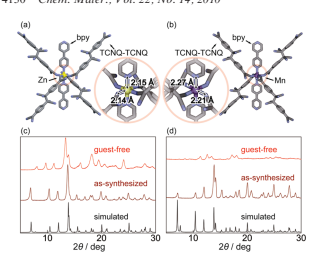
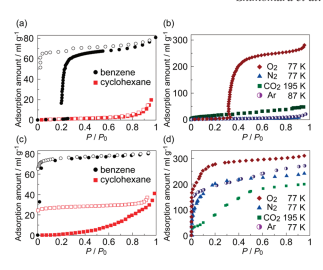
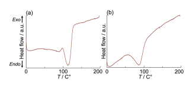
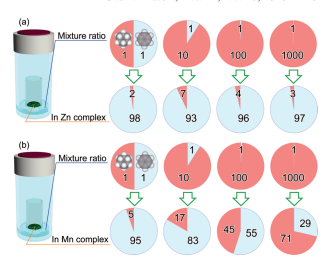

Flexibility of Porous Coordination Polymers Strongly

Linked to Selective Sorption Mechanism Satoru Shimomura,† Ryotaro Matsuda,‡,§ and Susumu Kitagawa*,†,‡,§
†Department of Synthetic Chemistry and Biological Chemistry, Graduate School of Engineering, Kyoto University, Katsura, Nishikyo-ku, Kyoto 615-8510, Japan, ‡ERATO Kitagawa Integrated Pores Project, Kyoto Research Park Building \#3, Shimogyo-ku, Kyoto 600-8815, Japan, and §Institute for Integrated Cell-Material Sciences (iCeMS),
Kyoto University, Yoshida, Sakyo-ku, Kyoto 606-8501, Japan Received May 19, 2010 Revised Manuscript Received June 15, 2010 Soft porous crystals have received increasing attention as new functional porous systems because of their unique molecular accommodation characteristics.1 Dynamic guest sorption by a highly ordered framework provides unique porous properties, which are not seen in other porous materials, and has created a platform for synthetic approaches to new functional materials. In this field, porous coordination polymers (PCPs) (or metal-organic frameworks) are among the most evolving classes of materials in recent decades,2-5 and there has been much

*Corresponding author.

(1) Horike, S.; Shimomura, S.; Kitagawa, S. Nat. Chem. 2009, 1, 695. (2) Batten, S. R.; Robson, R. Angew. Chem., Int. Ed. 1998, 37, 1460. (3) Kitagawa, S.; Kitaura, R.; Noro, S. Angew. Chem., Int. Ed. 2004, 43, 2334.

(4) Ferey, G.; Serre, C. Chem. Soc. Rev. 2009, 38, 1380.

(5) Phan, A.; Doonan, C. J.; Uribe-Romo, F. J.; Knobler, C. B.;
O'Keeffe, M.; Yaghi, O. M. Acc. Chem. Res. 2010, 43, 58.

(6) Kitagawa, S.; Kondo, M. Bull. Chem. Soc. Jpn. 1998, 71, 1739.

(7) Li, H.; Eddaoudi, M.; Groy, T. L.; Yaghi, O. M. J. Am. Chem. Soc.

1998, 120, 8571.

(8) Llewellyn, P. L.; Bourrelly, S.; Serre, C.; Filinchuk, Y.; Ferey, G.

Angew. Chem., Int. Ed. 2006, 45, 7751.

(9) Mulfort, K. L.; Hupp, J. T. J. Am. Chem. Soc. 2007, 129, 9604.

(10) Ma, S. Q.; Sun, D. F.; Simmons, J. M.; Collier, C. D.; Yuan, D. Q.;
Zhou, H. C. J. Am. Chem. Soc. 2008, 130, 1012.

(11) Choi, H. J.; Dinca, M.; Long, J. R. J. Am. Chem. Soc. 2008, 130, 7848.

(12) Dietzel, P. D. C.; Johnsen, R. E.; Fjellvag, H.; Bordiga, S.; Groppo, E.; Chavan, S.; Blom, R. Chem. Commun. 2008, 5125.

(13) Zhang, J. P.; Chen, X. M. J. Am. Chem. Soc. 2008, 130, 6010. (14) Wang, Z. Q.; Cohen, S. M. J. Am. Chem. Soc. 2009, 131, 16675.

(15) Klein, N.; Senkovska, I.; Gedrich, K.; Stoeck, U.; Henschel, A.;
Mueller, U.; Kaskel, S. Angew. Chem., Int. Ed. 2009, 48, 9954.

(16) Cheon, Y. E.; Park, J.; Suh, M. P. Chem. Commun. 2009, 5436.

(17) Ahnfeldt, T.; Guillou, N.; Gunzelmann, D.; Margiolaki, I.;
Loiseau, T.; Ferey, G.; Senker, J.; Stock, N. Angew. Chem., Int.

Ed. 2009, 48, 5163.

(18) Yang, S. H.; Lin, X.; Blake, A. J.; Walker, G. S.; Hubberstey, P.;
Champness, N. R.; Schroder, M. Nature Chem. 2009, 1, 487.

(19) Deng, H. X.; Doonan, C. J.; Furukawa, H.; Ferreira, R. B.; Towne, J.; Knobler, C. B.; Wang, B.; Yaghi, O. M. Science 2010, 327, 846.

(20) Chen, B. L.; Liang, C. D.; Yang, J.; Contreras, D. S.; Clancy, Y. L.;
Lobkovsky, E. B.; Yaghi, O. M.; Dai, S. Angew. Chem., Int. Ed.

2006, 45, 1390.

(21) Alaerts, L.; Kirschhock, C. E. A.; Maes, M.; van der Veen, M. A.;
Finsy, V.; Depla, A.; Martens, J. A.; Baron, G. V.; Jacobs, P. A.;
Denayer, J. E. M.; De Vos, D. E. Angew. Chem., Int. Ed. 2007, 46, 4293.
research published on their potential applications in gas storage,6-19 separation,20-26 sensing,27-33 and catalysis.34-39 In contrast to robust porous frameworks, guest sorption processes with a structural change have a highly complex mechanism, in which guest accommodation and structural transformation proceed simultaneously. This means that flexibility and transformability of the framework have significant influences on the sorption properties, and for that reason, this may lead to an unconventional methodology to control the porous properties.

The sorption properties of PCPs could be changed without tuning the pore sizes and/or pore surface properties, even if they have identical structures. Therefore, we focus on coordination bonds in the framework, which mainly affect the dynamic phenomena of PCPs. Two PCPs consisting of the same components except for the metal cations and forming identical structures were prepared to compare their structural flexibilities and guest sorption properties.

The PCPs [M(TCNQ-TCNQ)bpy]n (M = Mn, Zn)
[TCNQ=7,7,8,8-tetracyano-p-quinodimethane, bpy=4,40bipyridyl] were obtained from methanol and benzene solutions of the metal nitrate, LiTCNQ, and bpy at room temperature.22 In this solution, TCNQ radical anions spontaneously form a σ-bond by using their unpaired electrons, and coalesce into a TCNQ dimer in the complexation

(22) Shimomura, S.; Horike, S.; Matsuda, R.; Kitagawa, S. J. Am.

Chem. Soc. 2007, 129, 10990.

(23) Yoon, J.W.; Jhung, S. H.; Hwang, Y. K.; Humphrey, S.M.;Wood, P. T.; Chang, J. S. Adv. Mater. 2007, 19, 1830.

(24) Couck, S.; Denayer, J. F. M.; Baron, G. V.; Remy, T.; Gascon, J.;
Kapteijn, F. J. Am. Chem. Soc. 2009, 131, 6326.

(25) Li, Y. S.; Liang, F. Y.; Bux, H.; Feldhoff, A.; Yang, W. S.; Caro, J.

Angew. Chem., Int. Ed. 2010, 49, 548.

(26) Venna, S. R.; Carreon, M. A. J. Am. Chem. Soc. 2010, 132, 76.

(27) McManus, G. J.; Perry, J. J.; Perry, M.; Wagner, B. D.; Zaworotko, M. J. J. Am. Chem. Soc. 2007, 129, 9094.

(28) Chen, B. L.; Yang, Y.; Zapata, F.; Lin, G. N.; Qian, G. D.;
Lobkovsky, E. B. Adv. Mater. 2007, 19, 1693.

(29) Ohba, M.; Yoneda, K.; Agusti, G.; Munoz, M. C.; Gaspar, A. B.;
Real, J. A.; Yamasaki, M.; Ando, H.; Nakao, Y.; Sakaki, S.;
Kitagawa, S. Angew. Chem., Int. Ed. 2009, 48, 4767.

(30) Harbuzaru, B. V.; Corma, A.; Rey, F.; Jorda, J. L.; Ananias, D.;
Carlos, L. D.; Rocha, J. Angew. Chem., Int. Ed. 2009, 48, 6476.

(31) Xiao, B.; Byrne, P. J.; Wheatley, P. S.; Wragg, D. S.; Zhao, X. B.;
Fletcher, A. J.; Thomas, K. M.; Peters, L.; Evans, J. S. O.; Warren, J. E.; Zhou, W. Z.; Morris, R. E. Nat. Chem. 2009, 1, 289.

(32) Southon, P. D.; Liu, L.; Fellows, E. A.; Price, D. J.; Halder, G. J.;
Chapman, K. W.; Moubaraki, B.; Murray, K. S.; Letard, J. F.;
Kepert, C. J. J. Am. Chem. Soc. 2009, 131, 10998.

(33) Xie, Z. G.; Ma, L. Q.; deKrafft, K. E.; Jin, A.; Lin, W. B. J. Am.

Chem. Soc. 2010, 132, 922.

(34) Cho, S. H.; Ma, B. Q.; Nguyen, S. T.; Hupp, J. T.; AlbrechtSchmitt, T. E. Chem. Commun. 2006, 2563.

(35) Wu, C. D.; Lin, W. B. Angew. Chem., Int. Ed. 2007, 46, 1075.

(36) Muller, M.; Hermes, S.; Kaehler, K.; van den Berg, M. W. E.;
Muhler, M.; Fischer, R. A. Chem. Mater. 2008, 20, 4576.

(37) Alkordi, M. H.; Liu, Y. L.; Larsen, R. W.; Eubank, J. F.; Eddaoudi, M. J. Am. Chem. Soc. 2008, 130, 12639.

(38) Sun, C. Y.; Liu, S. X.; Liang, D. D.; Shao, K. Z.; Ren, Y. H.; Su, Z. M. J. Am. Chem. Soc. 2009, 131, 1883.

(39) Tonigold, M.; Lu, Y.; Bredenkotter, B.; Rieger, B.; Bahnmuller, S.;
Hitzbleck, J.; Langstein, G.; Volkmer, D. Angew. Chem., Int. Ed.

2009, 48, 7546.
See https://pubs.acs.org/sharingguidelines for options on how to legitimately share published articles.

Downloaded via UNIV OF TORONTO on September 19, 2024 at 17:32:24 (UTC).

process. These components assemble to produce a threedimensional open framework with undulating channels filled with benzene molecules. They have virtually identical structures, but the bond lengths between metal and organic ligands are slightly different. In contrast to the isotropic coordination geometry of the Zn complex, the presence of tetragonal distortion, with the Mn-N(bpy) axial bonds being longer than the Mn-N(TCNQ) equatorial bonds, can be observed in the Mn complex (Figure 1a, b). In this connection, the pore diameter of undulating channels is slightly different between them. It is interesting how these subtle differences in coordination bond and porous structure affect the guest sorption capability of the complexes.

The as-synthesized crystals of the Zn complex transform to a guest-free crystal phase in the guest removal process, and this transformation is reversible. In contrast, the crystals of the Mn complex show a significant decrease in crystallinity in the guest removal process and transform to an amorphous-like phase. This transformation is also reversible and both of these complexes are classified as third-generation compounds6 (Figure 1c, d).

By using these flexible PCPs with different transformability, we compared their sorption properties.

Panels a and c in Figure 2 show the benzene and cyclohexane sorption isotherms of the Zn and Mn complexes. The Zn complex shows apparent selective sorption properties; no uptake of cyclohexane and a gate-opentype sorption behavior for benzene were observed. A
previous study showed that the Zn complex has a good affinity for benzene based on H-π interactions between TCNQ dimers and benzene molecules, and this should be true for the isomorphic Mn complex. However, although a similar tendency is observed in the affinity of the Mn complex for benzene, there are some notable differences in the details of the sorption behavior. Benzene was adsorbed in the low relative pressure region (P < 0.1)
and a Type I adsorption profile without a gate-opening

(40) Sing, K. S. W.; Everett, D. H.; Haul, R. A. W.; Moscou, L.;
Pierotti, R. A.; Rouquerol, J.; Siemieniewska, T. Pure Appl. Chem.

1985, 57, 603.
Figure 1. Crystal structures of (a) Zn complex and (b) Mn complex showing the coordination geometries of as-synthesized phases. XRPD
patterns of (c) Zn complex and (d) Mn complex.

Figure 2. Sorption isotherms of several molecules for (a, b) Zn complex and (c, d) Mn complex. The sorption measurements of benzene and cyclohexane were conducted at 298 K. The filled and open symbols show the adsorption and desorption profiles, respectively.
phenomenon was obtained.40 In addition, cyclohexane

was gradually adsorbed as the pressure increased and a large hysteretic desorption curve was observed. We measured the X-ray powder diffraction (XRPD) patterns of these complexes before and after the cyclohexane sorption measurement. In contrast to no change in the Zn complex, several broad peaks appeared in the pattern of the Mn complex at the simulated peak positions of the assynthesized complex after the sorption measurement.

This result indicates that the Mn complex transforms from an amorphous-like phase to a roughly ordered phase that has a similar structure to the as-synthesized compound in the accommodation process of cyclohexane.

Their gas sorption isotherms are shown in panels b and d in Figure 2. The selective gas sorption property of the Zn complex is very specific; the Zn complex shows a high uptake with gate-open-type sorption behavior only in the case of O2. In contrast, the Mn complex has no selectivity and shows uptake for any gas molecules in the low-pressure region, despite some small differences such as adsorption steps. In addition, it turns out that the Mn complex adsorbed these gas molecules through the gate-opening process, as seen by examining the sorption isotherms in the lowpressure region (see the Supporting Information). This means that the Mn complex also transforms from a nonporous structure to a porous structure accompanying guest accommodation, as was observed with the Zn complex.

On the basis of these results, the distinct differences in sorption properties between Zn and Mn complexes should be explainable by reference to their structural transformability; the structural change of the Mn complex can be induced easier than that of the Zn complex. To determine the reason for this phenomenon, we checked the heat balance in the guest desorption processes by using differential scanning calorimetry (DSC). Figure 3 shows the DSC curves observed for the first heating processes on the assynthesized Mn and Zn complexes. The DSC scan for the Mn complex presented a broad endothermic peak at 87.2 C for the release of benzene. On the other hand, in the case of

Figure 3. DSC curves observed for the first heating process on the assynthesized sample of (a) Zn complex and (b) Mn complex at a scan rate of 2 K min-1.
the Zn complex, not only a broad endothermic peak at about 110 C for the guest release but also an exothermic peak at 98.1 C overlapping each other were observed. This exothermic peak should be derived from the structural transformation accompanying with the guest removal.

The differences in the DSC curves between these complexes indicate that an energy gap between the guest-accommodating phase and the guest-free phase of Zn complex is larger than that of Mn complex. Considering the almost same assynthesized structures of them, stabilities of the guest-free phases are critical elements of the thermal behaviors. The Zn complex is more stabilized thermodynamically through the structural transformation from the guest-accommodating phase to the guest-free phase with long-range structural order than is the Mn complex, whose guest-free phase has no ordered structure. By the cooperative transformation with maintenance of the ordered structure, the Zn complex produces a high energy barrier for guest sorption and only those guest molecules that can supply the adsorption energy produced by a good interaction with the framework, such as charge transfer or CH-π interactions, are able to overcome the energy barrier, induce the structural transformation and be accommodated. However, these results suggest that transformability of PCPs is one of the important factors for selective sorption properties.

We also compared their separation properties by using a benzene/cyclohexane mixture (Figure 4). Because of their chemical similarities and industrial importance, their separation is important.41 Their guest-free phases were exposed to the vapor of mixtures at various mixture ratios at room temperature for 24 h. The ratio of benzene to cyclohexane in the complexes was determined by 1H NMR spectroscopy. The Zn complex showed a quite high separation ability for benzene at all mixture ratios. Over 90% of the adsorbed guest molecules were benzene, even when the mixture ratio of benzene was a mere 0.1%. These complexes can be reused for separation after a desolvation treatment. The Mn complex also showed good separation ability for benzene, although the ability pales compared with that of the Zn

(41) Bai, Y. X.; Qian, J. W.; Zhao, Q.; Xu, Y.; Ye, S. R. J. Appl. Polym.

Sci. 2006, 102, 2832.

Figure 4. Separation properties of (a) Zn complex and (b) Mn complex.

 The red parts and the blue parts of circle graphs show the rates of cyclohexane and benzene, respectively.
complex. The results provide interesting insights into porous systems for the design of separation applications.

Introducing a good affinity for the target molecule into the framework, in this case CH-π interaction for the benzene molecule, is an effective approach for a good separation ability for the Mn complex, but not enough to gain a high selectivity. A blocking effect or a gate effect to prevent the accommodation of the other molecules, found in the sorption isotherms of the Zn complex, is the important factor to achieve highly selective separation ability. Structural flexibility, which can be configured by designability of PCPs, is useful for introducing these effects into the sorption process.

In conclusion, two PCPs consisting of the same components except for the metal cations and forming identical structures have been prepared to compare their selective sorption and separation properties. The structural changes accompanying guest removal vary widely and the differences strongly affect the selective sorption behavior. In this system, the high selective guest accommodation of the Zn complex is based on the crystal-tocrystal transformation with a large energy gap. The results indicate that the flexibility of the framework is one of the important factors determining the porous properties. Tuning the flexibility of PCPs based on designability of the frameworks will offer a new approach to control sorption behavior and a new function based on the dynamic properties of PCPs.

Acknowledgment.This work was supported by an ERATO
JST Project "Kitagawa Integrated Pores Project".

Supporting Information Available: Detailed materials, experimental method, and figures (PDF); X-ray crystallographic file
(CIF). This material is available free of charge via the Internet at http://pubs.acs.org.