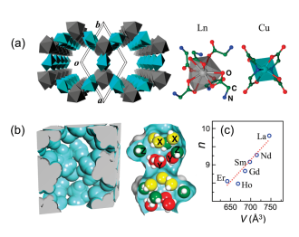
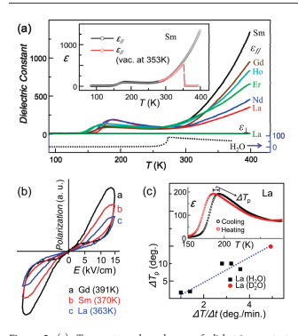
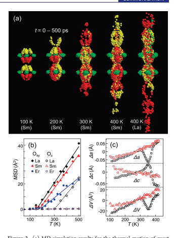

pubs.acs.org/JACS

# Anomalous Dielectric Behavior And Thermal Motion Of

 Water Molecules Confined In Channels Of Porous Coordination Polymer Crystals

Biao Zhou,† Akiko Kobayashi,*,† Heng-Bo Cui,‡ La-Sheng Long,§ Hiroki Fujimori,† and Hayao Kobayashi*,†
†Department of Chemistry, College of Humanities and Sciences, Nihon University, Sakurajosui, Setagaya-ku, Tokyo 156-8550, Japan
‡RIKEN, Wako-shi, Saitama 351-0198, Japan
§College of Chemistry and Chemical Engineering, Xiamen University, Xiamen 361005, China bS Supporting Information ABSTRACT: Guest water molecules confined in channels of porous coordination polymer crystals [Ln2Cu3-
(IDA)6]3 nH2O (Ln = La, Nd, Sm, Gd, Ho, Er; IDA =
[NH(CH2COO)2]
2; n ≈ 9) exhibited large dielectric constants (ε) and antiferroelectric behaviors at high temperatures (e.g., ε(Sm) ≈ 1300 at 400 K). In addition, plots of the temperature dependence of ε showed broad peaks at
∼170 K, below which ε became very small. These puzzling temperature dependences of ε are consistent with the results of molecular dynamics simulations, suggesting the "freezing of thermal motion" of water molecules at ∼170 K.

Recently, porous metalorganic framework crystals have attracted considerable attention for their uses in gas adsorption, separation, and storage.1,2 These crystals also provide opportunities to investigate the physical properties of nanomolecular assemblies. We have previously examined the dielectric properties of ethanol molecules encapsulated in the channels of a crystal of [Mn(HCOO)2] and found a ferroelectric transition.3 Recently, antiferro- and ferroelectric transitions have been discovered in similar metalformate framework systems with ammonium cations, [C][Zn(HCOO)3] (C = (CH3)2NH2 þ, NH4 þ).4,5 Water is an exceptionally polarizable material. Its dielectric constant (ε) increases with decreasing temperature to as much as 88 just above the freezing point, below which ε becomes very small.3b,6 We previously reported that the guest water molecules in the channels of the porous crystal [La2Cu3(IDA)6]3 nH2O (IDA
(iminodiacetate) = [NH(CH2COO)2]
2) exhibited antiferroelectric behavior at high temperatures.7 We report here the dielectric behavior and thermal motion of guest water molecules in [Ln2Cu3(IDA)6]3 nH2O (Ln = La, Nd, Sm, Gd, Ho, Er; n ≈ 9).8 Because the guest water molecules tended to escape from the crystal above ∼315 K, we fabricated small Teflon-sealed cylindrical cells out of heat-resistant polyimide to store the sample crystal during the dielectric measurements. The decrease in ε observed at high temperatures in the previous measurements was completely suppressed.7 X-ray diffraction experiments showed that all these crystals of
[Ln2Cu3(IDA)6]3 nH2O belong to the trigonal system with space group P3c1 (Figure 1a). The guest water molecules are Figure 1. (a) Crystal structure of [Ln2Cu3(IDA)6]3

nH2O (Ln = La, Nd, Sm, Gd, Ho, Er) viewed along the channel direction (||c) and the coordination structures around Ln and Cu atoms. (b) Schematic view of the inner region of the channel and a typical snapshot of the arrangement of water molecules determined by the molecular dynamics simulation. The positions occupied by yellow, red, and green water molecules are called positions X, Y, and Z, respectively. (c) Relation between n and the volume of porous space (V) of the unit cell of [Ln2Cu3(IDA)6]3 nH2O.

accommodated in the channel along the c-axis. The diameter of the channel is not uniform. Large halls and small necks appear alternately along the channel (Figure 1b). Small water clusters, previously termed "Chinese lanterns", exist in the hall.9 The n-value of [Ln2Cu3(IDA)6]3 nH2O was determined from the weight loss of the single crystals after keeping the crystals in glass tubes evacuated at 395 K for 20 h. The obtained n-value decreased with increasing atomic number of Ln. The average value of n was 9.0 (Figure 1c).

We measured ε of [Ln2Cu3(IDA)6]3 nH2O (Ln = La, Nd, Sm, Gd, Ho, Er) at 80400 K for an electric field (E = 0.2 V, 10 kHz)
applied parallel (||) and perpendicular (^) to the c-axis
(Figure 2a). Above room temperature, ε|| increased rapidly with temperature. In contrast, ε^ was small and exhibited featureless temperature dependence (ε^ ≈ 10). When the sample cell was evacuated, ε|| decreased sharply, clearly indicating that the large

Received: January 31, 2011 Published: March 28, 2011
See https://pubs.acs.org/sharingguidelines for options on how to legitimately share published articles.

Downloaded via UNIV OF TORONTO on September 19, 2024 at 17:26:31 (UTC).

Figure 2. (a) Temperature dependences of dielectric constants
(heating cycle) for [Ln2Cu3(IDA)6]3 nH2O (Ln = La, Nd, Sm, Gd, Ho, Er). The dark green line represents the temperature dependence of ε^. The dotted black line represents the dielectric constant of bulk H2O.3b,6 The inset shows the comparison of ε|| for the Sm crystal (black circles) and for the Sm crystal evacuated at 353 K (red circles). (b)
Hysteresis loops of [Ln2Cu3(IDA)6]3 nH2O (Ln = La, Sm, Gd). (c)
Relation between ΔTp and the average speed of the temperature change at ∼170 K (ΔT/Δt) for [La2Cu3(IDA)6]3 nH2O and
[La2Cu3(IDA)6]3 nD2O. The inset shows the temperature dependence of ε|| for [La2Cu3(IDA)6]3 nH2O.
ε originated from guest water molecules (inset of Figure 2a).

With an increase in the atomic number of Ln, the magnitude of ε|| at 400 K changed as La < Nd < Sm > Gd > Ho > Er (Figure 2a).

ε|| of [Sm2Cu3(IDA)6]3 nH2O (hereafter called the Sm crystal)
became 1300, which is 15 times larger than the maximum dielectric constant of bulk water. Figure 2a also shows that ε|| of [Ln2Cu3(IDA)6]3 nH2O exhibited a shallow minimum at
∼240280 K. ε|| then increased with a decrease in temperature and exhibited a drop at 150190 K, below which ε|| became very small (<15). The La and Nd crystals with relatively small ε|| values at 400 K exhibited fairly large peaks at ∼190 K (ε|| ≈ 190);
however, the Sm and Gd crystals with large ε||at 400 K exhibited inconspicuous minima and very small peaks. The Ho and Er crystals exhibited intermediate behaviors. At first sight, these dielectric behaviors appear very unusual. According to the wellknown formula of the entropy (S) of a dielectric material, ΔS -
(dε/dT)E2, S increases with the application of E above room temperature because dε/dT is positive, suggesting that the guest water system is in a "dielectrically ordered state".

10 On the other hand, the negative dε/dT below 240 K suggests the existence of "disordered water molecules" besides the "ordered water system".

The dielectric hysteresis experiments were performed for La, Sm, and Gd crystals.11a Antiferroelectric hysteresis loops were observed at high temperatures (Figure 2b). Consequently, the rapid increase in ε above 350 K is ascribed to approaching the

Figure 3. (a) MD simulation results for the thermal motion of guest water molecules of [Ln2Cu3(IDA)6]3 nH2O. The distribution of oxygen atoms of guest water molecules initially located at sites X (yellow), Y (red), and Z (green) at 100, 200, 300, and 400 K is plotted every 5 ps between 0 and 500 ps (see Figure 1b). (b) Temperature dependences of MSD (Δ2) for water molecules of [Ln2Cu3(IDA)6]3 nH2O (Ln = La, Sm, Er; t = 100 ps). (c) Temperature dependences of the lattice constants of [Gd2Cu3(IDA)6]3 nH2O (black) and the water-free La crystal
[La2Cu3(IDA)6] (red). The ordinates are Δa (= a(T)  a(273 K)), Δc (= c(T)  c(273 K)), and ΔV (= V(T)  V(273 K)). Lattice constants at 273 K: Gd, a = 13.415(1) Å, c = 14.462(1) Å, V = 2253.9 Å3; La
(water-free), a = 13.461(1) Å, c = 14.881(1) Å, V = 2335.0 Å3.
antiferroelectric transition with increasing temperature. At low temperature, the antiferroelectric susceptibility became small and the negative dε/dT became conspicuous. The resemblance between the dielectric behavior below 240 K and that of bulk water suggests that the drop of ε at ∼170 K is due to the "freezing" of the positional freedom of guest water molecules (Figure 2a).

In order to understand the thermal behavior of the water molecules, we performed constant-volume, constant-temperature molecular dynamics (MD) simulations on [Ln2Cu3(IDA)6]3 nH2O (Ln = La, Sm, Er).12,13 We assumed n = 9 (or 18 molecules in the unit cell), because 9 is not only the average value of n
(Figure 1c) but also a suitable number to realize "ordered water arrangement" consistent with the space group P3c1. The atomic coordinates of the host lattice were fixed. As shown in Figure 3a, MD simulations suggested that the positions of all of the water molecules are well fixed at low temperatures. However, with increasing temperature, the molecules tended to move. The mean-squared displacement (MSD, Δ2) indicated the existence of two types of water molecules (Figure 3b). For convenience of explanation, nine molecules in one formula unit forming a small water cluster were tentatively classified into three groups
(Figures 1b and 3a). One is the group of three green molecules occupying three crystallographically equivalent sites Z (Figure 1b). The other two groups are the groups of three yellow molecules and three red molecules. The six positions occupied by the yellow and red molecules (sites X and Y) are crystallographically equivalent. The three green molecules of the Sm, Gd, and Er crystals occupying three secluded positions in the large "hall"
(site Z) naturally did not move within the temperature examined
(<500 K). The green molecules in the La crystal with relatively large porous space began to move at ∼300 K (Figure 3b). On the other hand, the crystallographically equivalent yellow and red molecules existing at narrower parts of the channel (sites X and Y) were fairly mobile and easily exchanged their positions. However, the average distribution of total water molecules was approximately identical to that at low temperature. MSD can be expressed as Δ2≈ 0 at T < Tc, and Δ2- (T  Tc) at T > Tc, where Tc = 150185 K for the molecules initially located at sites X and Y and Tc = 300 K for the molecules initially located at site Z of the La crystal (Figure 3b). These results, indicating the "freezing" of the positions of guest water molecules below Tc, are consistent with the drop of ε at ∼170 K.

As mentioned before, the negative dε/dT below 240 K
suggests the existence of disordered water molecules. Since the Sm and Gd crystals exhibited a large increase in ε at high temperatures and a very small increase below 240 K, they are considered to possess porous spaces suitable for accommodating an ordered water system, which is consistent with the experimentally determined n-value (∼9) of these crystals (Figure 1c).

Consequently, the antiferroelectric order is sufficiently developed, and the space to allow the existence of disordered water molecules is small. However, the porous spaces of the La and Nd crystals are larger than the optimal space to permit the existence of disordered molecules, producing the relatively large dielectric peak at ∼180 K. In contrast, the porous spaces of the Ho and Er crystals are smaller than the optimal space, producing a less perfect molecular arrangement. The positional freedom of disordered molecules will be frozen at ∼170 K, similar to the case of glass transition. In Figure 2c, the difference between the peak temperatures of ε in the cooling and heating cycles (ΔTp) is plotted against the average speed of the temperature change at ∼170 K
(ΔT/Δt) for [La2Cu3(IDA)6]3 nH2O and [La2Cu3(IDA)6]3 nD2O. The relation ΔTp - ΔT/Δt was observed. When ΔT/
Δt is large, it is plausible that the large disorder remains and ΔTp becomes large. On the other hand, when ΔT/Δt is sufficiently small, the disorder is relaxed, reducing ΔTp.

We also examined the temperature dependences of the lattice constants of [Ln2Cu3(IDA)6]3 nH2O by using the crystals sealed in glass capillaries. All of the Ln crystals examined (Ln = La, Sm, Gd, Ho, Er) exhibited distinct anomalies at ∼350 K (Figure 3c).

However, no significant anomaly was observed at ∼170 K. Since the lattice constants of the water-free La crystal [La2Cu3(IDA)6]
showed no anomaly, the 350 K anomaly clearly originates from the structural change in the guest water system.

We performed X-ray structure determination of [Ln2Cu3-
(IDA)6]3 nH2O (Ln = La, Sm, Er) at 113, 173, 233, 273, 313, 353, and 393 K. The oxygen (water) positions determined below 313 K were in good agreement with those obtained by MD
simulation. On the other hand, the oxygen positions could not be determined above 353 K, which is consistent with previous results of the structure determination of the La crystal.7 Because antiferroelectric hysteresis was observed at high temperatures, the order of the arrangement of water molecules within the channel should be sufficiently developed even at 400 K. However, due to the strong one-dimensional nature of the guest water system, the interchannel correlation of water positions tends to be imperfect at high temperature, which will prevent the X-ray determination of water positions.11b The characteristic temperature dependence of the lattice constants at ∼350 K is considered to reflect the temperature dependence of the development of the interchannel correlation between the water positions. Further studies are required to clarify the process of the ordering of water molecules in the channels of the porous crystals.

The guest water system encapsulated in the channels of the coordination polymer crystal [Ln2Cu3(IDA)6]3 nH2O (Ln = La, Nd, Sm, Gd, Ho, and Er) exhibited antiferroelectric behavior and very large enhancement of ε at high temperature. In particular, ε of the Sm crystal became as large as 1300 at ∼400 K. In addition, the crystals exhibited broad dielectric peaks at ∼170 K, below which ε became very small, indicating the freezing of the positional freedom of guest water molecules. These puzzling dielectric behaviors are consistent with the MD simulation results, showing the usefulness of MD simulations in the analyses of the dielectric properties of guest molecules in porous crystals.

## 'Associated Content

bS Supporting Information. Materials and methods; structural information (CIF). This material is available free of charge via the Internet at http://pubs.acs.org.

## 'Author Information

Corresponding Author hayao@chs.nihon-u.ac.jp; akoba@chs.nihon-u.ac.jp

## 'Acknowledgment

This work was financially supported by Grants-in-Aid for Scientific Research (B) (No. 20350069), Young Scientists (B)
(No. 21750153), and Innovative Areas (20110003) from the Ministry of Education, Culture, Sports, Science and Technology of Japan. The study was also supported by the "Strategic Research Base Development" Program for Private Universities subsidized by MEXT (2009) (S0901022).

## 'References

(1) (a) Rosi, N. L.; Eckert, J.; Eddaoudi, M.; Vodak, D. T.; Kim, J.;
O'Keeffe, M.; Yaghi, O. M. Science 2003, 300, 1127–1129. (b) Matsuda, R.; Kitaura, R.; Kitagawa, S.; Kubota, Y.; Belosludov, R. V.; Kobayashi, T. C.; Sakamoto, H.; Chiba, T.; Takata, M.; Kawazoe, Y.; Mita, Y. Nature 2005, 436, 238–241.

(2) (a) Kim, H.; Kim, Y.; Yoon, M.; Lim, S.; Park, S. M.; Seo, G.;
Kim, K. J. Am. Chem. Soc. 2010, 132, 12200–12202. (b) Zheng, S. T.; Bu, J. T.; Li., Y. F.; Wu, T.; Zuo, F.; Feng, P. Y.; Bu, X. H. J. Am. Chem. Soc.

2010, 132, 17062–17064.

(3) (a) Cui, H. B.; Wang, Z. M.; Takahashi, K.; Okano, Y.; Kobayashi, H.; Kobayashi, A. J. Am. Chem. Soc. 2006, 128, 15074–15075. (b) Cui, H. B.; Takahashi, K.; Okano, Y.; Kobayashi, H.; Wang, Z. M.; Kobayashi, A.

Angew. Chem. Int. Ed. 2005, 44, 6508–6512.

(4) Jain, P.; Dalal, N. S.; Toby, B. H.; Kroto, H. W.; Cheetham, A. K.

J. Am. Chem. Soc. 2008, 130, 10450–10451.

(5) Xu, G. C.; Ma, X. M; Zhang, L.; Wang, Z. M.; Gao, S. J. Am.

Chem. Soc. 2010, 132, 9588–9590.

## 

(6) Archer, D. G.; Wang, P. M. J. Phys. Chem. Ref. Data 1990, 19, 371–411.

(7) Cui, H. B.; Zhou, B.; Long, L. S.; Okano, Y.; Kobayashi, H.;
Kobayashi, A. Angew. Chem. Int. Ed. 2008, 47, 3376–3380.

(8) The crystals of [Ln2Cu3(IDA)6]3 nH2O (Ln = La, Nd, Sm, Gd, Ho, Er) were prepared according to the method described in ref 9. The unit cell volumes and volumes of porous spaces are given in the Supporting Information.

(9) Ren, Y. P.; Long, L. S.; Mao, B. W.; Yuan, Y. Z.; Huang, R. B.;
Zheng, L. S. Angew. Chem. Int. Ed. 2003, 42, 532–535.

(10) Frohlich, H. Theory of Dielectrics; Oxford University Press:
London, 1958.

(11) (a) We previously performed the hysteresis experiments on the La crystal,7 but the hysteresis loop faded out at higher temperature because the measurements were made without using a polyimide cell. (b) We previously suggested that the guest water molecules are in the
"1D liquid state" at high temperatures,7 but the original idea must be modified because dε/dT was found to be positive up to 400 K.

(12) MD simulations were performed using the Material Studio Modeling v5.0 software package (Accelrys Inc., San Diego, CA), and the universal force field, as implemented in the Forcite Plus module.

(13) (a) Rappe, A. K.; Casewit, C. J.; Colwell, K. S.; Goddard, W. A.,
III; Skiff, W. M. J. Am. Chem. Soc. 1992, 114, 10024–10035. (b) Casewit, C. J.; Colwell, K. S.; Rappe, A. K. J. Am. Chem. Soc. 1992, 114, 10035–10046. (c) Casewit, C. J.; Colwell, K. S.; Rappe, A. K. J. Am.

Chem. Soc. 1992, 114, 10046–10053.