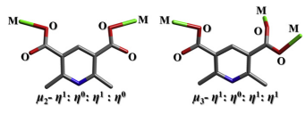
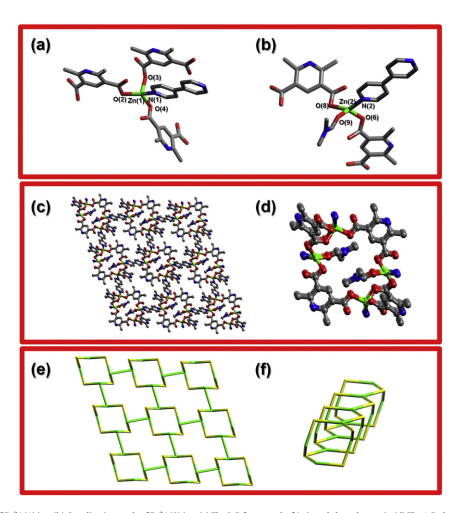
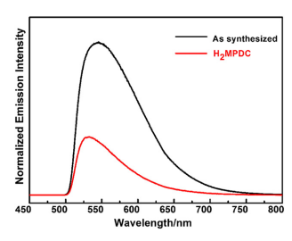

Contents lists available at ScienceDirect

Inorganic Chemistry Communications journal homepage: www.elsevier.com/locate/inoche A new 3D coordination polymer based on

 2,6-dimethylpyridine-3,5-dicarboxylic acid and 4,4′-bipyridine mixed ligands Mingzhen Yang, Ying Shi, Shuang Wang, Jinping Li ⁎
Research Institute of Special Chemicals, Taiyuan University of Technology, Taiyuan 030024, Shanxi, PR China article info abstract Article history:
Received 20 July 2014 Received in revised form 14 August 2014 Accepted 20 August 2014 Available online 22 August 2014 Keywords:
Porous coordination polymer 2,6-Dimethylpyridine-3,5-dicarboxylic acid 4,4′-Bipyridine Mixed ligands Luminescence properties A new porous coordination polymer, namely [Zn2(MPDC)2(4,4′-Bpy)(DMF)]·(DMF) 1 (H2MPDC = 2,6dimethylpyridine-3,5-dicarboxylic acid, 4,4′-Bpy = 4,4′-bipyridine, DMF = N,N′-dimethylformamide), has been successfully synthesized under solvothermal conditions. The result of crystal structural analysis indicates that compound 1 shows a three-dimensional (3D) network framework with 1-D channels along the a-axis. From the view of topology, the framework of 1 can be represented as a 2, 3, 4-connected net. Further characterization of compound 1 was performed by X-ray powder diffraction, thermal gravimetric analyses, and infrared spectra. In addition, compound 1 exhibits strong photoluminescent emissions in the solid state at room temperature.

© 2014 Elsevier B.V. All rights reserved.

In the past two decades, porous coordination polymers (PCPs), as a new class of well-ordered crystalline materials, have attracted researchers' intensively interests not only for their intriguing structural topologies but also for their potential applications as functional materials in gas storage and separation, catalysis, nonlinear optics, optoelectronics, sensors, magnetism, luminosity, porous materials, and so on
[1–3]. Thus, much effort has been devoted to the design and controlled synthesis of porous coordination polymers with unique structures and properties each year [4]. However, to be able to rationally design and construct PCPs with predicted geometries is still a great challenge, as many factors can affect the overall structural formation [5,6].

Among these factors, the structures of the organic ligands play an important role in directing the construction of PCPs with anticipative architectures and functionalities [7]. Recently, 2,3-/2,4-/2,5-/2,6-/3,4-/
3,5-pyridinedicarboxylates (PDCs) have been extensively studied and these ligands containing multi-oxygen and nitrogen atoms and can coordinate with metal ions in different ways, resulting in the formations of various PCPs with specific topologies and interesting properties [8–10]. Compared with these common pyridine dicarboxylic acids (PDCs) effectively utilized in the construction of PCPs, the highlysubstituted PDCs have not been well noticed in the construction of PCPs, for example, only a few 2,6-dimethylpyridine-3,5-dicarboxylic acid
(H2MPDC)-based compounds were reported [8,11–15]. Similar to the 3,5-PDC ligand, H2MPDC is also a rigid V-shaped tri-connected ligand,

⁎ Corresponding author.

E-mail address: jpli211@hotmail.com (J. Li).

http://dx.doi.org/10.1016/j.inoche.2014.08.012 1387-7003/© 2014 Elsevier B.V. All rights reserved.
especially, two non-coordinated –CH3 groups induce a spatial effect on the coordinated nitrogen atom, greatly influencing the structure of the resulting complexes.

As is known, one of the most effective strategies to assemble PCPs is to apply mixed multifunctional organic ligands to connect metal ions. The mixed organic ligands may play different roles in the formation of the final structure of the product [16,17]. As an extension of our research, we choose 4,4′-bipyridine (4,4′-Bpy) as auxiliary ligand on the basis that it was experimentally proven to be a very useful N-containing auxiliary ligand with extensive coordination polymer chemistry [18,19]. Besides, d10 metal ions present variable coordination numbers and geometries, and their complexes generally exhibit luminescent properties [20].

Taking these into consideration, we introduced 4,4′-bipyridine into the system of the H2MPDC ligands with d10 metal ions (Zn II), an interesting three-dimensional porous coordination polymers, [Zn2(MPDC)
2(4,4′-Bpy)(DMF)]·(DMF) 1, was obtained under solvothermal conditions. The single crystal X-ray diffraction analysis reveals that compound 1 crystallizes in the triclinic P-1 space group. The detailed crystallographic data and selected bond lengths and angles for compound 1 are listed in Tables S1 and S2, respectively [21].

Pale yellow rod-like crystals of the metal organic framework were synthesized solvothermally by reacting Zn(NO3)2·6H2O, H2MPDC and 4,4′-bipyridine in molar ratio of 2:3:25 in DMF/CH3CN at 85 °C for 10 h and at 105 °C for 48 h [22]. As shown in Fig. S1, there are two Zn2+ ions, one μ2-MPDC2− anion, one μ3-MPDC2− anion, one 4,4′-Bpy molecule, one coordinated DMF molecule and one uncoordinated DMF
molecule (Fig. 1). The Zn(1)2+ ion adopts an ideal tetrahedral

Fig. 1. Coordination modes of the MPDC2− ligands in 1.

geometry, with two oxygen atoms (O(2), O(3)) from a μ3-MPDC2−

anion, one oxygen atom (O(4)) from a μ2-MPDC2− anion, and one nitrogen atom (N(1)) from a bridging 4,4′-Bpy molecule to form a [Zn(1)
NO3] unit (Fig. 2a). The Zn(1)–L (L = O, N) distances are in the range of 1.992(2)–2.060(2), and the trans L–Zn(1)–L bond angles are in the range of 94.85(9)–140.07(10)°. Then the Zn(2)2+ ion is fourcoordinated with two oxygen atoms (O(6), O(8A)) from a μ3-MPDC2−
anion and a μ2-MPDC2− anion, one oxygen atom (O(9)) from a DMF molecule, one nitrogen atom (N(2)) from a bridging 4,4′-Bpy molecule to form a distorted tetrahedron [Zn(2)NO3] (Fig. 2b). The Zn(2)–L
(L= O, N) distances are in the range of 1.992(2)–2.064(3), and the trans L–Zn(2)–L bond angles are in the range of 89.22(11)–139.97(14)°. Four
[ZnNO3] units are surrounded by two μ2-MPDC2− ligands and two μ3-
MPDC2− ligands to form an 8-ring unit. The adjacent 8-rings are further linked together through the μ3-MPDC2− ligands to construct a 1-D
channel along the a-axis direction, and such 1-D channels are further connected by the 4,4′-Bpy bridges to form a 3-D framework (Fig. 2c and d). The porous sizes are approximately 9.820 × 9.312 Å (measured by the Zn…Zn distances), in which the pores are occupied by coordinated DMF molecules. To better understand the framework topology, compound 1 can be simplified as a combination of 2-connected nodes (4,4′-Bpy molecules and μ2-MPDC2− anions), 3-connected nodes (μ3-MPDC2− anions) and 4-connected nodes (Zn(1)2+ and Zn(2)2+ ions); the assembly of these three types of nodes results in the generation of a 3D network (Fig. 2e and f).

The simulated and experimental XRD patterns of 1 have been shown in Fig. S2. Their peak positions correspond well with the results simulated from the single crystal data, indicating the phase purity of the synthesized samples.

IR data (KBr pellet υ/cm−1): 2927 (w), 2848 (w), 1657 (s), 1604
(vs), 1430 (m), 1422 (m), 1370 (vs), 1222(w), 1144(w), 1074(w),
840(m), 795(m), 700(s) and 640(m) (Fig. S3). It exhibits weak absorption peaks in the range of 3000–2800 cm−1 due to the stretching vibrations of C–H groups. There are no absorption peaks around 1700 cm−1
(–COOH) indicating completely deprotonation of carboxyl groups in the compound [23]. The strong peaks at 1657–1604 cm−1 are ascribed to the stretching vibration of C_N and C_C. And the peaks centered at 1430 cm−1 and 1370 cm−1 are attributed to the stretching vibrations of C–O and C–N groups, respectively. The δO–C–O vibration in plane occurs in middle intensity peaks in the range of 857–700 cm−1.

Fig. 2. (a) Coordination mode of Zn2+(1) ion. (b) Coordination mode of Zn2+(2) ion. (c) The 3-D framework of 1 viewed along the a-axis. (d) The 1-D channel of 1 viewed along the a-axis.

(e) The topology of the 3-D framework of 1 viewed along the a-axis. (f) The topology of the 1-D channel of 1 viewed along the a-axis. All the hydrogen atoms have been omitted for clarity.

Color code: carbon: gray; nitrogen: blue; oxygen: red; zinc: green.
The thermal stability of compound was examined by the TG analysis at a heating rate of 10 °C min−1 from 35 to 800 °C. The TG curve of 1 shows a major weight loss of 80.13% in the temperature range of 100 to 490 °C, corresponding to the loss of two DMF molecules, one 4,4′-
Bpy molecule and two H2MPDC molecules in the framework (calc.

79.33%). The residual weight of 19.87% corresponds to ZnO (calc. 20.67%) (see ESI Fig. S4).

The luminescent properties of H2MPDC and compound 1 were investigated in solid state at room temperature. As shown in Fig. 3, compound 1 exhibits strong photoluminescence with emission maximum at 545 nm upon excitation at 466 nm. For excitation wavelength at 467 nm, a rather weak photoluminescence emission is observed for H2MPDC ligands (λem = 531 nm). Compared with the free H2MPDC
ligand, red shift of 14 nm in compound 1 has been observed. Furthermore, luminescent property of the compound 1 is much better than that of free H2MPDC ligand, which might be attributed to the ligand-to-metal charge transfer. The observation indicates that compound 1 may be an excellent candidate for potential photoactive materials.

In summary, we have synthesized a new porous coordination polymer based on H2MPDC, 4,4′-Bpy mixed ligands and d10 metal ions
(Zn II) under solvothermal conditions. Compound 1 is a 3-D framework constructed from 1-D channels. From the view of topology, the framework of 1 can be represented as a 2, 3, 4-connected net. The fluorescent emission shows that compound 1 may be a good candidate for photoactive materials. It is believed that more porous coordination polymers with interesting structures as well as physical properties will be synthesized by using H2MPDC and 4,4′-Bpy as mixed ligands, and this work is underway in our laboratory now.

## Acknowledgments

The authors acknowledge the financial support of the National Natural Science Foundation of China (Grant Nos. 51203109, 21136007), the Project 2013021008-2 supported by SXNSF, the Qualified Personnel Foundation of Taiyuan University of Technology (QPFT) (No: tyutrc201372a) and the Youth Foundation of Taiyuan University of Technology (Nos. 2013Y009 and 2013Z072).

## Appendix A. Supplementary Data

CCDC 979136 containing the supplementary crystallographic data

for this paper can be obtained free of charge from the Cambridge Crystallographic Data Centre via www.ccdc.cam.ac.uk/data_request/cif.

Powder XRD patterns, IR spectra, and TG curve as well as some structure views of the compounds can be found online at http://dx.doi.org/10. 1016/j.inoche.2014.08.012.

## References

[1] (a) F. Wang, X. Jing, B. Zheng, G. Li, G. Zeng, Q. Huo, Y. Liu, Four Cd-based metal–organic frameworks with structural varieties derived from the replacement of organic linkers, Cryst. Growth Des. 13 (2013) 3522–3527;
(b) K.H. He, Y.W. Li, Y.Q. Chen, W.C. Song, X.H. Bu, Employing zinc clusters as SBUs to construct (3,8) and (3,14)-connected coordination networks: structures, topologies, and luminescence, Cryst. Growth Des. 12 (2012) 2730–2735;
(c) V. Colombo, C. Montoro, A. Maspero, G. Palmisano, N. Masciocchi, S. Galli, E.

Barea, J.A.R. Navarro, Tuning the adsorption properties of isoreticular pyrazolate-based metal–organic frameworks through ligand modification, J.

Am. Chem. Soc. 134 (2012) 12830–12843;
(d) D. Dang, P. Wu, C. He, Z. Xie, C. Duan, Homochiral metal–organic frameworks for heterogeneous asymmetric catalysis, J. Am. Chem. Soc. 132 (2010)
14321–14323.

[2] (a) M.C. Das, Q. Guo, Y. He, J. Kim, C.G. Zhao, K. Hong, S. Xiang, Z. Zhang, K.M.

Thomas, R. Krishna, B. Chen, Interplay of metalloligand and organic ligand to tune micropores within isostructural mixed-metal organic frameworks
(M'MOFs) for Their highly selective separation of chiral and achiral small molecules, J. Am. Chem. Soc. 134 (2012) 8703–8710;
(b) H. Deng, S. Grunder, K.E. Cordova, C. Valente, H. Furukawa, M. Hmadeh, et al.,
Large-pore apertures in a series of metal–organic frameworks, Science 336 (2012) 1018–1023;
(c) Z.R. Herm, B.M. Wiers, J.A. Mason, J.M. van Baten, M.R. Hudson, P. Zajdel, et al.,
Separation of hexane isomers in a metal–organic framework with triangular channels, Science 340 (2013) 960–964;
(d) F. Debatin, A. Thomas, A. Kelling, N. Hedin, Z. Bacsik, I. Senkovska, et al., In situ synthesis of an imidazolate-4-amide-5-imidate ligand and formation of a microporous zinc–organic framework with H2-and CO2-storage ability, Angew. Chem.

Int. Ed. 49 (2010) 1258–1262.

[3] (a) L.H. Wee, C. Wiktor, S. Turner, W. Vanderlinden, N. Janssens, S.R. Bajpe, K.

Houthoofd, et al., Copper benzene tricarboxylate metal–organic framework with wide permanent mesopores stabilized by Keggin polyoxometallate ions, J. Am. Chem. Soc. 134 (2012) 10911–10919;
(b) K.K. Bisht, E. Suresh, Spontaneous resolution to absolute chiral induction:
pseudo-Kagomé type homochiral Zn (II)/Co (II) coordination polymers with achiral precursors, J. Am. Chem. Soc. 135 (2013) 15690–15693;
(c) Z. Zhang, M.J. Zaworotko, Template-directed synthesis of metal–organic materials, Chem. Soc. Rev. 43 (2014) 5444–5455.

[4] (a) D. Wang, T. Zhao, Y. Cao, S. Yao, G. Li, Q. Huo, Y. Liu, High performance gas adsorption and separation of natural gas in two microporous metal–organic frameworks with ternary building units, Chem. Commun. 50 (2014) 8648–8650;
(b) J. Luo, J. Wang, G. Li, Q. Huo, Y. Liu, Assembly of a unique octa-nuclear copper cluster-based metal–organic framework with highly selective CO2 adsorption over N2 and CH4, Chem. Commun. 49 (2013) 11433–11435;
(c) S.Wang, T. Zhao, G. Li, L. Wojtas, Q. Huo, M. Eddaoudi, Y. Liu, From metal–organic squares to porous zeolite-like supramolecular assemblies, J. Am. Chem. Soc. 132
(2010) 18038–18041;
(d) X. Jing, L. Zhang, T. Ma, G. Li, Y. Yu, Q. Huo, M. Eddaoudi, Y. Liu, Assembly of two metal–organic frameworks with intrinsic chiral topology from achiral materials, Cryst. Growth Des. 10 (2009) 492–494.

[5] (a) X. Qu, S. Wang, D. Zhang, X. Jing, L. Zhang, G. Li, Q. Huo, Y. Liu, Temperaturecontrolled hydrothermal synthesis of copper (I or II) coordination polymers via a variety of copper coordination modes, Chem. Res. Chin. Univ. 28 (2012) 581–584;
(b) S. Wang, L.R. Zhang, G.H. Li, Q.S. Huo, Y.L. Liu, Assembly of two 3-D metal–organic frameworks from Cd (II) and 4,5-imidazoledicarboxylic acid or 2-ethyl-4,5imidazoledicarboxylic acid, CrystEngComm 10 (2008) 1662–1666.

[6] (a) X. Zhao, X. Wang, S. Wang, J. Dou, P. Cui, Z. Chen, D. Sun, X. Wang, D. Sun, Novel metal–organic framework based on cubic and trisoctahedral supermolecular building blocks: topological analysis and photoluminescent property, Cryst. Growth Des. 12 (2012) 2736–2739;
(b) D. Sun, N. Zhang, R.B. Huang, L.S. Zheng, Ag3 triangle and Ag4 rectangle supported by deprotonated aminopyrimidyl derivatives and bis (diphenylphosphino)
methane, Inorg. Chem. Commun. 14 (2011) 1039–1042;
(c) D. Sun, Z.H. Wei, D.F. Wang, N. Zhang, R.B. Huang, L.S. Zheng, Acetonitriletemplated assembly of a laminar silver (I) phthalate coordination polymer, Cryst. Growth Des. 11 (2011) 1427–1430;
(d) M. Chen, S.S. Chen, T.A. Okamura, Z. Su, M.S. Chen, Y. Zhao, W.Y. Sun, N. Ueyama, pH dependent structural diversity of metal complexes with 5-(4H-1,2,4-Triazol4-yl) benzene-1,3-dicarboxylic acid, Cryst. Growth Des. 11 (2011) 1901–1912;
(e) D. Sun, Z.H. Wei, C.F. Yang, D.F. Wang, N. Zhang, R.B. Huang, L.S. Zheng, pHdependent Ag (I) coordination architectures constructed from 4cyanopyridine and phthalic acid: from discrete structure to 2D sheet, CrystEngComm 13 (2011) 1591–1601;
(f) S. Noro, R. Kitaura, M. Kondo, S. Kitagawa, T. Ishii, H. Matsuzaka, M. Yamashita, Framework engineering by anions and porous functionalities of Cu (II)/4,4′- bpy coordination polymers, J. Am. Chem. Soc. 124 (2002) 2568–2583.

[7] (a) E.C. Yang, H.K. Zhao, B. Ding, X.G. Wang, X.J. Zhao, Four novel three-dimensional Fig. 3. Fluorescent spectra of compound 1 and H2MPDC ligand at room temperature. triazole-based zinc (II) metal–organic frameworks controlled by the spacers of dicarboxylate ligands: hydrothermal synthesis, crystal structure, and luminescence properties, Cryst. Growth Des. 7 (2007) 2009–2015;
(b) Y. Wang, S.Q. Shen, J.H. Zhou, T. Wang, S.N. Wang, G.X. Liu, Synthesis, structural diversities and properties of a series of transition metal–organic frameworks based on asymmetric dicarboxylic acid and N-donor auxiliary ligand, Inorg. Chem. Commun. 30 (2013) 5–12.

[8] D. Zhang, R. Zhang, J. Li, W. Qiao, S. Wang, Two new 2D coordination polymers constructed from 2,6-dimethylpyridine-3,5-dicarboxylic acid ligands and alkaline earth metals (Sr and Ba), Inorg. Chem. Commun. 35 (2013) 307–310.

[9] L. Chen, X.M. Lin, Y. Ying, Q.G. Zhan, Z.H. Hong, J.Y. Li, N.S. Weng, Y.P. Cai, Synthesis, crystal structures and photoluminescence of Zn–Ln heterometallic polymers based on pyridine-2,3-dicarboxylic acid, Inorg. Chem. Commun. 12 (2009) 761–765.

[10] B. Chen, L. Wang, Y. Xiao, F.R. Fronczek, M. Xue, Y. Cui, G. Qian, A luminescent metal–
organic framework with Lewis basic pyridyl sites for the sensing of metal ions, Angew. Chem. Int. Ed. 48 (2009) 500–503.

[11] K.L. Huang, X. Liu, X. Chen, D.Q. Wang, Spontaneous assembly of 63 topological metal–organic nanotubes with distinct asymmetric subunits for the construction of hydrophilic intertube channels encapsulating rare helical water-chains, Cryst. Growth Des. 9 (2009) 1646–1650.

[12] K.L. Huang, Ligand-directed metal (II) coordination polymers: unusual disorder, and photoluminescence, Inorg. Chim. Acta 361 (2008) 241–247.

[13] K.L. Huang, C.W. Hu, Metal (II)–organic coordination polymers with two distinct atropisomeric building units from an axially prochiral inner salt through interchain C–H…X hydrogen bonds (X = O, Cl; metal = cobalt, nickel), Inorg. Chim. Acta 360 (2007) 3590–3596.

[14] K. Huang, Y. He, D. Wang, W. Pan, C. Hu, [Cd(mpdc)]: a novel five-connected 3-D
zeolite-like framework with intersecting helical chains in diamondoid net of CdII
(mpdc = 2,6-dimethylpyridine-3,5-dicarboxylate), J. Mol. Struct. 832 (2007) 146–149.

[15] X.X. Zhou, M.S. Liu, X.M. Lin, H.C. Fang, J.Q. Chen, D.Q. Yang, Y.P. Cai, Construction of three low dimensional Zn (II) complexes based on different organic–carboxylic acids, Inorg. Chim. Acta 362 (2009) 1441–1447.

[16] X. Jing, X. Zhou, T. Zhao, Q. Huo, Y. Liu, Construction of lanthanide–organic frameworks from 2-(pyridine-3-yl)-1H-4,5-imidazoledicarboxylate and oxalate, Cryst.

Growth Des. 12 (2012) 4225–4229.

[17] (a) O.K. Farha, C.D. Malliakas, M.G. Kanatzidis, J.T. Hupp, Control over catenation in metal–organic frameworks via rational design of the organic building block, J. Am. Chem. Soc. 132 (2010) 950–952;
(b) H. He, D. Collins, F. Dai, X. Zhao, G. Zhang, H. Ma, D. Sun, Construction of metal–
organic frameworks with 1D chain, 2D grid, and 3D porous framework based on a flexible imidazole ligand and rigid benzenedicarboxylates, Cryst. Growth Des.

10 (2010) 895–902;
(c) M. Xue, G. Zhu, H. Ding, L. Wu, X. Zhao, Z. Jin, S. Qiu, Six three-dimensional metal–organic frameworks with (3,4)-, (4,5)-, and (3,4,5)-connected nets based on mixed ligands: synthesis, structures, and adsorption properties, Cryst.

Growth Des. 9 (2009) 1481–1488;
(d) H. Jin, Y. Qi, E. Wang, Y. Li, X. Wang, C. Qin, S. Chang, Molecular and multidimensional organic-inorganic hybrids based on polyoxometalates and copper coordination polymer with mixed 4,4′-bipyridine and 2,2′-bipyridine ligands, Cryst.

Growth Des. 6 (2006) 2693–2698.

[18] Y.L. Wang, D.Q. Yuan, W.H. Bi, X. Li, X.J. Li, F. Li, R. Cao, Syntheses and characterizations of two 3D cobalt–organic frameworks from 2D honeycomb building blocks, Cryst. Growth Des. 5 (2005) 1849–1855.

[19] B. Moulton, M.J. Zaworotko, From molecules to crystal engineering: supramolecular isomerism and polymorphism in network solids, Chem. Rev. 101
(2001) 1629–1658.

[20] Y.H. He, Y.L. Feng, Y.Z. Lan, Y.H. Wen, Syntheses, structures, and photoluminescence of four d10 metal–organic frameworks constructed from 3,5-bis-oxyacetate-benzoic acid, Cryst. Growth Des. 8 (2008) 3586–3594.

[21] Structure crystal structure analysis: suitable single crystal of 1 (0.26 × 0.17 × 0.11 mm)
was selected for single-crystal X-ray diffraction analyses. The intensity data were collected on a Bruker SMART-APEX CCD diffractometer for 1 (λ(Mo-K
α) = 0. 71073 Å). The structure was solved by direct methods and refined by full-matrix least-squares on F2 using SHELXTL Version 5.1. All the metal atoms were located firstly, then the carbon, nitrogen and oxygen atoms of 1 were subsequently found in difference Fourier maps. The hydrogen atoms of the ligands were placed geometrically. All non-hydrogen atoms were refined anisotropically.

[22] (a) All the reagents were obtained from commercial sources and used without further purification. IR spectra were measured on a Nicolet Impact 410 FTIR spectrometer using KBr pellets in the range of 4000–400 cm−1. Thermogravimetric analyses was performed on NETZSCH STA 449C thermogravimetric analyzer used in air with a heating rate of 10 °C min−1 from 35 to 800 °C. Powder X-ray diffraction measurement was performed on a Rigaku Mini FlexII X-ray diffractometer using Cu-Kα radiation (λ = 0.15418 nm) in the 2θ range of 4–40° with a step size of 0.01° and a scanning rate of 2° min−1. Fluorescence spectra were collected on an Edinburgh Instruments FLS920 spectrophotometer at room temperature;(b) Synthesis of compound 1: Zn(NO3)2·6H2O (3.5 mg, 0.0118 mmol), 2,6-dimethylpyridine-3,5dicarboxylic acid (3.7 mg, 0.01875 mmol), 4,4′-bipyridine (24 mg, 0.154 mmol), N,N′-dimethylformamide (1 mL) and acetonitrile (0.8 mL) were sealed in a 20 mL
vial at 85 °C for 10 h, placed under room temperature for 20 h, and then heated to 105 °C for 48 h. After the reaction mixture was cooled to room temperature, and pale yellow rod-like crystals were obtained.

[23] Z.Y. Li, J.W. Dai, N. Wang, H.H. Qiu, S.T. Yue, Y.L. Liu, A series of three-dimensional 4d–4f heterometallic coordination polymers with (2,6)-connected doubly interpenetrated PCU net topology: structural, photoluminescent and magnetic properties, Cryst. Growth Des. 10 (2010) 2746–2751.