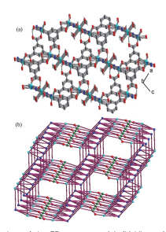

PAPER

Cite this: RSC Adv., 2015, 5, 76752

# Spin-Canting Magnetization In 3D Metal Organic Frameworks Based On Strip-Shaped D-Chains†

Xiu-Mei Zhang,* Peng Li, Wei Gao and Jie-Ping Liu Three isostructural coordination polymers, M2(TZI)(OH)(H2O)2$xH2O (x ¼ 3, M ¼ Cu(II) 1, x ¼ 4, M ¼ Co(II) 2 and Ni(II) 3) (H3TZI ¼ 5-(1H-tetrazol-5-yl)isophthalic acid), have been synthesized under hydrothermal conditions. The compounds consist of 3D frameworks, in which the magnetic D-chain motifs based on corner-sharing M3(m3-OH) isosceles triangle are linked by the TZI ligands, and they represent the rare
(3,4,5,6)-connected 4-nodal net topology with the point symbol (43)(4462)(4664)(4768). Magnetic analyses indicate that compound 1 shows the coexistence of spin canting, metamagnetism and antiferromagnetic ordering, whereas compounds 2 and 3 exhibit canted antiferromagnetic coupling without magnetic ordering down to 2 K. Such magnetic behaviors above 2 K are still rare in Cu(II), Co(II) and Ni(II) compounds with similar chains.

Received 9th August 2015 Accepted 3rd September 2015 DOI: 10.1039/c5ra15937g www.rsc.org/advances

## Introduction

Molecular magnetism has attracted much attention in recent years due to its great value in understanding fundamental magnetic phenomena, revealing magnetostructural relationships, and constructing new molecular magnetic materials with potential technological applications.1–3 In particular, studies have been much promoted by the discoveries of magnetic materials with spontaneous magnetization, such as spin canting, metamagnetism and long-range magnetic ordering. It is well-known that a spin canting system can arise from two mechanisms: single-ion anisotropy and the antisymmetric Dzyaloshinskii–Moriya (DM) interaction.4 They both require that there is no inversion center between the interacting spins. Therefore, the antiferromagnetic (AFM) and ferromagnetic (FM)
coupling between the noncollinear alignment of the spins usually result in spin-canting magnetic behaviors.5 Metamagnetism requires that the chain/layer must have net moments and may be FM or ferrimagnetic (FIM) or AFM with spin canting, and the interchain/interlayer interactions can induce AF ordering and are to be overcome by a critical eld.6 Magnetic materials, especially, those displaying canted metamagnetic ordering, are viewed as one of the good candidates of molecular magnets. However, the design and synthesis of such magnetic materials are still a challenging task. The selection of the short bridging ligands between paramagnetic centers is very important; because they may transmit magnetic coupling and build the secondary building units (SBUs) to construct novel

RSC Advances
 **View Journal | View Issue**

structural topology. The tetrazole and carboxylate as short bridging ligands have attracted much attention due to their coordinative and magnetic versatility. They can bind metal ions in various bridging modes and efficiently induce either FM or AFM coupling.7,8 To date, several Co(II) molecular magnets with tetrazole and m3-OH bridged magnetic D-chains have been synthesized, including metamagnetism, spin-canting and longrange ordered systems.9 But the only one known Cu(II) species10 with the similar chains has been reported, which displays spinfrustrated antiferromagnetic ordering. We are interested in 5-
(1H-tetrazol-5-yl)isophthalic acid (H3TZI), which has several remarkable features as follows: (i) two carboxylate groups may bind to metal centers with various coordination modes, allowing for varied magnetic interactions; (ii) the tetrazolate groups are expected to construct frustrated triangular motifs; (iii) both the carboxylate and tetrazolate groups of H3TZI have the ability to connect metal ions into high dimensional networks. Despite a few compounds with this ligand have been reported,11 it remains largely unexplored. Here we report three isostructural coordination polymers with this ligand, M2(TZI)(OH)(H2O)2-
$xH2O (x ¼ 3, M ¼ Cu(II) 1, x ¼ 4, M ¼ Co(II) 2 and Ni(II) 3) (H3TZI
¼ 5-(1H-tetrazol-5-yl)isophthalic acid), in which the stripshaped D-chains motifs built from corner-sharing M3(m3-OH)
triangle units with mixed double (m4-tetrazolate)(m3-OH)
bridges. Compounds represent the rare (3,4,5,6)-connected 4nodal net topology with the point symbol (43)(4462)(4664)(4768).

Magnetic investigations indicated that they all display intrachain spin canting AFM interactions through the mixed double bridges but the bulk behaviors are different. Compound 1 exhibit spin-canted ordering and metamagnetism, whereas compounds 2 and 3 exhibit canted antiferromagnetic coupling without magnetic ordering down to 2 K, respectively.

College of Chemistry and Materials Science, Huaibei Normal University, Anhui 235000, China. E-mail: zhangxiumeilb@126.com
† Electronic supplementary information (ESI) available: Fig. S1–S5. CCDC
1409334 and 1409333. For ESI and crystallographic data in CIF or other electronic format see DOI: 10.1039/c5ra15937g Noticeably, the complex magnetic phenomena of 1, 2 and 3 are different from previous compounds with similar chains.

## Experimental Materials And Physical Measurements

All the solvents and reagents including 5-(1H-tetrazol-5-yl)
isophthalic acid (H3TZI) were purchased commercially and were used as received. Infrared spectra were recorded on a NEXUS 670 FT-IR spectrometer using the KBr pellets. Elemental analysis was carried out in the range 500–4000 cm1 on an Elementar Vario El III elemental analyzer. The phase purity of the samples was conrmed by powder X-ray diffraction collected on a Bruker D8-ADVANCE diffractometer equipped with Cu Ka at a scan speed of 1 min1. Temperature-dependent and eld-dependent magnetic measurements were carried out on a Quantum Design SQUID MPMS-5 magnetometer.

Diamagnetic corrections were made with Pascal's constants.

[Cu2(OH)(TZI)(H2O)2]n 3nH2O (1). A mixture of Cu(NO3)2-
$3H2O (0.024 g, 0.1 mmol), and H3TZI (0.023 g, 0.1 mmol) in H2O/CH3CN (6/6 mL) was stirred for 10 min at room temperature, then sealed in a Teon-lined stainless steel vessel (25 mL),
heated at 150 C for 2 days under autogenous pressure, and then cooled to room temperature, blue crystals of 1 were obtained. Yield, 53% based on Cu. Elem anal. calcd (%) for C9H14O10N4Cu2: C, 23.23; H, 3.03; N, 12.04. Found (%): C, 23.21; H, 3.05; N, 12.07. Main IR bands (KBr, cm-1): 3457s, 1635m, 1607w, 1569m, 1477m, 1450m, 1418m, 1310s, 1251w, 1207w, 1013s, 932w.

[Co2(OH)(TZI)(H2O)2]n 4nH2O (2). A procedure similar to that for 1 was followed to prepare 2 using Co(NO3)2$6H2O
instead of Cu(NO3)2$3H2O. Red crystals were obtained. Yield, 68% based on Co. Elem anal. calcd (%) for C9H16O11N4Co2: C,
22.80; H, 3.40; N, 11.82. Found (%): C, 22.82; H, 3.43; N, 11.79.

Main IR bands (KBr, cm-1): 3415s, 1623m, 1579w, 1494m, 1429m, 1413m, 1380s, 1229w, 1160w, 1111s, 903w.

[Ni2(OH)(TZI)(H2O)2]n 4nH2O (3). A procedure similar to that for 1 was followed to prepare 3 using Ni(NO3)2$6H2O instead of Cu(NO3)2$3H2O. Green microcrystals were obtained. Our attempts to get single crystals of 3 by different methods did not succeed. Yield, 64% based on Ni. Elem anal. calcd (%) for C9H16O11N4Ni2: C, 22.82; H, 3.41; N, 11.83. Found (%): C, 22.84; H, 3.44; N, 11.86. Main IR bands (KBr, cm1): 3416s, 1624m, 1578w, 1489m, 1430m, 1411m, 1376s, 1224w, 1158w, 1110s, 905w.

## Crystal Structure Analysis

Diffraction data for 1 and 2 were collected at 293 K on a Bruker Apex II CCD area detector equipped with graphitemonochromated Mo Ka radiation (l ¼ 0.71073 A). Empirical ˚
absorption corrections were applied using the SADABS
program.12 The structures were solved by the direct method and rened by the full-matrix least-squares method on F2, with all non-hydrogen atoms rened with anisotropic thermal parameters.13 All the hydrogen atoms attached to carbon atoms were placed in calculated positions and rened using the riding

| Table 1              | Crystal data and structure refinement for compounds 1 and 2   |               |
|----------------------|---------------------------------------------------------------|---------------|
| Compounds            | 1                                                             | 2             |
| Empirical formula    | Cu2C9H14N4O10                                                 | Co2C9H16N4O11 |
| Formula weight       | 465.32                                                        | 474.12        |
| Crystal system       | Monoclinic                                                    | Monoclinic    |
| Space group          | P21/m                                                         | P21/m         |
| a/A                  | 10.0150(9)                                                    | 10.1792(15)   |
| ˚                    |                                                               |               |
| b/A                  | 6.6124(5)                                                     | 6.7279(9)     |
| ˚                    |                                                               |               |
| c/A                  | 12.4721(11)                                                   | 12.8158(18)   |
| ˚ a/                       | 90                                                            | 90            |
| b/                       | 109.412(2)                                                    | 111.698(4)    |
| g/                       | 90                                                            | 90            |
| V/A˚3                | 778.99(11)                                                    | 815.5(2)      |
| Z                    | 2                                                             | 2             |
| Dc (g m3 )                      | 1.984                                                         | 1.931         |
| m (mm1 )                      | 3.977                                                         | 2.102         |
| F(000)               | 468                                                           | 480           |
| Reections collected | 2553                                                          | 14 710        |
| Unique reections    | 1449                                                          | 2013          |
| GOF on F2            | 1.002                                                         | 1.025         |
| Rint                 | 0.0877                                                        | 0.0236        |
| R1 [I > 2s(I)]       | 0.1050                                                        | 0.0345        |
| wR2 (all data)       | 0.2989                                                        | 0.0983        |

model. The coordinated water hydrogen atoms were located from the difference maps. The uncoordinated water hydrogen atoms could not be modeled owing to the disorder and the limited quality of dataset. A summary of the crystallographic data, data collection, and renement parameters are provided in Table 1.

## Results And Discussion Synthesis

Compounds 1–3 were synthesized by the reactions of metal(II)
nitrate and H3TZI ligand in mixed aqueous acetonitrile at 150 C. However, a Cu(II) MOF with TZI (ref. 11a) was obtained by the reactions of copper(II) nitrate and H3TZI ligand in an N,Ndimethylformamide/ethanol solution at 80 C. The compositions and structures in 1–3 are quite different from those for a Cu(II) compound with ref. 11a. Notably, we report the rst examples of novel coordination modes of this ligand. The coordination modes of the TZI ligand for the previous compounds have been given elsewhere.11 The IR spectra of 1–3 show a broad absorption band at 3415–
3457 cm1, which should be ascribed to the n(O–H) vibration of free and coordinated water molecules and the hydroxy groups.

All compounds exhibit characteristic asymmetric (nas) and symmetric (ns) absorptions of the carboxylate groups14 and the tetrazole groups absorption peaks at 1400–1500 cm-1.

15 PXRD of 1–3. PXRD experiments have been carried out for 1–
3 to conrm the phase purity of the bulk samples. In 1 and 2, the experimental and simulated PXRD patterns (Fig. S1 and S2†)
were in good agreement with each other, indicating the phase purity of the as-synthesized products. We failed in obtaining single crystals of 3 for X-ray crystallographic analysis. However, the PXRD pattern of 3 is in good agreement with that calculated from the single-crystal data of 2, suggesting 2 and 3 are isomorphous (Fig. S2†).

## Description Of The Structures

Compounds 1 and 2. X-ray crystallographic analyses revealed that compounds 1 and 2 are isostructural and exhibit threedimensional frameworks in which 1D magnetic D-chains are connected by TZI spacers. The coordination environment of the metal ions are shown in Fig. 1a. There are two crystallographically independent metal(II) ions in the asymmetric unit. Cu1/
Co1 assumes a distorted octahedral [N2O4] coordination geometry dened by two tetrazolate nitrogen atoms (N1B and N1C), three carboxylate oxygen atoms (O1, O2 and O4A), and one m3-OH group oxygen atoms (O5). The M1-N/O distances range from 1.872(13) to 2.242(12) A for Cu1 and 1.996(3) to ˚
2.262(2) A for Co1. Cu1 may also be as an axially compressed ˚
octahedron, in which the equatorial plane contains O1, N1B,
O5, N1C with bond distance of 2.206–2.42 A and the apical ˚
positions are O2 and O4A with bond distance of 2.001 and 1.872 A, respectively. This feature is pertinent to the magnetic prop- ˚
erties. The Cu2/Co2 are located at a inversion center in similar an axially elongated octahedral [N2O4] environments. The equatorial plane is dened by two m3-OH groups oxygen atoms
(O5, O5I) and two tetrazolate nitrogen atoms (N2C, N2E), and the axial sites were occupied by two coordinated water molecules (O6, O6D). It was noted that the coordinated water molecules (O6) is at 2.508(2) A from Cu2, suggesting weak ˚
coordination. If this is not included, the geometry of Cu2 may be described as a distorted quadrilateral. The equatorial M–N/O
distances (av. 1.965(8) A for ˚ 1 and 2.079(1) A for ˚ 2) are somewhat shorter than the axial M–O distances 2.508(2) A for ˚ 1 and 2.140(2) A for ˚ 2. Adjacent the equatorial planes intrachain are slanted towards each other with the average angle of 22.07 for 1 and 25.75 for 2 between the equatorial planes.

The central hydroxyl group uses its oxygen atom binding three M ions, generating an isosceles triangle [M3(m3-OH)] with the M1/M2 distances of 3.562(2) and 3.5869(6) A, and M2 ˚ /M2 of 3.3062(3) and 3.3640(4) A for ˚ 1 and 2, respectively, and Fig. 1 (a) Local coordination environments in compound 1. (b) Infinite

strip-shaped D-chain topology based on corner-sharing M3(m3-OH)
triangle used to assemble 1. Symmetry codes: A x - 1, y, z; B x + 1, y -
1/2, -z + 2; C x + 1, -y + 2, -z + 2; D -x, -y + 2, -z + 1; E x - 1, y, z - 1; F x, -y + 3/2, z; I -x, y - 1/2, -z + 1.

Fig. 2 (a) A view of the 3D structure of 1. (b) View of 3D (3,4,5,6)-
connected net with (43)(4462)(4664)(4768) topology for 1 (Cu1 turquiose, Cu2 green, O red, TZI blue).

M–O–M angle of about 117.0–117.4 for 1 for and 108.9–119.4 for 2. The m3-OH oxygen atom is out of the mean basal plane by 0.3472(3) A for ˚ 1 and 0.4223(3) A for ˚ 2, which results in a noncoplanar [M3(m3-OH)] triangle. The [M3(m3-OH)] triangles are linked by sharing the M2 ions and adjacent M1 ions are bridged by m-N1,N1F-tetrazolate groups to form an innite strip-shaped D-chain along the b direction (Fig. 1b). It should be noted that a few examples of such D-chain topology have been reported so far.9,10 The D-chains in 1 and 2 were interlinked by TZI ligands to generate the 3D network framework with the shortest interchain M/M separations spanned by the TZI ligands being 7.907(4) A and 8.141(1) ˚ A, respectively (Fig. 2a). Each TZI ligand ˚
serves as a m6-bridging mode, with the chelated carboxylate group binding one M1 ion and the other carboxylate group binding one symmetry related M1 ion in a monocarboxylate mode, meanwhile, the tetrazolate group bridging four metal ions (one pair of M1 and one pair of M2). The uncoordinated oxygen atom (O3A) of the monodentate carboxylate group hydrogen-bonded to a m3-OH group oxygen atom (O5) with O5-
H5B/O3A ¼ 148.6(8), H5B/O3A ¼ 1.974(2) A and O5 ˚ /O3A ¼
2.736(2) A for ˚ 1; O5-H5B/O3A ¼ 167.9(2), H5B/O3A ¼
2.136(6) A and O5 ˚ /O3A ¼ 2.792(6) A for ˚ 2.

From the view of topology, the m3-OH group and TZI ligand serve as 3- and 6-connected nodes, respectively, to join three M(II) ions (one M1 and two M2) and six M(II) ions (four M1 and two M2). The M1 and M2 play the 5- and 4-connected role, respectively, to link the TZI nodes and m3-OH nodes (2 tetrazolate + 2 carboxylate + 1 m3-OH nodes for M1 and 2 tetrazolate + 2 m3-OH nodes for M2). Thus, the overall 3D network could be described as a 4-nodal (3,4,5,6)-connected net with the point symbol of (43)(4462)(4768) (Fig. 2b).

## Magnetic Properties

Compounds 1–3. The magnetic susceptibility (c) of compound 1 was measured on a pure polycrystalline sample under 1000 Oe in the range 2–300 K (Fig. 3a). The cT value of per Cu2 at room temperature is about 0.74 emu K mol1, being close to the value expected for two magnetically isolated Cu(II) ions. As the temperature is lowered, the cT value rst decreases to a minimum at 28 K and then show rapid increases to a maximum of 0.79 cm3 mol1 K at 3.5 K, and nally decreases again down to 2 K, while the c value rst increases and then decreases. The data above 130 K follow the Curie–Weiss law with C ¼ 0.78 emu K
mol1 and q ¼ -14.1 K. This behavior of the cT–T plot is characteristic of spin-canted antiferromagnetism, while a peak at 2.5 K in the c–T curve is characteristic for the antiferromagnetic ordering. However, so far, no appropriate theoretical model was used to estimate the magnetic exchange parameters in the complicated system containing the magnetic strip-shaped Dchain with mixed double (m3-OH and m4-tetrazolate) bridges.

In order to conrm the actual coupling nature for compound 1, the zero-eld-cooled (ZFC) and eld-cooled (FC) magnetization were measured under 20 Oe in the range of 2–20 K (Fig. 3b).

The FC and ZFC are identical and show a peak at 2.5 K, implying the short-range order of spins in antiferromagnetic coupling. Furthermore, the ac susceptibility shows a frequency-

Fig. 3 (a) Magnetic susceptibility of 1 plotted as cT vs. T and c vs. T

curves at 1 kOe. (b) The FCM and ZFCM curves at 20 Oe for 1. (c)
Magnetic susceptibility (AC) obtained at 3 Oe field for 1. The lines are guides.

Fig. 4 (a) Isothermal magnetization curves at 2 K for 1; (b) FC
magnetization curves for 1 at different fields.
independent maximum at 6 K in the real (c0) component
(Fig. 3c), and no signal was observed in imaginary component
(c00), supporting the onset of antiferromagnetic ordering below Tc ¼ 2.6 K.

The isothermal magnetization curve at 2 K rst increases rapidly and then increases slowly to 0.61 Nb at 50 kOe with increased eld, which is much lower than the saturation value of two Cu(II) ions (2.00 Nb) (Fig. 4a), conrming a canted antiferromagnet. The linear region in high eld was extrapolated to zero eld, which gives a magnetization value of 0.415 Nb. That value could be taken as the weak magnetization (Mr) contribution arising from spin canting. Thus, the canting angle (g) can be roughly estimated by sin(g) ¼ Mr/MS to be 11.98(MS ¼ 2.0 Nb for two Cu(II) ions).1a In the low-eld region, the magnetization curve presents a sigmoid shape, which indicates a metamagnetic behavior. The critical eld is estimated to be about 1.7 kOe according to the dM/dH derivative plot (Fig. 4a). Metamagnetism is also conrmed by the eld-cooled (FC) magnetizations under different elds (Fig. 4b). The FC plot displays a maximum under 1.5 kOe at about 2.3 K, supporting the occurrence of antiferromagnetic ordering. As the eld is lied, the maximum shis toward lower temperatures and becomes less prominent. When the external eld is increased to 2.5 kOe, the maximum disappears, indicating that the antiferromagnetic interactions were overcome by a high eld.16 The magnetization loop was measured by cycling of the eld between -50 and 50 kOe at 2 K. No hysteresis was observed upon cycling of the eld between 50 and 50 kOe at 2 K (Fig. S3†).

According to the structural data, Cu1 assumes an axially compressed octahedron, while Cu2 is an axially elongated octahedron. So, the unpaired electron is in dz 2 orbital of Cu1 but in dx2 - y 2 of Cu2. So that it is ferromagnetic coupling between Cu1 and Cu2 ions. It is well known that the interaction in the Cu(II)
systems is sensitive to the Cu–O–Cu angle, with large bridging angles (>97.5) transmitting antiferromagnetic coupling.17 Thus, O5 and tetrazole ligand mediate the antiferromagnetic coupling between Cu2 ions, because 1 has a larger Cu2–O–Cu2 angle
[117.37] in equatorial plane and tetrazole provides a two - atoms bridge mediating antiferromagnetic interaction in spin polarization mechanism. The interaction intrachain between Cu1 ions is very weak by tetrazole groups, which can be neglected. The antiferromagnetic coupling is much stronger than the ferromagnetic coupling, so the spin at Cu1 is frustrated. Just for this reason, this system shows the spin-canting phenomenon. The canting source is from Cu1 and the canting angle should be larger than the usual antiferromagnetic system.

The magnetic susceptibility (c) of 2 is shown in Fig. 5a. The cT value per Co2 at room temperature is about 6.42 emu K
mol-1, which is much larger than the spin-only value of 3.75 emu K mol1 for three non-interacting octahedral Co(II) ions (S
¼ 3/2, g ¼ 2.00), owing to the strong orbital contribution. As the temperature is lowered, the cT value decreases continuously, while the c value increases slowly to an approximate plateau at about 9 K and then increases rapidly upon further cooling to 2 K. This shape of the plots may be attributed to spin canting, due to the alignment of these antiferromagnetic interactions in an isosceles triangle. The data above 200 K follow the Curie–Weiss law with C ¼ 6.72 emu K mol-1 and q ¼ -14.3 K. The decrease of cT with decreased temperature indicates antiferromagnetic coupling between Co(II) ions. But the negative q value is not necessary for the antiferromagnetic interactions because a single octahedral Co(II) ion has the effects of the spin–orbital coupling. The isothermal magnetization curve measured at 2 K
(Fig. 5b) also supports the spin-canting of 2. The magnetization rst increases rapidly and then increases slowly with the 0.75 Nb at 50 kOe with increased eld, which is much lower than the saturation value of two Co(II) ions. These features are consistent with the antiferromagnetic interactions in the intrachain. The nonlinearity of the low-eld range can be due to spin canting.

Thermal ac susceptibilities were measured on 2 under a zero dc eld at different frequencies (Fig. S4†). The real (c0) component exhibits a frequency-independent without the maximum and no signal was observed the imaginary component (c00), suggesting magnetic ordering not occurring above 2 K. The intrachain magnetic behaviors are similar to those of previous compounds with similar D-chains based on mixed double bridges (m3-OH
and m4-tetrazolate),9 which also are ascribed to the spin canting antiferromagnetic coupling.

The overall magnetic behavior of 3 is similar to that of 2. The cT value per Ni2 at 300 K is 2.54 emu K mol-1, corresponding to

a S ¼ 1 spin with g > 2 (Fig. 6a). Upon cooling, the cT value decreases continuously, while the c value increases slowly to an approximate plateau and then increases rapidly upon further cooling to 2 K. This behavior is characteristic of a canted spin system. The data above 120 K follow the Curie–Weiss law with C
¼ 2.92 emu K mol-1 and q ¼ -44.3 K. The negative value of q indicates antiferromagnetic coupling in the high temperature range. The magnetization curve increases nonlinearly with the 0.32 Nb at 50 kOe with increased eld (Fig. 6b), which is far from the saturation value, in agreement with that expected for a spin-canted antiferromagnet. Frequency independent behavior was observed in thermal ac susceptibility curves (Fig. S5†). No maximum in the real component (c0) and no imaginary signal (c00) were observed, indicating the antiferromagnetic interaction between Ni(II) ions and the absence of long-range ordering above 2 K.

Spin canting can be constructed by using D-chain containing triangle motifs with antisymmetric magnetic exchange and/or

Fig. 5 (a) The cT and c vs. T plot of 2 at 1 kOe; (b) field-dependent

isothermal magnetization curve of 2 at 2 K.

Fig. 6 (a) The cT and c vs. T plot of 3 at 1 kOe; (b) field-dependent isothermal magnetization curve of 3 at 2 K.
single-ion magnetic anisotropy. The isostructural compounds 1–3 with magnetic D-chain all exhibit intrachain spin canted antiferromagnetic interactions but show distinct bulk properties:
compound 1 shows spin canting, antiferromagnetic ordering and eld-induced metamagnetism, whereas compounds 2 and 3 exhibit canted antiferromagnetic coupling without magnetic ordering above 2 K. The canted antiferromagnetic coupling in 1 arised from the competition of antiferromagnetic and ferromagnetic interactions between spins, which results in uncompensated residual spins. The spin-competing antiferromagnetic interaction is presented in this system due to the magnetic Dchains. As for 2 and 3, the Co(II) and Ni(II) ions have spin–orbital coupling and single-ion anisotropy. The spin–orbital coupling destroys the competing interaction in the system, and results in spin canting, and single-ion anisotropy (one of the origins of spincanting) of Co(II) ion favours spin canting. The occurrence of 3D
magnetic ordering may be related to the intrachain and/or interchain interactions. Generally, the intrachain factors can determine the occurrence of ordering and the ordering temperature.18 The ordering temperature can also be evoked by interchain exchange and the degree of spin canting. Two interchain interactions are essential for magnetic ordering: one is the superexchange interactions interchains through weak bonds, which disappears very rapidly as the distance increases, and the other is dipolar interactions interchains through space, which has long-range effects. The magnetic difference among compounds 1–3 is related to interchain and/or intrachain interaction. It is difficult to make detailed comparisons between the two series owing to the wide different nature of bridges and spin centers.

## Conclusions

Three new spin canting magnets with corner-sharing M3(m3-OH)
isosceles triangle D-chain were synthesized and structurally and magnetically characterized. The isostructural compounds 1–3 show 3D structures assembled by the TZI (H3TZI ¼ 5-(1H-tetrazol5-yl)isophthalic acid) ligands linking D-chains, which represent the rare (3,4,5,6)-connected 4-nodal net topology with the point symbol (43)(4462)(4664)(4768). Magnetic investigations on three compounds reveal that all exhibit intrachain canted antiferromagnetic interactions. 1 shows the coexistence of spin canting, metamagnetism and antiferromagnetic ordering, whereas 2 and 3 exhibit canted antiferromagnetic coupling without magnetic ordering above 2 K. More interesting, the coexistence of several magnetic behaviors was observed in 1, and the origin of spin canting was discussed. Especially, compounds 1 and 3 are the rst Cu(II) and Ni(II) compounds with such magnetic behaviors above 2 K in the series. This work provide a good example for magnetic studies with similar structures and different spin carriers to research magneto-structural correlations.

## Acknowledgements

We are thankful for the nancial support from NSFC (21201069)
and the Natural Science Foundation of Anhui Province (1308085QB23).

## Notes And References

1 (a) O. Kahn, Molecular Magnetism, VCH, Weinheim, Germany, 1993; (b) J. S. Miller, Adv. Mater., 2002, 14, 1105;
(c) J. S. Miller and M. Drillon, Magnetism: Molecules to Materials, Wiley-VCH, Weinheim, Germany, 20022005, vol. IV; (d) R. L. Carlin. Magnetochemistry, Springer, Berlin-Heidelberg, 1986; (e) C. Coulon, H. Miyasaka and R. Cl´erac, Struct. Bonding, 2006, 122, 163.

2 (a) D. F. Weng, Z. M. Wang and S. Gao, Chem. Soc. Rev., 2011, 40, 3157; (b) J. R. Li, R. J. Kuppler and H.-C. Zhou, Chem. Soc. Rev., 2009, 38, 1477; (c) P. Zhang, Y. N. Guo and J. Tang, Coord. Chem. Rev., 2013, 257, 1728; (d) X. Y. Wang, C. Avendano and K. R. Dunbar, Chem. Soc. Rev., 2011, 40, 3213.

3 (a) Y. Hu, M. Zeng, K. Zhang, S. Hu, F. Zhou and M. Kurmoo, J. Am. Chem. Soc., 2013, 135, 7901; (b) S. Xiang, X. Wu, J. Zhang, R. Fu, S. Hu and X. Zhang, J. Am. Chem. Soc.,
2005, 127, 16352; (c) P. L. Arnold, Nat. Chem., 2012, 4, 967;
(d) D. Gatteschi and R. Sessoli, Angew. Chem., Int. Ed., 2003, 42, 268.

4 (a) T. Moriya, Phys. Rev., 1960, 117, 635; (b) I. Dzyaloshinsky, J. Phys. Chem. Solids, 1958, 4, 241; (c) T. Moriya, Phys. Rev., 1960, 120, 91.

5 (a) M. B. Hastings, Phys. Rev. B: Condens. Matter Mater. Phys.,
2001, 63, 014413/1; (b) D. Shao, S.-L. Zhang, X.-H. Zhao and X.-Y. Wang, Chem. Commun., 2015, 51, 4360; (c) B. Li, Z. Li, R.-J. Wei, F. Yu, X. Chen, Y.-P. Xie, T.-L. Zhang and J. Tao, Inorg. Chem., 2015, 54, 3331; (d) B. M. Bartlett and D. G. Nocera, J. Am. Chem. Soc., 2005, 127, 8985; (e)
D. Papoutsakis, D. Grohol and D. G. Nocera, J. Am. Chem.

Soc., 2002, 124, 2647.

6 (a) B. Deviren and M. Keskin, Phys. Lett. A, 2010, 374, 3119;
(b) N. Motokawa, S. Matsunaga, S. Takaishi, H. Miyasaka, M. Yamashita and K. R. Dunbar, J. Am. Chem. Soc., 2010, 132, 11943; (c) W.-W. Sun, C.-Y. Tian, X.-H. Jing, Y.-Q. Wang and E.-Q. Gao, Chem. Commun., 2009, 4741; (d)
X.-M. Zhang, Y.-Q. Wang, Y. Song and E.-Q. Gao, Inorg.

Chem., 2011, 50, 7284.

7 (a) W. Ouellette, A. V. Prosvirin, K. Whitenack, K. R. Dunbar and J. Zubieta, Angew. Chem., 2009, 121, 2174; Angew. Chem.,
Int. Ed., 2009, 48, 2140; (b) M. Dinca, A. F. Yu and J. R. Long, J.

Am. Chem. Soc., 2006, 128, 8904; (c) G. Arom´ı, L. A. Barrios, O. Roubeau and P. Gamez, Coord. Chem. Rev., 2011, 255, 485; (d) X.-B. Li, J.-Y. Zhang, Y.-Q. Wang, Y. Song and E.-Q. Gao, Chem.–Eur. J., 2011, 17, 13883; (e) X.-B. Li, G.-M. Zhuang, X. Wang, K. Wang and E.-Q. Gao, Chem.

Commun., 2013, 49, 1814; (f) Q.-X. Jia, Y.-Q. Wang, Q. Yue, Q.-L. Wang and E.-Q. Gao, Chem. Commun., 2008, 4894; (g)
X.-M. Zhang, P. Li, W. Gao, J.-P. Liu and E.-Q. Gao, Dalton Trans., 2015, 511.

8 (a) H. Tian, Q.-X. Jia, E.-Q. Gao and Q.-L. Wang, Chem.

Commun., 2010, 46, 5349; (b) M. Kurmoo, Chem. Soc. Rev.,
2009, 38, 1353; (c) Q. Sun, A.-L. Cheng, Y.-Q. Wang, Y. Ma and E.-Q. Gao, Inorg. Chem., 2011, 50, 8144; (d) Y.-Z. Zheng, M.-L. Tong, W. X. Zhang and X.-M. Chen, Angew. Chem.,
Int. Ed., 2006, 45, 6310; (e) S. R. Caskey, A. G. Wong-Foy and A. J. Matzger, J. Am. Chem. Soc., 2008, 130, 10870; (f)
E. A. Nytko, J. S. Helton, P. Muller and D. G. Nocera, ¨ J. Am.

Chem. Soc., 2008, 130, 2922.

9 (a) R.-X. Yao, Y.-L. Qin, F. Ji, Y.-F. Zhao and X.-M. Zhang, Dalton Trans., 2013, 6611; (b) W.-C. Song, J. Tao, T.-L. Hu, Y.-F. Zeng and X.-H. Bu, Dalton Trans., 2011, 11955; (c)
E.-C. Yang, Z.-Y. Liu, X.-Y. Wu and X.-J. Zhao, Chem.

Commun., 2011, 47, 8629; (d) D.-S. Liu, Y. Sui, T.-W. Wang, C.-C. Huang, J.-Z. Chen and X.-Z. You, Dalton Trans., 2012, 5301.

10 E.-C. Yang, Z.-Y. Liu, X.-Y. Wu, H. Chang, E.-C. Wang and X.-J. Zhao, Dalton Trans., 2011, 10082.

11 (a) F. Nouar, J. F. Eubank, T. Bousquet, L. Wojtas, M. J. Zaworotko and M. Eddaoudi, J. Am. Chem. Soc., 2008, 130, 1833; (b) A. J. Calahorro, A. Salinas-Castillo, J. M. Seco, J. Zuniga, E. Colacioa and A. Rodr ˜ ´ıguezDi´eguez, CrystEngComm, 2013, 15, 7636; (c) Z.-R. Qu, Z. Xing, B.-Z. Wu, X.-Z. Li and G.-F. Han, Z. Anorg. Allg.

Chem., 2009, 635, 39; (d) J. Jia, J.-N. Xu, S.-Y. Wang, P.-C. Wang, L.-J. Gao, M. Yu, Y. Fan and L. Wang, CrystEngComm, 2015, 17, 6030.

12 G. M. Sheldrick, Program for Empirical Absorption Correction of Area Detector Data, University of G¨ottingen, Germany, 1996.

13 G. M. Sheldrick, SHELXTL Version 5.1, Bruker Analytical X-ray Instruments Inc., Madison, Wisconsin, USA, 1998.

14 (a) K. Nakamoto, Infrared and Raman Spectra of Inorganic and coordination Compounds Part B, John Wiley, New York, 5th edn, 1997; (b) G. B. Deacon and R. J. Phillips, Coord. Chem.

Rev., 1980, 33, 227.

15 (a) Y. C. Qiu, H. Deng, J. X. Mou, S. H. Yang, M. Zeller, S. R. Batten, H. H. Wu and J. Li, Chem. Commun., 2009, 5415; (b) Y. C. Qiu, Y. H. Li, G. Peng, J. B. Cai, L. M. Jin, L. Ma, H. Deng, M. Zeller and S. R. Batten, Cryst. Growth Des., 2010, 10, 1332; (c) B. Liu, Y. C. Qiu, G. Peng and H. Deng, CrystEngComm, 2010, 12, 270.

16 R. L. Carlin. Magnetochemistry, Springer, Berlin, 1986. 17 (a) R. W. Jotham and S. F. A. Kettle, Inorg. Chim. Acta, 1970, 4, 145; (b) Y.-f. Song, C. Massera, O. Roubeau, P. Gamez, A. M. M. Lanfredi and J. Reedijk, Inorg. Chem., 2004, 43, 6842; (c) V. H. Crawford, H. W. Richardson, J. R. Wasson, D. J. Hodgson and W. E. Hateld, Inorg. Chem., 1976, 15, 2107.

18 (a) J. S. Miller, Chem. Soc. Rev., 2011, 40, 3266; (b) M. Drillon and P. Panissod, J. Magn. Magn. Mater., 1998, 188, 93; (c) P. Panissod and M. Drillon, in Magnetism-From Molecules to Materials, ed. J. S. Miller and M. Drillon, Wiley-VCH,
Weinheim, 2002, vol. IV, p. 233269.