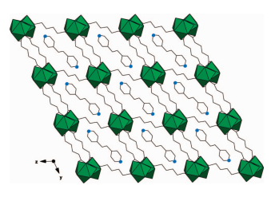

# Synthesis And Characterization Of A Praseodymium–Adipate Framework Templated With 1,2-Bis(4-Pyridyl)Ethane: Host–Guest Interactions And Structural Survey

Daniel T. de Lill† and Christopher L. Cahill*,†,‡
Department of Chemistry, The George Washington UniVersity, 725 21st Street NW,
Washington, D.C. 20052, and Geophysical Laboratory, Carnegie Institution of Washington, 5251 Broad Branch Road NW, Washington, D.C. 20015 ReceiVed August 6, 2007; ReVised Manuscript ReceiV*ed September 6, 2007* ABSTRACT: A new templated metal–organic framework has been synthesized and characterized: [Pr2(C6H8O4)3(H2O)2]·(C12H12N2).

This structure represents the completion of a series of lanthanide–adipate metal–organic framework materials that have been templated with 4,4′-bipyridine-derived template molecules. Host–guest interactions have been qualitatively analyzed within this system along with previously templated systems. On the basis of these observations, a series of guidelines have been established to predict template occlusion. These guidelines include hard–soft acid–base considerations, hydrophobic–hydrophilic interactions, hydrogen bonding, and geometric considerations. These criteria may aide in the future utilization of templates in the topological control of metal–organic frameworks.

The study of metal–organic framework (MOF) materials has received much attention in recent years.1–4 This is not surprising, considering their wide range of potentially useful applications and their straightforward synthesis.5–7 MOFs are composed of metal centers that are essentially polymerized into extended structures through organic linker molecules. In transition-metal-based MOF systems, topological control is rendered by taking advantage of the predictable coordination geometries of the metal centers. The lanthanide elements, on the other hand, pose a distinct challenge in that they often possess high coordination numbers with a range of feasible coordination geometries that are arguably based on steric hindrance (due in part to the highly ionic nature of their bonding) rather than more directional, covalent bonding as seen in the transition metals.8 This same challenge is also an advantage to studying MOFs of the lanthanide elements in that the structural diversity is extensive, with rich topologies that are not easily achieved with other metals. Still, topological formation is difficult to predict and control. In this regard, our work has borrowed inspiration from more traditional framework materials such as zeolites,9–11 in which a structure-directing agent (SDA),12 or template, is used to promote the formation of novel topologies. The template is either a molecular or ionic species around which the framework assembles and crystallizes. In our opinion, the use of templates in MOF materials is not as well-developed as in other systems and remains relatively unexplored.13–23 Our laboratory has had much success with the use of 4,4′-
bipyridine as a templating agent (as well as a sensitizer for luminescence emission)24 in the synthesis of lanthanide MOFs. As such, we have explored molecular species that are directly related to 4,4′-bipyridine by varying the distance between the two pyridyl rings. To date, we have used these molecules to template a number of structures,21–23 yet attempts to incorporate (for reasons discussed herein) the ethane-bridged bipyridine species, 1,2-bis(4-pyridyl)ethane (DPE), into the adipate framework had eluded all efforts until now. In this communication, we report the synthesis and properties of this material, [Pr2(C6H8O4)3(H2O)2]·(C12H12N2), which represents the final structure in our family of templated lanthanide-adipate frameworks.

The title compound, which we refer to as GWMOF-11 was synthesized hydrothermally over three days at 120 °C. Hydrated PrCl3, adipic acid, and DPE were combined in a 23 mL Teflon-

See https://pubs.acs.org/sharingguidelines for options on how to legitimately share published articles.

Downloaded via UNIV OF TORONTO on September 19, 2024 at 17:30:44 (UTC).

Figure 1. Title compound (GWMOF-11) viewed down the [100]

direction. Green polyhedra represent the PrO9 coordination sphere with the attached black lines representing the adipate linker. The black lines with blue spheres are the template molecules, DPE. lined Parr bomb in the relative molar ratios of 1.5:2:5, followed by the addition of 2 mL of distilled water (pH 5.0). After 3 days, a clear orange liquid (final pH 4.9) was decanted from light green crystals. The crystals were then washed several times with both water and ethanol, and allowed to air-dry at room temperature
(∼55% yield based on Pr). The title compound was also produced by increasing the starting pH to ∼6.5 using concentrated ammonium hydroxide. Elemental analysis was performed and shows good agreement (found/calcd): C (3.35, 3.09); H (1.01, 1.04); N (3.60%, 3.60).

A representative single crystal was selected from the sample and mounted on a glass fiber for single-crystal X-ray diffraction analysis,25–28 and the structure is described here. GWMOF-11
(Figures 1 and 2) comprises PrO9 polyhedra that are edge-shared into chains running down the [100] direction. Oxygen atoms O1 and O4 of the carboxylate functional groups from the adipic acid bind to the metal centers in a bridging tridentate fashion, whereas O2, O5, O6, and O7 link in a bidentate manner. There is one bound water molecule (O3) per Pr(III) center. The PrO9 chains are linked in the [010] and [001] directions by adipate anions to form an overall three-dimensional structure. Within the channels of this structure, there are neutral molecules of DPE. The pyridine rings are parallel to each other, connected by an ethane bridge, resembling a "z" shape when viewed from the side (see the Supporting
* Corresponding author. Phone: (202) 994-6959. Fax: (202) 994-5873. E-mail:
cahill@gwu.edu. † The George Washington University.

‡ Carnegie Institution of Washington.

Figure 2. ORTEP drawing of GWMOF-11. Ellipsoids are shown at the 50% probability level. Hydrogen atoms are omitted for clarity.

Superscript indicates symmetry transformation: i ) –x, –y, –z.
Information), with the angle between the rings and the ethane bridge
(as measured from atoms C12, C15, C15′) approaching tetrahedral at 110.46° and a torsion angle (as measured from atoms C12, C15, C15′, C12′) of 180.0°. This orientation and geometric parameters are similar to those found in related systems such as a Ca(II)–adipate–DPE (GWMOF-8).22 In addition, a search of the Cambridge Structural Database (CSD)29 and subsequent analysis using the Vista program30 revealed 250 structures containing DPE (either as a ligand or as a free molecule). Within this search, 382 different torsion angles were found, with an average absolute value of 156.2°
and a majority (275) ranging between 170 and 180°. Further, intrachain angles (i.e., those equivalent to C12, C15, and C15′ in GWMOF-11) were analyzed and found to have an average value of 113.1°, with 351 in the range of 110–120°. There are no interactions between the pyridine rings themselves based on π–π stacking as the pyridyl Cg–Cg distance is nearly 8 Å. There is a relatively strong hydrogen bond, however, between the bound water on the Pr(III) center (O3) and the nitrogen atom of the DPE (N1) at a donor–acceptor distance of 2.771 Å.

Thermogravimetric analysis was conducted on GWMOF-11 (see the Supporting Information) using a TA Instruments TGA 2050 from 30 to 600 °C at 10 °C/min under a N2 gas flow. The compound shows an initial weight loss of approximately 4.5% occurring at around 125 °C, followed by a second weight loss of 17.5% at 200 °C (total weight loss of 22.0%). These correspond to loss of the bound water ligands (calculated, 3.9%) and DPE (calculated, 19.7%), for a total theoretical weight loss of 23.6%. There are two more decomposition steps at 340 °C (18.5%) and 410 °C (21.7%), indicating loss of the adipate anions except for four oxygen atoms per formula unit needed for the final degradation product (total actual weight loss ) 39.5%, theoretical ) 40.2%). The final product forms at 550 °C, which is a praseodymium oxide, PrO1.83(PDF 060329),31 representing a final weight percentage of 36.5%, and is in good agreement with the data (37.5%). It is also interesting in that some of the Pr(III) must have been oxidized during the TGA to form Pr(IV) in order to produce the PrO1.83.

This compound represents the final component of our studies of the 4,4′-bipyridine templated Ln–adipate system (Figure 3). On the basis of this structure and previously reported ones, a series of generalizations about the properties of the templates and frameworks can be deduced in which we can predict a favorable guest–inclusion interaction. Hard–soft/acid–base guidelines32,33 are used in order to select a template molecule that will not preferentially bind to the metal center. In this case, 4,4′-bipyridine and related molecules are appropriate because they are considered "borderline" and Ln(III) ions are "hard". Additionally, the nitrogen atoms in the pyridine

rings are excellent hydrogen bond acceptors, taking advantage of the observation that Ln(III) metal ions often have excess water ligands (hydrogen bond donors) coordinated when synthesized under aqueous conditions in order to fulfill their higher coordination numbers. In these systems, it is also common to observe excess water residing in available void space as a space-filling species. Because the walls of these frameworks are typically hydrophobic, this unfavorable hydrophobic–hydrophilic interaction is stabilized by other factors, such as hydrogen bonding. As such, during the self-assembly process, water may be preferentially excluded to allow for a more favorable hydrophobic–hydrophobic interaction, as is present in these structures because of the hydrophobicity of 4,4′- bipyridine-related molecules. Finally, the template and possible void space size need to be complementary in order for the template to fit into the available space as well as to create the various aforementioned favorable interactions. For example, the size of the template in GWMOF-9 (Figure 3) is too large for the framework, but the molecule is accommodated because of the flexibility induced through the propane chain between pyridine rings (discussed further below).

Structurally, the role of the template in directing topological features is rather apparent (Table 1 and Figure 3). The original "templated" structure, GWMOF-3, is an adipate framework with excess adipic acid and solvate molecules (water) residing in the channels. The hydrogen bonding in this system is a bit more extensive than in the other systems, and there is no direct hydrogen bonding between the carbonyl oxygen of the adipic acid and the lanthanide coordination sphere. Rather, it is hydrogen-bound to one of the solvate water molecules (2.87 Å), which in turn is hydrogenbound to a coordinated carboxylate oxygen on the lanthanide center
(2.81 Å). The protonated oxygen of the carboxylate group is directly hydrogen-bound to the lanthanide center through a carbonyl oxygen (2.71 Å). Once a template is introduced, a similar lanthanide–adipate framework is formed, but the extra-framework species in the channels are now displaced by the template (GWMOF-6, -9, -11), whose nitrogen atom is hydrogen-bound to a water ligand on the lanthanide center in every case (∼2.7–2.8 Å). The position of the nitrogen atom is critical in template selection as well. Attempts to use 2,2′-bipyridine and 2,4′-bipyridine were unsuccessful, perhaps because of the nitrogen atoms having a less favorable disposition for hydrogen bonding. Though the importance of hydrogen bonding between template and metal coordination sphere is apparent in the end product, this observation indicates that hydrogen bonding may be important during the self-assembly process as well.

Channel dimensions of GWMOFs are subject to the influence of the template species as well, as they change slightly to accommodate template occlusion. Moving from adipic acid and water (GWMOF-3) to 4,4′-bipyridine (GWMOF-6), the channel dimensions increase slightly (Table 1), but once DPE is introduced, the channel dimensions increase quite dramatically and decrease again with 1,2-bis(4-pyridyl)propane (TMD, GWMOF-9). This may explain, in part, why the synthesis of the title compound has been so difficult to achieve, because the adipate framework is now quite possibly "stretched" to its maximum capacity. We also observe that in GWMOF-9, the TMD molecule twists around itself because of the flexibility of the propane bridge, allowing the framework to relax back to its "preferred" dimensions, effectively reducing steric strain as reflected in the channel dimensions. DPE is more rigid than TMD, indicating that this relative inflexibility may be another factor contributing to the relative difficulty in its occlusion within the framework. DPE is, however, able to orient itself in a way in which the two pyridyl rings face the same direction in a U-shaped fashion. This is not commonly observed in other systems (69 of the 382 torsion angles discussed in the structural description are in this range, 47–88°), and therefore not surprising that it is not seen in this compound. Another generality that has been observed is the lowering of the coordination number of the lanthanide metal centers to nine once a template is introduced through loss of a bound water ligand. Thus far, all of our observations are clearly qualitative

Figure 3. Templated Ln–adipate series. Structures (clockwise from top left): GWMOF-3 with adipic acid and water as template; GWMOF-6 with

4,4′-bipyridine as template; GWMOF-11 (title compound) with DPE as template; GWMOF-9 with TMD as template. Different colors of the polyhedra

represent different lanthanide elements from which the single crystal data were collected (green ) Pr(III), purple ) Nd(III)).

Table 1. Comparison of the Various Templated Ln–Adipate Systemsa

GWMOF-X template H-bonds (Å) channel dimensions (Å)b Ln CNc no. of bound H2Oc space group ref

3 adipic/water 2.87, 2.81, 2.71 7.2 × 5.1 10 2 P1 25 j

6 4,4′-bipyridine 2.78 7.3 × 5.4 9 1 *Pbcn* 25

11 DPE 2.78 7.4× 7.3 9 1 P1j

9 TMD 2.72, 2.71 7.3 × 5.3 9, 9 1, 1 P1 26 j

a All syntheses were under similar conditions (hydrothermal, 3 days, 120 °C), but with varying starting molar ratios. The order down the table is

arranged in increasing template size for comparison purposes. b Channel dimensions were measured from the shortest carboxylic O–O center-to-center distances (without van der Waals corrections) between Ln polyhedra. c More than one number in these columns indicates more than one

crystallographically distinct lanthanide center.

in nature and are based upon careful examination of and correlation between crystal structures. A more quantitative approach such as a molecular modeling inquiry to explore intermolecular interactions is certainly warranted, yet is beyond the scope of this communication.

GWMOF-11 has been synthesized on the basis of the template inclusion criteria specified above and made apparent through previous work done in this system, despite the difficulties in incorporating the DPE because of its size and inflexibility. Through careful examination of the different structures, we have qualitatively illustrated the use of template molecules to influence topological control in the synthesis of coordination polymers and metal–organic frameworks.

Acknowledgment. The authors gratefully acknowledge Dr. K.

Travis Holman and Sayon Kumalah of Georgetown University for use of their TGA instrument, the National Science Foundation for its generous support (NSF-CAREER Grant DMR-0348982 to C.L.C. and NSF-MRI Grant DMR-0419754 for single-crystal diffractometer), and the ARCS (Achievement Reward for College Scientists) Foundation, Metropolitan Washington Chapter, for a tuition award to D.T.D.

Supporting Information Available: X-ray crystallographic information file (CIF) for GWMOF-11. PXRD patterns with calculated match of the as-synthesized GWMOF-11 and GWMOF-11 after heating to 600 °C; ball-and-stick graphic of the DPE template molecule, as it is orientated in the channels of GWMOF-11 (PDF). This material is available free of charge via the Internet at http://pubs.acs.org.

## References

(1) Champness, N. R. *Dalton Trans.* **2006**, 877–880.

(2) James, S. L. *Chem. Soc. Re*V. **2003**, 32, 276–288.

(3) Kitagawa, S.; Noro, S.-i.; Nakamura, T. *Chem. Commun.* **2006**, 701–
707.

(4) Rao, C. N. R.; Natarajan, S.; Vaidhyanathan, R. *Angew. Chem., Int.*
Ed. **2004**, 43, 1466–1496.

(5) Rosi, N. L.; Eddaoudi, M.; Kim, J.; O'Keeffe, M.; Yaghi, O. M. *Cryst.*
Eng. Comm. **2002**, 4, 401–404.

(6) Rosseinsky, M. J. *Microporous Mesoporous Mater.* **2004**, 73, 15–30. (7) Mueller, U.; Schubert, M.; Teich, F.; Puetter, H.; Schierle-Arndt, K.;
Pastre, J. *J. Mater. Chem.* **2006**, 16, 626–636.

(8) de Lill, D. T.; Cahill, C. L. *Prog. Inorg. Chem.* **2007**, 55, 143–203.

(9) Cundy, C. S.; Cox, P. A. *Chem. Re*V. **2003**, 103, 663–701.

(10) Ferey, G. *Chem. Mater.* **2001**, 13, 3084–3098. (11) Lok, B. M.; Messina, C. A.; Patton, R. L.; Gajek, R. T.; Cannan, T. R.;
Flanigen, E. M. *J. Am. Chem. Soc.* **1984**, 106, 6092–6093.

(12) Davis, M. E.; Lobo, R. F. *Chem. Mater.* **1992**, 4, 756–768. (13) Burrows, A. D.; Cassar, K.; Friend, R. M. W.; Mahon, M. F.; Rigby, S. P.; Warren, J. E. *CrystEngComm* **2005**, 7, 548–550.

(14) Choi, E.-Y.; Park, K.; Yang, C.-M.; Kim, H.; Son, J.-H.; Lee, S. W.;
Lee, Y. H.; Min, D.; Kwon, Y.-U. Chem.s*Eur. J.* **2004**, 10, 5535–
5540.

(15) Liu, C.-B.; Zheng, X.-J.; Yang, Y.-Y.; Jin, L.-P. Inorg. Chem.

Commun. **2005**, 8, 1045–1048.

(16) Mohanu, A.; Brouca-Cabarrecq, C.; Trombe, J.-C. *J. Solid State Chem.*
2006, 179, 3–17.

(17) Shi, Z.; Li, G.; Wang, L.; Gao, L.; Chen, X.; Hua, J.; Feng, S. Cryst.

Growth Des. **2004**, 4, 25–27.

(18) Schlueter, J. A.; Manson, J. L.; Geiser, U. *Inorg. Chem.* **2005**, 44, 3194–3202.

(19) Wang, Z.; Zhang, B.; Otsuka, T.; Inoue, K.; Kobayashi, H.; Kurmoo, M. *Dalton Trans.* **2004**, 2209–2216.

(20) Xu, H.; Li, Y. *J. Mol. Spectrosc.* **2004**, 690, 137–143. (21) de Lill, D. T.; Gunning, N. S.; Cahill, C. L. *Inorg. Chem.* **2005**, 44, 258–266.

(22) de Lill, D. T.; Bozzuto, D. J.; Cahill, C. L. *Dalton Trans.* **2005**, 12, 2111–2115.

(23) Cahill, C. L.; de Lill, D. T.; Frisch, M. *Cryst. Eng. Comm.* **2007**, 9, 15–26.

(24) de Lill, D. T.; de Bettencourt Dias, A.; Cahill, C. L. *Inorg. Chem.*
2007, 46, 3960–3965.

(25) Intensity data were collected at room temperature on a Bruker SMART
diffractometer with an APEX II CCD detector using omega and psi scans. The structure was solved using SIR92 and refined with SHELXL-97 in the P1 space group within the WINGX software j system (PrC15H20O7, FW ) 467.23 g/mol, triclinic, P1, j a ) 7.8538(5) Å, b ) 11.0219(7) Å, c ) 11.6693(8) Å, R ) 108.6740(10)°,
- ) 105.8120(10)°, γ ) 104.1080(10)°, Z ) 2, µ ) 2.875 mm-1, Rint ) 8.44%, R1 ) 5.02%, wR2 ) 5.55%). Powder X-ray diffraction data were collected on a Scintag XDS 2000 (Cu KR, 3–60°, 0.05°
step, 1.0 s/step). The calculated powder patterns were compared to the single-crystal data and show excellent agreement, confirming phase purity (see the Supporting Information for PXRD pattern and CIF). Further, Crystallographic data for GWMOF-11 has been deposited with the Cambridge Crystallographic Data Centre (CCDC) and may be obtained at http://www.ccdc.cam.ac.uk/ by citing reference number 659677.

(26) Altomare, A.; Cascarano, G.; Giacovazzo, C.; Guagliardi, A. J. Appl.

Crystallogr. **1993**, 26, 343–350.

(27) Sheldrick, G. M. *SHELX97*; Institüt für Anorganische Chemie der Universität Göttingen: Göttingen, Germany, 1998.

(28) Farrugia, L. J. *J. Appl. Crystallogr.* **1999**, 32, 837–838. (29) Allen, F. H. *Acta Crystallogr. Sect. B* **2002**, 58, 380–388.

(30) CCDC. VistasA Program for the Analysis and Display of Data RetrieV*ed from the CSD*; Cambridge Crystallographic Data Centre:
Cambridge, U.K., 1994.

(31) *JADE*, edition 6.1; Materials Data Inc.: Livermore, CA, 2002. (32) Pearson, R. G. *J. Am. Chem. Soc.* **1963**, 85, 3533–3539.

(33) Pearson, R. G. *Coord. Chem. Re*V. **1990**, 100, 403–425.

CG700741V