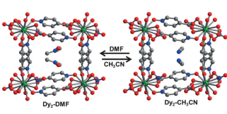
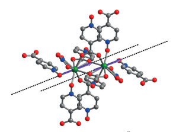
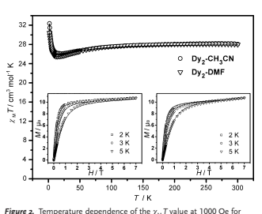
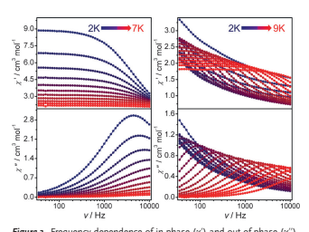
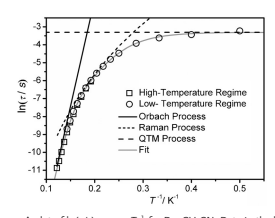

Magne German Edition: DOI: 10.1002/ange.201503636 tic Properties International Edition: DOI: 10.1002/anie.201503636

# Influence Of Guest Exchange On The Magnetization Dynamics Of Dilanthanide Single-Molecule-Magnet Nodes Within A Metal–Organic Framework**

Xuejing Zhang, Veacheslav Vieru, Xiaowen Feng, Jun-Liang Liu, Zhenjie Zhang, Bo Na, Wei Shi,* Bing-Wu Wang, Annie K. Powell, Liviu F. Chibotaru,* Song Gao,* Peng Cheng, and Jeffrey R. Long* Abstract: Multitopic organic linkers can provide a means to organize metal cluster nodes in a regular three-dimensional array. Herein, we show that isonicotinic acid N-oxide (HINO)

serves as the linker in the formation of a metal–organic framework featuring Dy2 single-molecule magnets as nodes.

Importantly, guest solvent exchange induces a reversible singlecrystal to single-crystal transformation between the phases Dy2(INO)4(NO3)2

·2 solvent (solvent = DMF (Dy2

-DMF),

CH3CN (Dy2

-CH3CN)), thereby switching the effective magnetic relaxation barrier (determined by ac magnetic susceptibility measurements) between a negligible value for Dy2

-DMF

and 76 cm¢1for Dy2

-CH3CN. Ab initio calculations indicate that this difference arises not from a significant change in the intrinsic relaxation barrier of the Dy2 nodes, but rather from a slowing of the relaxation rate of incoherent quantum tunneling of the magnetization by two orders of magnitude.

Single-molecule magnets (SMMs) are discrete molecules exhibiting magnet-like behavior and have attracted considerable attention for potential applications in high-density information storage and nanoscale electronics.

[1] Lanthanide ions provide many of the best examples of SMMs, owing to the significant magnetic anisotropy originating from strong spin-orbit coupling and crystal-field effects, which can lead to large spin reversal energy barriers.

[2] However, the factors

```
[*] X. Zhang, Dr. Z. Zhang, Dr. B. Na, Prof. Dr. W. Shi, Prof. Dr. P. Cheng
                                                                                       
    Department of Chemistry
                                    
    Key Laboratory of Advanced Energy Materials Chemistry (MOE)
                                                                                    
    State Key Laboratory of Elemento-Organic Chemistry
                                                                      
    Collaborative Innovation Center of Chemical Science and
                                                                           
    Engineering (Tianjin), Nankai University
                                                      
    Tianjin 300071 (P. R. China)
                                       
    E-mail: shiwei@nankai.edu.cn
                                          
    Prof. Dr. B.-W. Wang, Prof. Dr. S. Gao
                                                  
    Beijing National Laboratory of Molecular Science
                                                                 
    State Key Laboratory of Rare Earth Materials Chemistry and
                                                                              
    Applications, College of Chemistry and Molecular Engineering
                                                                                  
    Peking University, Beijing 100871 (P. R. China)
                                                              
    E-mail: gaosong@pku.edu.cn
                                         
    Prof. Dr. A. K. Powell
                              
    Institute of Inorganic Chemistry, Karlsruhe Institute of Technology
                                                                                       
    Engesserstrasse 15, 76131 Karlsruhe (Germany)
                                                                
    V. Vieru, Prof. Dr. L. F. Chibotaru
                                             
    Theory of Nanomaterials Group and INPAC—Institute of
                                                                           
    Nanoscale Physics and Chemistry, Katholieke Universiteit Leuven
                                                                                      
    Celestijnenlaan 200F, 3001 Heverlee (Belgium)
                                                               
    E-mail: Liviu.Chibotaru@chem.kuleuven.be
                                                          

```

influencing the magnetization dynamics for lanthanide-based SMMs are still obscured by the complicated magnetic nature of lanthanide ions, including the spin-orbit coupling, high magnetic anisotropy, weak magnetic exchange interactions, and multiple relaxation pathways. The main factor that governs the intrinsic relaxation barrier for such species is considered to be symmetry-related single-ion anisotropy.

[2c, 3]

Other factors, such as hyperfine couplings, dipolar spin–spin interactions, and transverse internal fields, could also lower the effective relaxation energy barrier by introducing fast quantum tunneling of the magnetization.[1b, 4] The hyperfine couplings can be effectively tuned by utilizing isotopically pure or enriched lanthanide sources,

[5] whereas the other two factors, spin–spin interactions and transverse internal fields, can be suppressed by magnetic dilution[5,6] or strong exchange interactions between lanthanide ions.

[7] To date, it is often still quite challenging to prepare isotopically enriched or magnetically dilute samples or, in particular, to introduce strong magnetic exchange coupling in most lanthanide systems.

[5–7] In this context, a regular platform that can provide fine tuning of SMM behavior is of great interest to the field.

Metal–organic frameworks (MOFs) constructed from inorganic nodes and organic linkers are a promising class of functional molecule-based materials because their highly porous structures can accommodate a wide variety of differ-

```
    X. Feng, J.-L. Liu, Prof. Dr. J. R. Long
                                         
    Department of Chemistry, University of California, Berkeley
                                                                
    Berkeley, CA 94720 (USA)
                              
    E-mail: jrlong@berkeley.edu
                                 
[**] This work was supported by the "973" program (grant number
                                                                    
    2012CB821702), the NSFC (grant numbers 21331003, 21373115,
                                                                      
    and 91422302) and the MOE (grant numbers NCET-13-0305 and
                                                                      
    IRT-13R30). Research at UC Berkeley was carried out within the
                                                                     
    Nanoporous Materials Genome Center, which is supported by the
                                                                       
    U.S. Department of Energy, Office of Basic Energy Sciences,
                                                                 
    Division of Chemical Sciences, Geosciences, and Biosciences under
                                                                        
    award DE-FG02-12ER16362. We thank very much Dr. Chen Gao
                                                                    
    from Peking University for the help with PPMS measurement. We
                                                                       
    also thank the reviewers for their valuable comments which have
                                                                      
    improved the manuscript.
                               
    Supporting information for this article is available on the WWW
                                                                     
    under http://dx.doi.org/10.1002/anie.201503636.
                                                      

```

Angew. Chem. Int. Ed. 2015, 54, 9861     GmbH    9861
ent guest molecules. MOFs have shown great potential for a number of applications, including gas storage and separations,

[8, 9] chemical sensing,

[10] and catalysis.

[11] A current synthetic challenge, however, is to create porous MOFs in which SMMs serve as the nodes, thereby providing a means of tuning the magnetization dynamics through the influence of different guest molecules within the pores. In principle, different sizes, shapes, and hydrogen-bonding capabilities of the guest molecules could drastically influence the SMM

behavior, as has been demonstrated for example by supramolecular effects within a series of molecular species of the type LnIII-DOTA (H4DOTA = 1,4,7,10-tetraazacyclododecane-N,N',N'',N'''-tetraacetic acid).[12]
Herein, we demonstrate how the magnetization dynamics of SMM nodes in a lanthanide-based MOF can be tuned through guest exchange.

[6d, 13, 14] Specifically, a new MOF

system containing a binuclear DyIII node, namely Dy2(INO)4

-

(NO3

)2

·2 solvent (HINO = isonicotinic acid N-oxide; solvent = DMF (Dy2

-DMF), CH3CN (Dy2

-CH3CN)) and Dy2

-

(INO)4(NO3)2 (Dy2

-A) without solvent, is introduced and investigated for guest-dependent magnetic properties. As a result of the porous nature of the structure, exchange of the guest molecules can be achieved through a single-crystal to single-crystal transformation, leading to major changes in the magnetic relaxation behavior. As demonstrated using ab initio calculations, this effect is a result of the high sensitivity of the crystal field of the DyIII ions to modifications in their environment.

The metal–organic framework Dy2

-DMF was synthesized by the solvothermal reaction of Dy(NO3)3

·6H2O with HINO
in DMF. In view of its porous structure and thermal stability

(see Figure S1 in the Supporting Information), a solvent exchange reaction was performed (Scheme 1). The isomor-

Scheme 1. Synthetic route and single-crystal to single-crystal transformation between Dy2



-DMF and Dy2

-CH3CN. Atom colors: Dy=green, O=red, N=blue, C=gray. H atoms have been omitted for clarity.
phic phase Dy2

-CH3CN was obtained by soaking Dy2

-DMF in six sequential aliquots of acetonitrile at room temperature.

The exchanged solvent molecules in Dy2

-CH3CN could be readily resolved by single-crystal X-ray diffraction analysis, and complete exchange was further confirmed by elemental analysis and thermogravimetric analysis. Significantly, this single-crystal to single-crystal transformation is fully reversible, as determined by both single-crystal and powder X-ray diffraction analyses (see Table S1 and Figure S2 in the Supporting Information). Moreover, the evacuated frame-

Figure 1. The coordination environment of the DyIII centers within the



binuclear Dy2 units of Dy2

-DMF. The dashed lines show the main anisotropy axes for each metal and the arrows indicate the local magnetic moments in the ground exchange doublet state.

work (Dy2

-A) without any guest solvent was successfully prepared and fully characterized (Tables S1, Figure S1, S2).

The crystal structure of the parent phase Dy2

-DMF

consists of binuclear Dy2 units connected within a porous three-dimensional network (Scheme 1 and Figure 1). The structure features just one crystallographically independent DyIII center, situated within a monocapped square antiprism coordination environment (approximately C4v symmetry) comprising two O atoms from a NO3

¢ion and seven O atoms from six different INO¢linkers. Two m2

-O atoms from carboxylate groups and two m1,3-carboxylate groups bridge the two DyIII centers to form the binuclear units, which reside upon crystallographic inversion centers.

The main distinctions between the crystal structures of Dy2

-DMF and Dy2

-CH3CN arise from the differing solvent molecules residing within the pores and how they interact with the surrounding framework (Figure S3). These effects lead to subtle differences in the structures of the Dy2 units:
the Dy···Dy separations are 4.0483(3) and 4.0090(2) è, the Dy¢O distances range from 2.312(2)–2.737(3) è and 2.323(2)–2.667(2) è, and the Dy-O-Dy angles are 106.29(8)8 and 106.73(8)8 for Dy2

-DMF and Dy2

-CH3CN, respectively.

Variations in the C¢H···O(N) hydrogen-bonding interactions as a result of the different guest molecules are responsible for the minor differences of the coordination environments of the DyIII centers (Table S2). It is noted that an almost identical structural form of Dy2

-A with Dy2

-MeCN but not with Dy2

-

DMF was found by the comparison of the crystal structures of the three frameworks. We also note that the Dy2

···Dy2 separation between the midpoints of neighboring Dy2 units are all greater than 10 è, suggesting an absence of significant magnetic exchange interactions between binuclear units.

Direct current (dc) magnetic susceptibility data were collected for the three MOFs in the temperature range 2–

300 K under an applied field of 1 kOe (Figure 2 and Figure S4). The cM T values (where cM is the molar magnetic susceptibility) at 300 K are 28.12, 28.32, and 28.07 cm3Kmol¢1 for Dy2

-DMF, Dy2

-CH3CN, and Dy2

-A, respectively, which are close to the expected value of 28.34 cm3Kmol¢1for two non-interacting DyIII centers (

6H15/2, S = 5/2, L = 5, J = 15/2,

9862     GmbH    Angew. Chem. Int. Ed. 2015, 54 



Dy2

-DMF (!) and Dy2

-CH3CN (*). Inset: Plots of magnetization (M)
versus applied field (H) at 2, 3, and 5 K for Dy2

-CH3CN (left) and Dy2

-

DMF (right). The solid lines correspond to calculated fits to the data.

Angew. Chem. Int. Ed. 2015, 54     GmbH     9863 g = 4/3). Upon lowering the temperature, the cM T value decreases gradually to minima of 25.53, 26.50, and 25.71 cm3Kmol¢1at 12, 20, and 12 K, before increasing abruptly to reach values of 30.42, 33.94, and 31.66 cm3Kmol¢1at 2 K for Dy2

-DMF, Dy2

-CH3CN, and Dy2

-A, respectively. The increases in cM T at very low temperature suggest that ferromagnetic coupling starts to dominate the magnetic behavior for the ground state of each material. At 2 K, the magnetization increases steeply upon increasing the magnetic field strength, reaching saturation values of 10.76, 10.78, and 10.54 mB for Dy2

-DMF, Dy2

-

CH3CN, and Dy2

-A, respectively, indicating well-separated excited states. This is confirmed by ab initio calculations (see below).

The isostructural nature of the three frameworks, and especially the very similar core structures of the binuclear nodes, might be anticipated to give rise to similar magnetization dynamics at low temperature. However, ac magnetic susceptibility data collected under zero applied dc field reveal significant differences in the observed relaxation behavior

(Figure 3 and Figures S5–S9), indicating the dominance of differing relaxation mechanisms depending on the guest molecules present within the pores. For Dy2

-DMF, the peaks in the out-of-phase ac susceptibility only appear at very high frequencies of near 10 kHz. The correlation between the relaxation time (t) and temperature (T) can be obtained from a plot of ln(t) versus ln(T) to give an n value of 1.7 (n is the parameter that represents the relation between relaxation time and temperature in the equation t = T
-n
), indicating that relaxation occurs mainly by a direct process (Figure S10). In contrast, for Dy2

-CH3CN slow magnetic relaxation was observed for a wide range of frequencies and temperatures.

To distinguish between glassiness and superparamagnetism, the parameter f, derived from the equation f= (DTp

/Tp)/
D(logn), was calculated (Tp is the peak temperature of the inphase ac susceptibilities).[15] The calculated value of f= 0.18 lies within the range 0.1–0.3, as expected for superparamagnetic behavior. To extract relaxation times, ac susceptibility

Angewandte Chemie Figure 3. Frequency dependence of in-phase (c') and out-of-phase (c'')





ac susceptibilities under zero dc field at indicated temperatures for Dy2

-DMF (left) and Dy2

-CH3CN (right).

Figure 4. A plot of ln(t/s) versus T
¢1for Dy2

-CH3CN. Data in the hightemperature regime were obtained using a PPMS instrument, and data in the low-temperature regime were measured using a SQUID-VSM

instrument. All data were collected under zero dc field. QTM=quantum tunneling of magnetization.

data can be fitted with a generalized Debye model, as shown in Cole–Cole plots (Figure S7–S9, Tables S3, S4).[16] The resulting temperature dependence of the relaxation time is shown in Figure 4. Spin-lattice relaxation processes, such as Raman or quantum tunneling processes, can coexist with Orbach (or thermally-activated) relaxation, but dominate in a different temperature range. At high temperatures, an Orbach process is mainly responsible for the relaxation, whereas at low temperatures gradual transitions are observed as a result of non-Orbach relaxation. A fit employing Equation (1) (where tQTM is the quantum tunneling of magnetization relaxation time, C is the coefficient of Raman process, Ueff is the energy barrier to magnetization reversal, and kB is the Boltzmann constant) gives good agreement with the data over the entire temperature range with parameters of tQTM

¢1 = 26.8 s
¢1, C = 0.0057 s
¢1K

¢6.69, n =
6.69, t0 = 3.24 × 10
¢11 s, and Ueff = 76 cm¢1(110 K). For Dy2

-A,

the magnetization dynamics are very close to those of Dy2

-

CH3CN because of the almost identical structural form of Dy2

-A with Dy2

-MeCN (Figures S5, S6, S9, S11 and Table S5).

Angewandte .Communications


From the analysis of the ac data, a fit employing Equation (1)

also gives good agreement with the data over the entire temperature range (Figure S11) with parameters of tQTM

¢1 =
26.3 s

¢1, C = 0.0476 s
¢1K

¢5.71, n = 5.71, t0 = 1.81 × 10
¢11 s, and Ueff = 67 cm¢1(97 K).

```
t
 ¢1 ¼ tQTM
          
          ¢1 þ CTn þ t0
                       
                       ¢1expð¢Ueff=kB TÞ ð1Þ

```

To elucidate the differences in magnetization relaxation dynamics between Dy2

-DMF and Dy2

-CH3CN (or Dy2

-A),

ab initio calculations were performed at the CASSCF/SORASSI/SINGLE_ANISO level using the Molcas 7.8 program

(Tables S6–S9, Figure S14 and S15).[17] The levels for the lowlying spectra associated with the DyIII centers are listed in Table S7, and the g tensors of the lowest-lying Kramers doublets are provided in Table S8. From this data, the firstexcited Kramers doublet is evident at 60, 66, and 53 cm¢1for Dy2

-CH3CN, Dy2

-A, and Dy2

-DMF, respectively. Both computational approximations, small fragment with a bigger basis set and larger fragment with a smaller basis set, predict that the ground Kramers doublet is less axial in the case of the DMF analogue than for the acetonitrile compound or for the evacuated framework (Table S8). Owing to the presence of an inversion center in the Dy2 unit of both MOFs, the main anisotropy axes of the DyIII centers are parallel to each other, as shown in Figure 1.

The dipolar interaction between the DyIII centers within a binuclear unit was calculated on the basis of ab initio results, while the magnetic exchange interaction was taken into account within the Lines model[17a, 18] using the POLY_ANISO program. The Lines exchange parameters were determined by fitting the experimental magnetic susceptibility data

(Figure 2 and Figure S4). As shown in Table S9, the dipolar interaction is stronger than the exchange interaction and stabilizes the parallel alignment of the local magnetic moments of the DyIII centers in the ground exchange doublet

(Figure 1). The tunneling gap (Dtun) for the Dy sites induced by the dipolar applied magnetic field (Hdip) from the surrounding metal ions, Dtun = 1/2gx,ymBHdip (mB is the Bohr magneton), is estimated as approximately 10¢3cm¢1for Dy2

-

CH3CN or Dy2

-A and approximately 10¢2cm¢1for Dy2

-DMF.

These estimates correspond to a transverse field of 100 mT for Dy2

-CH3CN or Dy2

-A and 90 mT for Dy2

-DMF, arising from one nearest Dy neighbor. As the relaxation rate of incoherent quantum tunneling is proportional to Dtun 2
, it is clear that it will be circa 102times slower in Dy2

-CH3CN or Dy2

-A than in Dy2

-DMF, explaining why the former two compounds are good SMMs, while the latter is not.[1d] The experimentally extracted barriers of 76 and 67 cm¢1for Dy2

-CH3CN and Dy2

-

A can be firmly attributed to the relaxation via the firstexcited Kramers doublet of the DyIII centers. Indeed, the calculated first Kramers doublets for the DyIII centers in Dy2

-

CH3CN is located at 60 cm¢1(see Table S7), and that of Dy2

-A

lies at 66 cm¢1, in reasonable agreement with the experimental results. The foregoing results clearly reveal the origin of the magnetization dynamics: a) the similar energy barriers are mainly from the single-ion anistropy of the DyIII centers because of the similar coordination environments; b) the subtle differences caused by either the guest molecules or no

9864     GmbH    Angew. Chem. Int. Ed. 2015, 54 
guest molecule lead to different dipole–dipole interactions which tune the relaxation rate of incoherent quantum tunneling to give drastically different effective relaxation barriers.

Additionally, considering that the single-ion anisotropy contributions from the two DyIII centers in the bimetallic units are symmetry related, the continuous symmetry measure

(CSM) method was employed to evaluate the deviation from an ideal monocapped square antiprismatic coordination geometry.

[19] Herein, the larger the calculated CSAPR-9 parameter, the greater the deviation from an ideal C4v symmetry. The calculated CSAPR-9 parameters are 2.011, 1.727, and 1.879 for Dy2

-DMF, Dy2

-CH3CN, and Dy2

-

A, respectively, indicating that there is relatively little geometric difference between the binuclear units in all the three structures. This is further consistent with the results of the ab initio calculations of the similar energy gaps between the ground and the first excited states for the DyIII centers in all compounds. Thus, the different solvent molecules or no solvent molecule within the pores of the MOF play an important role in influencing the dipole–dipole interactions, in accordance with the very different magnetic dynamics observed. Accordingly, the ab initio calculations based on the single-crystal structures afford substantially different values for the dipolar coupling of 2.11 cm¢1for Dy2

-DMF, 1.81 cm¢1 for Dy2

-CH3CN, and 1.81 cm¢1for Dy2

-A. To our knowledge, this is the first example in which guest molecules are employed to adjust the dipole–dipole interactions and thereby tune the relaxation rates arising from incoherent quantum tunneling of the magnetization.

In summary, exchange of the guest molecules within the pores of a new lanthanide-based MOF featuring binuclear Dy2 III single-molecule magnets as nodes has been demonstrated to impart major changes in the magnetization relaxation dynamics. Guest exchange reactions interconverting the two frameworks from single-crystal to single-crystal were successfully performed using DMF and acetonitrile.

Magnetic susceptibility measurements and ab initio calculations have shown that the subtle structural changes associated with guest solvent exchange can lead to drastic improvements in SMM behavior. This work not only illustrates a chemical means of combining SMMs and MOFs in molecule-based materials, but also provides a powerful new platform for tuning SMM behavior.

Keywords: ab initio calculations · host–guest systems ·
lanthanides · metal–organic frameworks ·

single-molecule magnets How to cite: Angew. Chem. Int. Ed. 2015, 54, 9861– 9865 Angew. Chem. 2015, 127, 9999– 10003

[1] a) M. N. Leuenberger, D. Loss, Nat. Chem. 2001, 410, 789 - 793; b) D. Gatteschi, R. Sessoli, Angew. Chem. Int. Ed. 2003, 42, 268 - 297; Angew. Chem. 2003, 115, 278 - 309; c) S. Hill, R. S. Edwards, N. Aliaga-Alcalde, G. Christou, Science 2003, 302, 1015 - 1018; d) D. Gatteschi, R. Sessoli, J. Villain, Molecular Nanomagnets, Oxford University Press, Oxford, 2006; e) L. Bogani, W.

Wernsdorfer, Nat. Mater. 2008, 7, 179 - 186; f) P. Jarillo-Herrero, Science 2010, 328, 1362 - 1363; g) M. Mannini, F. Pineider, C.
Angew. Chem. Int. Ed. 2015, 54     GmbH     9865

```
   Danieli, F. Totti, L. Sorace, P. Sainctavit, M.-A. Arrio, E. Otero,
                                                                   
   L. Joly, J. C. Cezar, A. Cornia, R. Sessoli, Nature 2010, 468, 417 –
   421; h) S. Thiele, F. Balestro, R. Ballou, S. Klyatskaya, M.
                                                                   
   Ruben, W. Wernsdorfer, Science 2014, 344, 1135 - 1138.
[2] a) R. Sessoli, A. K. Powell, Coord. Chem. Rev. 2009, 253, 2328 –
   2341; b) B. W. Wang, S. D. Jiang, X. T. Wang, S. Gao, Sci. China
                                                                   
   Ser. B 2009, 11, 1739 - 1758; c) J. D. Rinehart, J. R. Long, Chem.
   Sci. 2011, 2, 2078 - 2085; d) L. Sorace, C. Benelli, D. Gatteschi,
   Chem. Soc. Rev. 2011, 40, 3092 - 3104; e) D. N. Woodruff, R. E. P.
   Winpenny, R. A. Layfield, Chem. Rev. 2013, 113, 5110 - 5148.
[3] a) N. Ishikawa, M. Sugita, T. Ishikawa, S.-y. Koshihara, Y. Kaizu,
                                                                   
   J. Am. Chem. Soc. 2003, 125, 8694 - 8695; b) M. A. AlDamen,
   J. M. Clemente-Juan, E. Coronado, C. Mart-Gastaldo, A. GaitaAriÇo, J. Am. Chem. Soc. 2008, 130, 8874 - 8875; c) S. D. Jiang,
   B. W. Wang, H. L. Sun, Z. M. Wang, S. Gao, J. Am. Chem. Soc.
                                                                   
   2011, 133, 4730 - 4733; d) C. R. Ganivet, B. Ballesteros, G.
   de La Torre, J. M. Clemente-Juan, E. Coronado, T. Torres,
                                                                   
   Chem. Eur. J. 2013, 19, 1457 - 1465; e) J.-L. Liu, Y.-C. Chen,
   Y.-Z. Zheng, W.-Q. Lin, L. Ungur, W. Wernsdorfer, L. F.
                                                                   
   Chibotaru, M.-L. Tong, Chem. Sci. 2013, 4, 3310 - 3316.
[4] a) N. Ishikawa, M. Sugita, W. Wernsdorfer, J. Am. Chem. Soc.
                                                                   
   2005, 127, 3650 - 3651; b) N. Ishikawa, M. Sugita, R. Cl¦rac, W.
   Wernsdorfer, Angew. Chem. Int. Ed. 2005, 44, 2931 - 2935;
   Angew. Chem. 2005, 117, 2991 - 2995.
[5] F. Pointillart, K. Bernot, S. Golhen, B. L. Guennic, T. Guizouarn,
                                                                   
   L. Ouahab, O. Cador, Angew. Chem. Int. Ed. 2015, 54, 1504 –
   1507; Angew. Chem. 2015, 127, 1524 - 1527.
[6] a) S. D. Jiang, B. W. Wang, G. Su, Z. M. Wang, S. Gao, Angew.
                                                                   
   Chem. Int. Ed. 2010, 49, 7448 - 7451; Angew. Chem. 2010, 122,
   7610 - 7613; b) F. Habib, P. H. Lin, J. Long, I. Korobkov, W.
                                                                   
   Wernsdorfer, M. Murugesu, J. Am. Chem. Soc. 2011, 133, 8830 –
   8833; c) K. R. Meihaus, J. R. Long, J. Am. Chem. Soc. 2013, 135,
   17952 - 17957; d) B. Na, X.-J. Zhang, W. Shi, Y.-Q. Zhang, B.-W.
                                                                   
   Wang, C. Gao, S. Gao, P. Cheng, Chem. Eur. J. 2014, 20, 15975 –
   15980.
          
[7] a) J. D. Rinehart, M. Fang, W. J. Evans, J. R. Long, Nat. Chem.
                                                                   
   2011, 3, 538 - 542; b) Y.-N. Guo, G.-F. Xu, W. Wernsdorfer, L.
   Ungur, Y. Guo, J. Tang, H.-J. Zhang, L. F. Chibotaru, A. K.
                                                                   
   Powell, J. Am. Chem. Soc. 2011, 133, 11948 - 11951; c) J. D.
   Rinehart, M. Fang, W. J. Evans, J. R. Long, J. Am. Chem. Soc.
                                                                   
   2011, 133, 14236 - 14239; d) S. Demir, J. Zadrozny, M. Nippe,
   J. R. Long, J. Am. Chem. Soc. 2012, 134, 18546 - 18549.
[8] a) E. D. Bloch, W. L. Queen, R. Krishna, J. M. Zadrozny, C. M.
                                                                   
   Brown, J. R. Long, Science 2012, 335, 1606 - 1610; b) Z. R.
   Herm, B. M. Wiers, J. A. Mason, J. M. van Baten, M. R. Hudson,
                                                                   

```


Chemie

```
     P. Zajdel, C. M. Brown, N. Masciocchi, R. Krishna, J. R. Long,
                                                                                  
     Science 2013, 340, 960 - 964.
 [9] T. A. Makal, J.-R. Li, W. Lu, H.-C. Zhou, Chem. Soc. Rev. 2012,
     41, 7761 - 7779.
                        
[10] a) J. Rocha, L. D. Carlos, F. A. Almeida Paz, D. Ananias, Chem.
                                                                                  
     Soc. Rev. 2011, 40, 926 - 940; b) J. Heine, K. Mîller-Buschbaum,
     Chem. Soc. Rev. 2013, 42, 9232 - 9242.
[11] A. Corma, H. Garcia, F. X. L. Xamena, Chem. Rev. 2010, 110,
     4606 - 4655.
                   
[12] a) G. Cucinotta, M. Perfetti, J. Luzon, M. Etienne, P.-E. Car, A.
                                                                                  
     Caneschi, G. Calvez, K. Bernot, R. Sessoli, Angew. Chem. Int.
                                                                                  
     Ed. 2012, 51, 1606 - 1610; Angew. Chem. 2012, 124, 1638 - 1642;
     b) M.-E. Boulon, G. Cucinotta, J. Luzon, C. DeglÏInnocenti, M.
                                                                                  
     Perfetti, K. Bernot, G. Calvez, A. Caneschi, R. Sessoli, Angew.
                                                                                  
     Chem. Int. Ed. 2013, 52, 350 - 354; Angew. Chem. 2013, 125, 368 –
     372.
          
[13] W. Shi, K. Liu, P. Cheng, Struct. Bonding (Berlin) 2015, 163, 231 –
     263.
          
[14] a) Y. Wang, W. Shi, H. Li, Y. Song, L. Fang, Y. Lan, A. K. Powell,
                                                                                  
     W. Wernsdorfer, L. Ungur, L. F. Chibotaru, M. Shen, P. Cheng,
                                                                                  
     Chem. Sci. 2012, 3, 3366 - 3370; b) T. Han, W. Shi, X. P. Zhang,
     L. L. Li, P. Cheng, Inorg. Chem. 2012, 51, 13009 - 13016; c) T.
     Han, W. Shi, Z. Niu, B. Na, P. Cheng, Chem. Eur. J. 2013, 19,
     994 - 1001; d) S. Zhang, W. Shi, L. Li, E. Duan, P. Cheng, Inorg.
                                                                                  
     Chem. 2014, 53, 10340 - 10346; e) K. Liu, W. Shi, P. Cheng,
     Coord. Chem. Rev. 2015, 289 - 290, 74 - 122.
[15] J. A. Mydosh, Spin Glasses: An Experimental Introduction,
                                                                                  
     Taylor & Francis, London, 1993.
[16] M. Hagiwara, J. Magn. Magn. Mater. 1998, 177 - 181, 89 - 90.
[17] a) L. F. Chibotaru, L. Ungur, C. Aronica, H. Elmoll, G. Pilet, D.
                                                                                  
     Luneau, J. Am. Chem. Soc. 2008, 130, 12445 - 12455; b) F.
     Aquilante, L. De Vico, N. Ferre, G. Ghigo, P.-A. Malmqvist, P.
                                                                                  
     Neogrady, T. B. Pedersen, M. Pitonak, M. Reiher, B. O. Roos, L.
                                                                                  
     Serrano-Andres, M. Urban, V. Veryazov, R. Lindh, J. Comput.
                                                                                  
     Chem. 2010, 31, 224 - 247; c) L. F. Chibotaru, L. Ungur, J. Chem.
     Phys. 2012, 137, 064112; d) http://molcas.org/documentation/
     manual.
               
[18] M. E. Lines, J. Chem. Phys. 1971, 55, 2977 - 2984.
[19] a) H. Zabrodsky, S. Peleg, D. Avnir, J. Am. Chem. Soc. 1992, 114,
     7843 - 7851; b) M. Pinsky, D. Avnir, Inorg. Chem. 1998, 37, 5575 –
     5582.
            
Received: April 21, 2015
                             
Revised: May 20, 2015
                           
Published online: June 26, 2015
                                      

```
