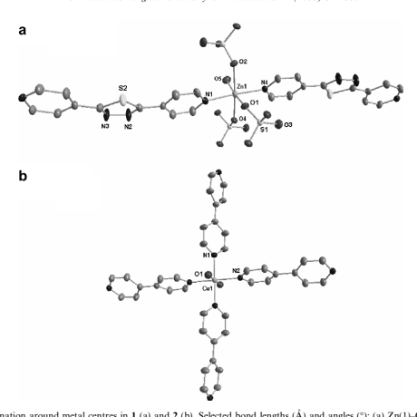
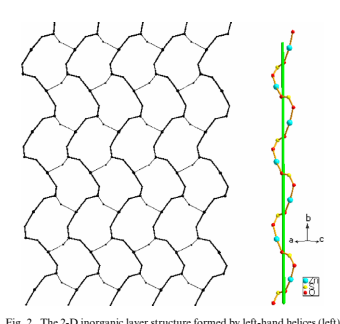
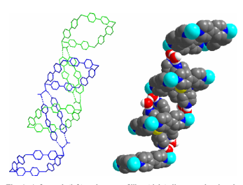
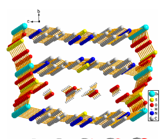
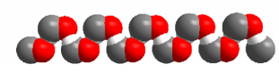
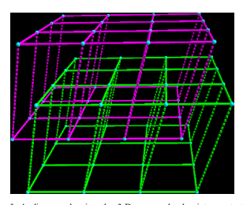

Inorganic Chemistry Communications 11 (2008) 377–380 www.elsevier.com/locate/inoche

# Chiral Metal–Organic And Supramolecular Interpenetrating

 3-D Frameworks Constructed By One Angular Ligand And 4,40-Dipyridine

Caoyuan Niu, Benlai Wu, Hongyun Zhang *, Zhongjun Li, Hongwei Hou Department of Chemistry, Zhengzhou University, Zhengzhou 450052, PR China Received 21 November 2007; accepted 28 December 2007 Available online 8 January 2008 Abstract The self-assembly of 1,3,4-thiadiazole-2,5-di-4-pyridyl (L1), 4,40-dipyridyl (L2) with Zn(II), Cu(II) salts afforded one unusual coordination polymer with left-handed homo-chiral 3-D open MOFs in which supramolecular left-handed methanol helices were selectively formed, and one 2-D coordination polymer where two-fold interpenetrated 3-D supramolecular frameworks were constructed by hydrogen bonds.

- 2008 Elsevier B.V. All rights reserved.

Keywords: Metal–organic frameworks; Interpenetrating; Chiral; Angular ligand The design and self-assembly of interpenetrating networks have attracted great interests not only for their potential new or special characteristics as functional materials, but also for their fascinating architectures and topologies [1,2]. Meanwhile, constructing chiral coordination polymers have also attracted great attention because of their special utilities in enantioselective separation, asymmetric syntheses, nonlinear optical materials, as well as the processes of chiral self-organization being universal in life [3,4]. Therefore, they are two hot research topics of crystal engineerings in recent years. However, the smaller in number of coordination polymers with chiral or interpenetrated frameworks suggests that exploring new coordination polymers with novel architecture is still one of the major challenges in the pursuit of special functional materials [5,6].

Using rigid multipyridyl ligands to build interesting porous or interpenetrated networks is a long-lasting goal

* Corresponding author. Tel./fax: +86 371 67763675.

E-mail address: wzhy917@zzu.edu.cn (H. Zhang).

1387-7003/$ - see front matter - 2008 Elsevier B.V. All rights reserved. doi:10.1016/j.inoche.2007.12.038
of our group. As our continuous work, longer biting spacer 2,5-bis(4-pyridyl)-1,3,4-thiadiazole (L1) [7] which is expected to be an excellent pillar to bridge metal nodes to chains, helices, porous or interpenetrated frameworks has been synthesized and used to assemble with zinc(II)
and copper(II) salts, etc. We report herein the two resultant coordination polymers {[Zn(L1)(H2O)(SO4)](CH3OH)0.5- (H2O)0.5}n (1) and {[Cu(L2)2(H2O)2](L1)2(H2O)2(PF6)2}n
(2) [8]. Their crystal structures determined by X-ray diffraction [9] exhibit unusual 3-D chiral MOFs (1) and interpenetrated supramolecular networks (2), respectively.

For compound 1, each zinc centre is based on a distorted octahedral symmetry coordinating to one oxygen atom [O(5)] from one water molecule, three oxygen atoms
[O(1), O(2), O(4)] from three distinct SO24 anions and two nitrogen atoms [N(1), N(4)] from pyridyl rings of two distinct L1. The obvious distortion is reflected in differences of bond distances and deviations of bond angles from 90 relating to zinc(II) metal centres (Fig. 1a).

The compound 1 crystallized in the chiral space group P212121 is a 3-D chiral coordination polymer possessing three types of homo-chiral helices. The first

Fig. 1. The local coordination around metal centres in 1 (a) and 2 (b). Selected bond lengths (A˚ ) and angles (): (a) Zn(1)–O(1), 2.183(2), Zn(1)–O(2),
2.198(2), Zn(1)–O(4), 2.171(3), Zn(1)–O(5), 2.076(3), Zn(1)–N(1), 2.126(3), Zn(1)–N(4), 2.121(3), O(5)–Zn(1)–N(4), 90.88(12), O(5)–Zn(1)–N(1), 96.69(12), O(5)–Zn(1)–O(4), 87.56(10), N(1)–Zn(1)–O(4), 89.40(11), N(1)–Zn(1)–O(1), 83.90(12), O(5)–Zn(1)–O(2), 84.39(9), N(1)–Zn(1)–O(2), 90.48(11), O(4)– Zn(1)–O(1), 101.33(10), O(5)–Zn(1)–O(1), 171.10(10), N(4)–Zn(1)–N(1), 172.31(12); (b) Cu(1)–N(1), 2.062(3), Cu(1)–N(2), 2.079(3), Cu(1)–O(1), 2.380(3), N(1)–Cu(1)–N(2), 88.03(10), N(1)–Cu(1)–O(1), 90.23(10), N(2)–Cu(1)–O(1), 89.68(10).
mentioned is the chiral inorganic 2-D layers consisting of l3-SO24 bridging Zn(II) centres. There are characteristic IR bands of the SO24 anions at 1040–
1140 cm1, indicating its tridentate coordination feature.

Through two oxygen atoms [O(2), O(4)], each sulfate anion bridges two Zn(II) ions to form infinite left-handed helical –Zn–O–S–O–Zn– chains along the crystallographic b-axis. The short distance of ZnZn bridged by a sulfate anion is about 5.555 A˚ and the pitch of the helix is about 10.364 A˚ . These helices are further connected into a chiral 2-D ZnSO4 layer by oxygen atoms [O(1)] of sulfates
(Fig. 2). Along the crystallographic c-axis, L1, however, bridge two Zn(II) ions by two pyridyls' nitrogen atoms, forming another left-handed –Zn–L1–Zn– helix. Thus all parallel inorganic layers are linked into a chiral 3-D framework containing two distinct homo-chiral helices. As shown in Fig. 3, the inorganic layers are supported by rigid pillars L1 to form two-sorted dimension-different square channels.

The striking feature of this polymer is that the larger square chiral channel (about 14  6 A˚ 2) embodies the third homo-chiral left-handed helix guest, which is a methanol supramolecule assembled by intermolecular hydrogen interactions C–HO (Fig. 3) [10]. This suggests that achi-

Fig. 2. The 2-D inorganic layer structure formed by left-hand helices (left)

and a view of cylindrical left-hand helice (right) of ZnSO4 of the complex 1.
ral organic molecules can be selectively assembled into chiral supramolecular helices under a chiral environment such as a chiral channel.

Fig. 3. A diagram showing methanol molecules as guests in the larger

channels of 3-D metal–organic framework (up) and a space-filling view of the left-hand supramolecular methanol helice (down).
For compound 2, the metal centre Cu(II) is six-coordinated to four nitrogen atoms from four distinct L2 molecules and two oxygen atoms from two distinct water molecules to form a slightly distorted octahedral symmetry where bond distances of Cu–O are longer than those of Cu–N. Four nitrogen atoms are located in the equatorial plane and two oxygen atoms in two axial positions
(Fig. 1b). L1 molecules do not act as bridging ligand as in compound 1 but play another role of guests hosted in the metal–organic square grid. Each (4, 4) grid with the dimensions of 11.2108  11.2108 A˚ 2 is constructed by four copper ions bridged by four L2 ligands (Fig. S1).

It is noteworthy that there are medium p–p stacking interactions between two antiparallel neighbouring L1 molecules in one grid with the central to central distance 3.7218 A˚ and dihedral angle 0. The two packing L1 molecules can be considered as one bridge which connects two 2-D layers up and down the 2-D layer penetrated by L1 molecules through hydrogen bondings between nitrogen atoms (acceptors) from L1 molecules and oxygen atoms (donors) from coordinating and non-coordinating water molecules [O(1)–H(1W)N(4), 2.757(4) A˚ ;
O(2)–H(3W)N(3), 2.852(5) A˚ ; O(1)–H(2W)O(2),
2.734(4) A˚ ] (Fig. 4). This type of linkage can be applied to every L1 molecule and 2-D layer. So all 2-D layers are penetrated by double L1 molecules and all separate 2-D
layers are linked by L1 linkers. Thus, an interesting twofold supramolecular interpenetrating network is generated
(Fig. 5).

Finally, from the structural information of the two coordination polymers, it can be inferred that the angular dipyridyl ligand L1 can either act as bridging ligand linking

Fig. 4. A firework (left) and a space-filling (right) diagrams showing the

 supramolecular interpenetration (dotted line standing for hydrogen bondings). Fig. 5. A diagram showing the 3-D supramolecular interpenetrating network of the compound 2 (the dotted line standing for linkages of double L1 molecules by hydrogen bondings).
metal nodes to construct metal–organic frameworks or be used to construct supramolecular structures through noncovalent interactions such as hydrogen bondings.

## Acknowledgements

We gratefully acknowledge financial support from the National Natural Science Foundation of China
(20771094, 20671083), the Science and Technology Key Task of Henan Province (0524270061).

## Appendix A. Supplementary Material

CCDC 622165 and 627043 contain the supplementary crystallographic data for this paper. These data can be obtained free of charge from The Cambridge Crystallographic Data Centre via www.ccdc.cam.ac.uk/data_request/cif. Supplementary data associated with this article can be found, in the online version, at doi:10.1016/
j.inoche.2007.12.038.

## References

[1] (a) M.H. Zeng, W.X. Zhang, X.Z. Sun, X.M. Chen, Angew. Chem.

Int. Ed. 44 (2005) 3079;
(b) C.H. Liu, S. Gao, D.Q. Zhang, Y.H. Huang, R.G. Xiong, Z.L. Liu, F.C. Jiang, D.B. Zhu, Angew. Chem. Int. Ed. 43
(2004) 990; (c) O.R. Evans, W. Lin, Chem. Mater. 13 (2001) 2705; (d) B. Kesanli, Y. Cui, M.R. Smith, E.W. Bittner, B.C. Bockrath, W. Lin, Angew. Chem. Int. Ed. 44 (2005)
72.

[2] (a) A.J. Blake, N.R. Champness, A. Khlobystov, W.S. Li, M.

Schro¨der, D.A. Lemenovskii, Chem. Commun. (1997) 2027;
(b) M. Sarkar, K. Biradha, Chem. Commun. (2005) 2229;
(c) J.C. Dai, X.T. Wu, Z.Y. Fu, S.M. Hu, W.X. Du, C.P. Cui, L.M.

Wu, H.H. Zhang, R.Q. Sun, Chem. Commun. (2002) 12;
(d) J.P. Ma, Y.B. Dong, R.Q. Huang, M.D. Smith, C.Y. Su, Inorg. Chem. 44 (2005) 6143.

[3] (a) J.S. Seo, D. Whang, H. Lee, S.I. Jun, J. Oh, Y.J. Jeon, K. Kim, Nature 404 (2000) 982; (b) Y.-M. Song, T. Zhou, X.-S. Wang, X.-N. Li, R.-G. Xiong, Cryst.

Growth Des. 6 (2006) 14.

[4] (a) L. Han, M. Hong, R. Wang, J. Luo, Z. Lin, D. Yuan, Chem.

Commun. (2003) 2580; (b) Z.-F. Chen, R.-G. Xiong, B.F. Abrahams, X.-Z. You, C.-M. Che, J. Chem. Soc., Dalton Trans. (2001) 2453.

[5] (a) R. Kitaura, K. Seki, G. Akiyama, S. Kitagawa, Angew. Chem.

Int. Ed. 42 (2003) 428; (b) B. Kesanlie, W. Lin, Coord. Chem. Rev. 246 (2003) 305; (c) M. Gruselle, C. Train, K. Boubekeur, P. Gredin, N. Ovanesyan, Coord. Chem. Rev. 250 (2006) 2491.

[6] O.M. Yaghi, M. O'Keeffe, N.W. Ockwig, H.K. Chae, M. Eddaoudi, J. Kim, Nature 423 (2003) 705.

[7] (a) M. Lebrini, F. Bentiss, M. Lagrene´e, J. Heterocycl. Chem. 42
(2005) 991; (b) Z. Huang, H.-B. Song, M. Du, S.-T. Chen, X.-H. Bu, Inorg.

Chem. 43 (2004) 931;
(c) Z. Huang, M. Du, H.-B. Song, X.-H. Bu, Cryst. Growth Des. 4
(2004) 71; (d) X.-M. Zhang, R.-Q. Fang, H.-S. Wu, Cryst. Eng. Commun. 7 (2005) 96.

[8] Synthesis of 1. To a solution of L1 (0.024 g, 0.1 mmol) and L2
(0.016 g, 0.1 mmol) in the mixed solvent (5 mL chloroform, 10 mL
methanol) was added ZnSO4  7H2O (0.029 g, 0.1 mmol) in methanol
(15 mL). The mixture was stirred for 20 min, and then filtered. The filtrate was allowed to slowly evaporate the solvents at room temperature and about 40 days later suitable single crystals (colourless needle) were obtained. Yield: about 25%. Anal. Calcd % (found
%) for C12.50H13N4O6S2Zn: C, 33.75 (34.12); H, 2.95 (2.96); N, 12.60
(12.57). IRmKBr (cm-1): 3444b, 2930w, 1616s, 1560w, 1435s, 1402m, 1333w, 1261w, 1225m, 1139s, 1078m, 1032m, 1004w, 977w, 829m, 712m, 608s, 536w, 484w. Synthesis of 2. To a solution of L1 (0.024 g, 0.1 mmol) and L2 (0.016 g, 0.1 mmol) in the mixed solvent (5 mL
chloroform, 10 mL methanol) was added Cu(CH3COO)2  H2O
(0.02 g, 0.1 mmol) in methanol (10 mL). NH4PF6 (0.033 g, 0.2 mmol)
in water (5 mL) was added to the mixture after it was stirred for 20 min. After being stirred for another 5 min the mixture was filtered. The filtrate was allowed to slowly evaporate the solvents at room temperature and about 20 days later suitable single crystals (blue block) were obtained. Yield: about 32%. Anal. Calcd % (found %) for C44H40CuF12N12O4P2S2: C, 43.37 (43.54); H, 3.31 (3.28); N, 13.79
(13.62). IRmKBr (cm1): 3111w, 1609 s, 1558w, 1535w, 1492w, 1428s, 1331w, 1259w, 1223s, 1101w, 1071m, 997w, 844vs, 736w, 698m, 639w, 611w, 560s, 495w.

[9] X-ray diffraction data for single crystals were collected at 291 K on a Bruker SMART APEX-II CCD diffractometer equipped with a graphite crystal and incident beam monochromator using MoKa radiation (k = 0.71073 A˚ ). Crystal data for 1: C12.50H13N4O6S2Zn, M = 444.79, Orthorhombic, space group P212121 (No. 19),
a = 5.5225(6), b = 10.3642(11), c = 29.725(3) A˚ , V = 1701.3(3) A˚ 3, Z = 4, l(MoKa) = 1.728 mm1, final R indices [I > 2r(I)]:
R1 = 0.0323, wR2 = 0.0728, R indices (all data): R1 = 0.0377, wR2 = 0.0757. Crystal data for 2: C44H40F12N12O4P2S2Cu, M = 1218.48, Monoclinic, space group P2(1)/m (No. 11),
a = 11.0886(10), b = 16.4333(15), c = 14.9897(13) A˚ , V = 2570.1(4) A˚ 3, b = 109.790(1), Z = 2, l(MoKa) = 0.668 mm1, final R indices
[I > 2r(I)]: R1 = 0.0524, wR2 = 0.1410, R indices (all data): R1 = 0.0672, wR2 = 0.1543.

[10] (a) V.K. Muppidi, S. Das, P. Raghavaiah, S. Pal, Inorg. Chem.

Commun. 10 (2007) 234;
(b) J. Barbera´, L. Puig, P. Romero, J.L. Serrano, T. Sierra, J. Am.

Chem. Soc. 127 (2005) 458.