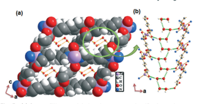

# 

PAPER
 **View Journal | View Issue**

Cite this: CrystEngComm, 2014, 16, 4805

# Construction Of 2D Interwoven And 3D Interpenetrated Metal–Organic Frameworks Of Zn(Ii) By Varying N,N′-Donor Spacers†

C. M. Nagaraja,*a Bharat Ugalea and Anjana Chanthapallyb Received 3rd December 2013, Accepted 24th January 2014 DOI: 10.1039/c3ce42454e www.rsc.org/crystengcomm

## Introduction

The design and synthesis of porous coordination polymers
(PCPs) or metal–organic frameworks (MOFs) by connecting the metal ions as nodes or clusters (secondary building units, SBUs) with a variety of organic ligands as linkers has attracted a great deal of interest in the past two decades, due to their intriguing network topology and novel functionality.1 The network topology and the functionality can be tuned by the judicious choice of bridging organic linkers and metal containing SBUs.2 Having the merits of both organic and inorganic building units combined with a high surface area and tailored pore volume makes MOFs useful materials for hydrogen storage,3 selective adsorption of carbon dioxide,4 separation,5 heterogeneous catalysis,6 and sensing7 as well as drug delivery8 applications. Recently, considerable efforts have also been made to construct MOFs with structural diversity/flexibility by employing mixed ligand systems that have carboxylate ligands combined with various bipyridyl N,N′-donor spacer ligands.9 Furthermore, it has been observed that the use of long organic linkers has often resulted in the formation of interpenetrated/entangled networks.10 In

aDepartment of Chemistry, Indian Institute of Technology Ropar, Rupnagar 140001, Punjab, India. E-mail: cmnraja@iitrpr.ac.in; Tel: +91 1881242229 bDepartment of Chemistry, National University of Singapore, 3 Science Drive 3, Singapore 117543
† Electronic supplementary information (ESI) available. CCDC 973248–973251.

For ESI and crystallographic data in CIF or other electronic format see DOI: 10.1039/c3ce42454e
Four new metal–organic frameworks (MOFs) of Zn(II) ions, [Zn2(muco)2(azopy)2]·3DMF·2H2O (1), [Zn(muco)(bpee)]·4H2O (2), [Zn(muco)(3bpdh)] (3), and [Zn4(muco)4(4bpdh)4]·4bpdh·2H2O (4) (where, muco = trans,trans-muconate dianion, azopy = 4,4′-bisazobipyridine, bpee = 1,2-bis(4-pyridyl)ethylene, 3bpdh = 2,5-bis(3-pyridyl)-3,4-diaza-2,4-hexadiene, and 4bpdh = 2,5-bis(4-pyridyl)-3,4-diaza-2,4-hexadiene) have been synthesized using mixed ligand systems and characterized structurally by single-crystal X-ray diffraction. Compound 1 has a 2D network with 2-fold interwoven, (4,4)-connected, {44·62}-sql net topology.

Compounds 2 and 3 have 3D diamondoid (dia) structures with interesting 5-fold and 3-fold interpenetrated nets, respectively, whereas, compound 4 has a 3D cubic (pcu, α-Po) structure with 2-fold interpenetrating, 6-connected, {412·63} net topology. Topological analyses of 2 and 3 reveal 4-connected nets with 66 topology.

In spite of the interweaving/interpenetration, compounds 1 and 2 possess rectangular channels with dimensions of 3.9 × 4.5 Å2 and 4.3 × 7.0 Å2, respectively. Photoluminescence studies showed the emissions of 1–4 and the thermal stabilities of the compounds were also examined.

this context, rigid spacer ligands, such as trans,trans-muconic acid (H2muco) have been found to be quite useful in the construction of MOFs with interpenetration, due to their moderately longer spacer length and diverse binding modes.11 The origin of interpenetration in a framework has been attributed to the presence of large voids in it and often interpenetration does not prevent the possibility of obtaining porous frameworks.12 However, the factors that influence the resulting degree of interpenetration remain unknown. A literature survey reveals that more than 60% of interpenetrated frameworks bear a diamondoid topology.13 MOFs with diamondoid motifs have attracted special interest not only from a topological point of view but also due to their robust structural motifs and the possible applications in nonlinear optical (NLO) properties.14 Diamondoid frameworks with various degrees of interpenetration such as, 2–5-fold, 7–9-fold, 11-fold as well as 12-fold degeneracy have been reported.15 Herein, we report the design and syntheses of four new MOFs based on Zn(II) ions, [Zn2(muco)2(azopy)2]·3DMF·2H2O
(1), [Zn(muco)(bpee)]·4H2O (2), [Zn(muco)(3bpdh)] (3), and
[Zn4(muco)4(4bpdh)4]·4bpdh·2H2O (4) (muco = trans,transmuconate dianion, azopy = 4,4′-bisazobipyridine, bpee =
1,2-bis(4-pyridyl)ethylene, 3bpdh = 2,5-bis(3-pyridyl)-3,4-diaza2,4-hexadiene, and 4bpdh = 2,5-bis(4-pyridyl)-3,4-diaza-2,4hexadiene) by changing the bipyridine spacers (Scheme 1). Compounds 1, 3 and 4 were synthesized under solvothermal conditions, whereas, compound 2 was constructed by selfassembly of Zn(II) ions with muconate dianions and bpee

Scheme 1 Chemical structures of the muconate dianion and other N,N′-donor spacers.
spacers (Scheme 2). Compound 1 has a 2-fold interwoven 2D
network with {44·62} topology. Compounds 2 and 3 possess 3D
diamondoid structures with 5-fold and 3-fold interpenetrating nets, respectively. Compound 4 has a 2-fold interpenetrated 3D
pillar-layered framework with {412·63} topology. Interestingly, in spite of the interweaving/interpenetration, compounds 1 and 2 possess rectangular 1D channels with dimensions 3.9 × 4.5 Å2 and 4.3 × 7.0 Å2, respectively, occupied by guest solvent molecules. Solid state photoluminescence studies show the emissions of 1–4.

## Experimental Materials

All the reagents employed were commercially available and used as provided without further purification. The Zn(II) salts, trans, trans-muconic acid and 1,2-bis(4-pyridyl)ethylene (bpee) were obtained from Sigma Aldrich chemical Co. 4,4′-bisazobipyridine
(azopy), 2,5-bis(3-pyridyl)-3,4-diaza-2,4-hexadiene (3bpdh) and 2,5-bis(4-pyridyl)-3,4-diaza-2,4-hexadiene) (4bpdh) were synthesized following a previously reported procedure.16

## Physical Measurements

Elemental analysis was carried out using a Thermo Fischer

Flash 2000 Elemental Analyzer. IR spectra were recorded on a

Thermo Scientific Nicolet iS10 FT-IR spectrometer in the 4000–400 cm−1 region. Thermogravimetric analysis (TGA) was carried out using a Mettler Toledo thermogravimetric analyzer in a nitrogen atmosphere (flow rate = 50 mL min−1) in the temperature range 30–500 °C (heating rate = 3 °C min−1).

Powder X-ray diffraction (XRD) patterns of the compounds were recorded by using Cu Kα radiation (k = 1.542 Å; 40 kV,
20 Ma) with PANalytical's X'PERT PRO diffractometer. The patterns agreed with those calculated from single crystal structure determination (see ESI†). Solid state photoluminescence (PL)
spectra of the samples were recorded on a Perkin-Elmer LS 55 spectrofluorometer.

## Synthesis Of [Zn2(Muco)2(Azopy)2]·3Dmf·2H2O (1)

Compound 1 was synthesized under solvothermal conditions at 125 °C. Zn(NO3)2·6H2O (0.074 g, 0.25 mmol) was dissolved in 4 ml of deionized water to which a DMF solution (2 ml) of H2muco (0.036 g, 0.25 mmol) was added with constant stirring. To this solution an ethanolic solution (2 ml) of azopy
(0.046 g, 0.25 mmol) was added and the contents were stirred for 30 min and then transferred to a 30 mL glass vial, sealed with parafilm and heated at 125 °C for 2 days. After being cooled to room temperature, orange block crystals of 1 were isolated. Anal. calcd. for C41H49N11O13Zn2: C, 47.59; H, 4.77; N, 14.89; found: C, 46.91; H, 4.23; N, 14.32. Yield (74%). IR (cm−1):
ν(H2O), 3219(b); ν(CH–Ar), 3002(w); ν(CN), 1611(s), ν(NN),
1570(s); ν(CC), 1516–1387(s); ν(C–O), 1342–1214(s).

## Synthesis Of [Zn(Muco)(Bpee)]·4H2O (2)

Compound 2 was prepared at room temperature using a layering method. Stock solutions of Zn(OAc)2·2H2O (0.055 g, 0.25 mmol) in 25 ml H2O, H2muco (0.036 g, 0.25 mmol) neutralized with NaOH (0.020 g, 0.5 mmol) in 12.5 ml of H2O
and bpee (0.045 g, 0.25 mmol,) in 12.5 ml of ethanol were prepared. The bpe and the H2muco solutions were mixed together and stirred for 30 min. Then 2 ml of this solution was slowly and carefully layered over 2 ml of the metal solution using 1 ml of 2 : 1 (v/v) buffer solution of H2O and ethanol. The colorless block crystals of 2 were obtained after four weeks. Yield (70%). Anal. calcd. for C18H30N2O8Zn: C, 46.21; H, 6.46; N, 5.98; found: C, 47.01; H, 6.03; N, 6.72. IR (cm−1):
ν(H2O), 3394(b); ν(CH–Ar), 3050(w); ν(CN), 1614(s), ν(CC),
1560–1433(s); ν(C–O), 1365–1255(s).

## Synthesis Of [Zn(Muco)(3Bpdh)] (3)

Compound 3 was synthesized under solvothermal conditions at 110 °C. Zn(OAc)2·2H2O (0.055 g, 0.25 mmol) was dissolved in 4 ml of deionized water to which a DMF solution (2 ml) of H2muco (0.036 g, 0.25 mmol) was added with constant stirring. To this solution, an ethanolic solution (2 ml) of 3bpdh
(0.060 g, 0.25 mmol) was added and the contents were stirred for 30 min and then transferred to a 30 mL glass vial, sealed with parafilm and heated at 110 °C for 2 days. After being cooled to room temperature, light yellow block crystals of 3 Scheme 2 Synthetic conditions for compounds 1–4. were isolated. Yield (60%). Anal. calcd. for C20H18N4O4Zn:
C, 54.13; H, 4.08; N, 12.62; found: C, 53.6; H, 4.64; N, 13.02.

IR (cm−1): ν(CH–Ar), 3100–3031(bw); ν(CN), 1613(s), ν(CC),
1575–1435(s); ν(C–O), 1335–1282(s).

## Synthesis Of [Zn4(Muco)4(4Bpdh)4]·4Bpdh·2H2O (4)

Compound 4 was synthesized under solvothermal conditions at 100 °C. Zn(NO3)2·6H2O (0.074 g, 0.25 mmol) was dissolved in 4 ml of deionized water to which an aqueous solution
(2 ml) of H2muco (0.036 g, 0.25 mmol) neutralised with NaOH (0.020 g, 0.5 mmol) was added with constant stirring. To this solution an ethanolic solution (2 ml) of 4bpdh (0.060 g, 0.25 mmol) was added and the contents were stirred for 30 min and then transferred to a 30 mL glass vial, sealed with parafilm and heated at 100 °C for 3 days. After being cooled to room temperature, yellow block crystals of 4 were isolated.

Yield (70%). Anal. calcd. for C94H86N20O18Zn4: C, 55.20; H, 4.23; N, 13.69; found: C, 55.80; H, 3.93; N, 14.23. IR (cm−1):
ν(H2O), 3400–3200(bw); ν(CH–Ar), 3022(w); ν(CN), 1612(s);
ν(CC), 1565–1421(s); ν(C–O), 1339–1220(s).

## X-Ray Crystallography

X-ray single crystal structural data for all the compounds 1–4 were collected on a Bruker D8 Venture PHOTON 100 CMOS diffractometer equipped with an INCOATEC micro-focus source with graphite monochromated Mo Kα radiation (λ = 0.71073 Å)
operating at 50 kV and 30 mA. The program SAINT17 was used for the integration of diffraction profiles and absorption corrections were made with the SADABS18 program. All the structures were solved by SIR 9219 and refined by the full matrix least square method using SHELXL-9720 and the WinGX system, Ver 1.70.01.21 All of the non-hydrogen atoms were located from the difference Fourier map and refined anisotropically. All the hydrogen atoms were fixed by HFIX and placed in ideal positions and included in the refinement process using a riding model with isotropic thermal parameters. The potential solvent accessible area, or void space, was calculated using PLATON multipurpose crystallographic software.22 All the crystallographic and structure refinement data for compounds 1–4 are summarized in Table 1. Selected bond lengths and angles are given in Table S1–S4,† respectively. The crystallographic information files are deposited with the CCDC
numbers 973248–973251.

## Results And Discussion Synthesis And Crystal Structure

Compounds 1, 3 and 4 were synthesized by the solvothermal reaction of Zn(II) with deprotonated H2muco ligands and N,N′-donors (azopy, 3bpdh and 4bpdh, respectively) at temperatures of 100–125 °C (Scheme 2). It is worth mentioning that solvothermal preparation of 1 and 3 in H2O–ethanol did not yield the desired products and the use of DMF in combination with H2O–ethanol gave the products, indicating the role of DMF in their formation. This is also supported by the presence of three DMF molecules of crystallization in compound 1. Similarly, the solvothermal reaction of Zn(II) with H2muco and bpee in H2O–DMF–ethanol at 110 °C yielded the reported 3D framework, [Zn(muco)(bpe)]·DMF·H2O, which hosts DMF molecules

| Table 1                                                                      | Crystal data and structure refinement parameters of compounds 1–4   |               |               |                 |
|------------------------------------------------------------------------------|---------------------------------------------------------------------|---------------|---------------|-----------------|
| Parameters                                                                   | 1                                                                   | 2             | 3             | 4               |
| Chemical formula                                                             | C41H49N11O13Zn2                                                     | C18H22N2O8Zn  | C20H18N4O4Zn  | C94H86N20O18Zn4 |
| Formula mass                                                                 | 1034.65                                                             | 459.75        | 443.75        | 2045.31         |
| Crystal system                                                               | Orthorhombic                                                        | Monoclinic    | Monoclinic    | Triclinic       |
| Space group                                                                  | Pca21 (no. 29)                                                      | C2/c (no. 15) | C2/c (no. 15) | P¯1 (no. 2)     |
| a/Å                                                                          | 11.0697(6)                                                          | 22.2190(13)   | 16.000(5)     | 10.7575(4)      |
| b/Å                                                                          | 22.2083(11)                                                         | 5.5243(3)     | 5.452(5)      | 15.3180(6)      |
| c/Å                                                                          | 19.5333(11)                                                         | 18.471(10)    | 22.025(5)     | 29.3906(13)     |
| α (°)                                                                        | 90                                                                  | 90            | 90            | 81.112(1)       |
| β (°)                                                                        | 90                                                                  | 115.962(2)    | 107.74(5)     | 87.711(1)       |
| γ (°)                                                                        | 90                                                                  | 90            | 90            | 84.536(1)       |
| V (Å3 )                                                                      | 4802.1(4)                                                           | 2038.5(2)     | 1830.3(18)    | 4761.6(3)       |
| Z                                                                            | 4                                                                   | 4             | 4             | 2               |
| Dc (g cm−3 )                                                                 | 1.426                                                               | 1.498         | 1.610         | 1.427           |
| μ (mm−1 )                                                                    | 1.071                                                               | 1.252         | 1.379         | 1.073           |
| F(000)                                                                       | 2128                                                                | 952           | 912           | 2108            |
| T (K)                                                                        | 293                                                                 | 293           | 293           | 293             |
| λ(Mo Kα) (Å)                                                                 | 0.71073                                                             | 0.71073       | 0.71073       | 0.71073         |
| Θmin (°)                                                                     | 2.3                                                                 | 2.4           | 2.7           | 2.2             |
| Θmax (°)                                                                     | 28.4                                                                | 28.3          | 28.4          | 28.4            |
| Total data                                                                   | 128 645                                                             | 17 871        | 15 873        | 135 441         |
| Unique data                                                                  | 11 361                                                              | 2548          | 2292          | 23 865          |
| Rint                                                                         | 0.053                                                               | 0.026         | 0.022         | 0.079           |
| Data[I > 2σ(I)]                                                              | 8870                                                                | 2489          | 2248          | 15 835          |
| R1 a                                                                         | 0.0661                                                              | 0.0225        | 0.0227        | 0.0525          |
| wR2 b                                                                        | 0.1906                                                              | 0.0581        | 0.0602        | 0.1337          |
| S                                                                            | 1.06                                                                | 1.07          | 1.09          | 1.06            |
| a R1 = P‖Fo| − |Fc‖/ P|Fo|. b wR2 = [Pw(Fo 2 − Fc 2 ) 2 / Pw(Fo 2 ) 2 ] 1/2. |                                                                     |               |               |                 |

in the open channels.11c On the other hand, room temperature reaction in the absence of DMF yielded the structurally different compound [Zn(muco)(bpee)]·4H2O 2, which hosts only H2O
molecules. Therefore, the solvent molecules play an important role in the formation of compounds 1–4.

## Crystal Structure Of [Zn2(Muco)2(Azopy)2]·3Dmf·2H2O (1)

Compound 1 crystallizes in the orthorhombic crystal system with the non-centrosymmetric, Pca21 space group. X-ray structure determination reveals a two-dimensional (2D) network constituted by a muconate (muco) dianion and an azopy spacer. The asymmetric unit consists of two Zn(II) ions, two muconate dianions and two azopy spacers along with three guest DMF and two water molecules of crystallization. Both the Zn1 and Zn2 centers are in a distorted tetrahedral geometry with a ZnO2N2 chromophore with two carboxylate oxygen atoms, O1 and O2 for Zn1 (O3 and O4a, where a = x, −1 + y, z, for Zn2), from two bridging muconate dianions, and two nitrogen atoms, N1 and N2 for Zn1 (N3 and N4 for Zn2), from the azopy spacer (Fig. 1a). The Zn1–O and Zn1–N bond lengths are in the ranges 1.952(5)–1.969(4) Å and 2.016(6)–2.021(6) Å,

 (b) View of a single 2D network constructed by Zn(II), muco, and azopy linkers (H atoms and solvent molecules are omitted for clarity). (c) and (d) show a closely-packed spheres (CPK) view of the 2-fold interwoven 2D networks (two different 2D nets are shown in two different colors).
geometry around the Zn(II) center is a distorted tetrahedron with a ZnO2N2 chromophore with two oxygen (O1 and O1a, where a = 1 − x, y, 1/2 − z) atoms from a bridging muconate and two nitrogen (N1 and N1a, where a = 1 − x, y, 1/2 − z) atoms of a bpee linker (Fig. 3a). The Zn–O/N bond lengths

 atom of 2; the H atoms and the solvent molecules are omitted for clarity. (b) Perspective view of a single dia cage constructed by Zn (II), muco and bpee linkers. (c) Simplified view of the 4-connected single dia net.

Fig. 2 (a) Space-filling model of the 2-fold interwoven 2D network showing the void spaces in 1. (b) Topological representation of the 2-fold interwoven nets in 1 (two different 2D nets are shown in different colors.
respectively. The Zn2–O/N and Zn2–N bond distances are in the ranges 1.958(5)–1.976(4) Å and 2.011(6)–2.017(6) Å, respectively.

The degree of distortion from an ideal tetrahedral geometry can be seen from the tetrahedral angles, which vary from 100.39(19)
to 115.7(2)° and from 97.66(19) to 114.2(2)° for Zn1 and Zn2, respectively. The muconate dianion acts as a monodentate ligand which bridges the Zn1 and Zn2 centers in a μ1-O fashion, forming 1D [Zn(muco)]n zig-zag chains that are connected by azopy spacers to form a 2D [Zn(muco)(azopy)]n network
(Fig. 1b). This houses large rectangular 1D channels with dimensions of ~8.0 × 10.7 Å2 along the crystallographic b-axis
(Fig. 1b). The presence of large rectangular channels along with the bent shape of the azopy spacer facilitate interweaving of one 2D net over another to generate a 2-fold interwoven 2D network (Fig. 1c and d). As a result of 2-fold interweaving, the size of the 1D channels is reduced to ~3.9 × 4.5 Å2 as shown in Fig. 2a. Topological analysis by TOPOS23 suggests that each Zn(II) center acts as a 4-connecting node and the overall structure has a (4,4)-connected 2D interwoven network with the Schläfli point symbol {44·62} (Fig. 2b). Interestingly, in spite of the 2-fold interweaving, the structure has an effective solvent accessible void volume of ~38.9% (4802.1 Å3) per unit cell volume calculated using PLATON22 after the removal of guest DMF
and water molecules. The distances between two adjacent Zn⋯Zn centers along Zn⋯muco⋯Zn and along Zn⋯azopy⋯Zn are 11.770 Å and 11.070 Å, respectively. The structure shows C–H⋯O hydrogen bonding interactions involving the aromatic C–H bonds with the carboxylate oxygens of muco ligands, and the guest water (O2w) molecule (Table S5†).

## Crystal Structure Of [Zn(Muco)(Bpee)]·4H2O (2)

Compound 2 crystallizes in the monoclinic crystal system

 with the C2/c space group. X-ray structure determination reveals a 3D framework constituted by a bridging muconate dianion and a bpee spacer. The asymmetric unit consists of a Zn(II) ion, a muconate dianion and a bpee spacer and two guest water molecules which reside in special positions. The are 1.933(2)/1.969 (9) Å, respectively. The extent of distortion from a regular tetrahedral geometry can be seen in the tetrahedral angles at the Zn(II) center, which vary from 98.93(4) to 124.48(4)°. Similar to 1, the muconate dianion coordinates to two Zn(II) centers in a monodentate μ1-O fashion. Thus, the Zn(II) centers act as 4-connected nodes which are connected with each other in three dimensions by muconate and bpee linkers to generate a 3D diamondoid framework (Fig. 3b and c).

Topological analysis by TOPOS23 suggests that each Zn(II) center acts as a 4-connecting node and the overall structure has the diamondoid (dia) net topology with the Schläfli point symbol
{66} (Fig. 3b and c). As can be seen in Fig. 3, the 3D dia framework possesses a large cavity inside which assists further nucleation in the vacant spaces and allows the formation of new 3D
nets in those regions. The void space is large enough to generate a complex 5-fold interpenetrated, 3D framework (Fig. 4a).

Interpenetration analysis with TOPOS suggests the presence of a 5-fold interpenetration with the Schläfli extended point symbol
[6(2)·6(2)·6(2)·6(2)·6(2)·6(2)] (Fig. 4b). Interestingly, in spite of the 5-fold interpenetration, the framework possesses rectangular channels with dimensions of ~4.3 × 7.0 Å2, occupied by guest water molecules, along the crystallographic b-axis (Fig. 5a). The guest water molecules (O1w and O2w) are located in special positions and are actively engaged in hydrogen bonding between each other and with the non-coordinating carboxylate oxygen (O2) atom of the muconate ligand, forming a 1D zig-zag chain of water molecules in the open channels of the framework
(Fig. 5b, Table S6†). The distances between two adjacent Zn⋯Zn centers along Zn⋯muco⋯Zn and along Zn⋯bpee⋯Zn are 10.976 and 13.453 Å, respectively. The effective solvent accessible void volume calculated using PLATON22 is ~27.9% (2038.5 Å3)
per unit cell volume after the removal of guest water molecules.

## Crystal Structure Of [Zn(Muco)(3Bpdh)] (3)

Compound 3 crystallizes in the monoclinic crystal system

 with the C2/c space group. X-ray structure determination reveals a 3D framework constituted by a muconate dianion and a 3bpdh spacer. The asymmetric unit consists of a Zn(II)
Fig. 5 (a) Space-filling model showing rectangular 1D channels occupied by guest water molecules in 2. (b) View of the 1D chain of guest

water molecules formed via hydrogen bonding between them and with the carboxylate oxygen atom of the muconate ligand.

ion, a muconate dianion and a 3bpdh spacer. Similar to 1 and 2, the Zn(II) center is in a distorted tetrahedral geometry with a ZnO2N2 chromophore with two oxygen (O1 and O1a, where a = 1 − x, y, 3/2 − z) atoms of a muconate and two nitrogen atoms (N1 and N1a, where a = 1 − x, y, 3/2 − z) from the 3bpdh spacer (Fig. 6a). The Zn–O and Zn–N bond distances are 1.933(2) Å and 2.052(2) Å, respectively. The extent of distortion from the regular tetrahedral geometry can be seen from the tetrahedral angles at the Zn center, which vary from 99.95(4) to 123.95(4)°. Similar to 2, the Zn(II) nodes are connected to each other in three dimensions by muconate and 3bpdh to form a 3D dia framework (Fig. 6). Topological analysis by TOPOS23 suggests that each Zn(II) atom acts as a 4-connected node and the overall structure has a dia net with the Schläfli point symbol {66} (Fig. 6b). Interestingly, due to the angular nature of the 3bpdh linker compared to that of a linear linker, such as bpee, the void space in the dia net of 3 is relatively smaller than that of 2, but it is sufficient enough to allow the penetration of two other independent nets to generate a 3-fold interpenetrated 3D framework (Fig. 7a).

Interpenetration analysis with TOPOS23 suggests the presence of a 3-fold interpenetration with the Schläfli extended point symbol [6(2)·6(2)·6(2)·6(2)·6(2)·6(2)] (Fig. 7b). The distances between two adjacent Zn⋯Zn centers along Zn⋯muco⋯Zn

Fig. 4 (a) View of the 5-fold interpenetrated 3D framework of 2 showing the rectangular channels along the b-axis. (b) Topological representation of the 5-fold interpenetrating nets in 2 (five different 3D nets are shown in five different colors).

 (c) Simplified view of the 4-connected single dia net.

Fig. 7 (a) View of the 3-fold interpenetrated 3D framework of 3 showing the open channels along the b-axis. (b) Topological representation of the 3-fold interpenetrating net in 3 (three different 3D nets are shown in three different colors).
and along Zn⋯3bpdh⋯Zn are 11.882 Å and 12.063 Å, respectively. Calculations using PLATON22 reveal that the framework does not possess any void space (see Fig. S1†).

## Crystal Structure Of [Zn4(Muco)4(4Bpdh)4]·4Bpdh·2H2O (4)

Compound 4 crystallizes in the triclinic crystal system with the P¯1 space group. X-ray structure determination reveals a 3D framework constituted by the muconate dianion and the 4bpdh spacer. The asymmetric unit consists of four Zn(II) ions, four muconate dianions and four 4bpdh spacers along with a guest molecule of 4bpdh and two water molecules. The geometry around all four Zn(II) centers can be best described as a distorted octahedron with a ZnO4N2 chromophore with four carboxylate oxygen atoms, O1, O2, O3 & O4
(at Zn1), O5, O6, O7 & O8 (at Zn2), O9, O10, O11 & O12
(at Zn3) and O13, O14, O15 & O16 (Zn4) in the equatorial positions from four different bridging muconates, and two nitrogen atoms, N1 & N2 (Zn1), N3 & N4 (Zn2), N5 & N6 (Zn3) and N7 & N8 (Zn4) in the axial positions from four different 4bpdh spacers (Fig. 8). The extent of distortion from the regular octahedral geometry at the Zn centers can be seen from the cisoid and transoid angles, which are in the ranges 58.34(8)–121.97(9)°

Fig. 8 The coordination environment around the Zn1, Zn2, Zn3

 and Zn4 atoms of 4: only the nitrogen atoms of two more bridging 4bpdh spacers are shown for clarity. The H atoms and the guest water molecules are omitted for clarity.

and 145.78(9)–175.58(9)° (for Zn1); 55.89(8)–123.17(9)° and 138.03(9)–176.32(10)° (for Zn2); 58.35(8)–114.16(9)° and 149.89(9)– 175.88(9)° (for Zn3); 58.11(8)–94.09(8)° and 150.30(8)–171.74(9)°
for Zn4, respectively. Zn1 and Zn2 are connected by two muconate dianions, one of which coordinates in a chelating bidented, μ2-O fashion and the other one in a monodentate μ1-O bridging mode, forming a 2D [Zn1Zn2(muco)2]n sheet
(Fig. 9a). Similarly, Zn3 and Zn4 are connected by two other muconate dianions, resulting in another 2D [Zn3Zn4(muco)2]n sheet. These two 2D sheets are pillared by 4bpdh linkers to form a 3D pillar-layered framework which houses almost rectangular 1D channels with dimensions of ~3.4 × 11.0 Å2 along the crystallographic b-axis (Fig. 9b). The void space is sufficient enough to allow the penetration of another 3D framework to generate a 2-fold interpenetrated 3D pillar-layered framework as shown in Fig. 9c. Topological analysis by TOPOS suggests the presence of two types of Zn(II) ions which act as 6-connecting nodes, and the overall structure has cubic (pcu α-Po) net topology with a Schläfli point symbol for the net of {412·63} (Fig. 9c). Interpenetration analysis with TOPOS
suggests the presence of 2-fold interpenetration with the Schläfli extended symbol [4·4·4·4·4·4·4·4·4·4·4·4·6(4)·6(4)·6(4)]
(Fig. 9d). Interestingly, a guest molecule of 4bpdh is located in the open channels of the framework and it is involved in C–H⋯O and C–H⋯N hydrogen bonding interactions with the

Fig. 9 (a) View of the single [Zn2(muco)2]n 2D sheet in the ab-plane. The 4bpdh pillars, solvent molecules and H atoms are omitted for clarity.

(b) CPK view of a single 3D pillar-layered framework in 4. (c) CPK view showing the 2-fold interpenetrating 3D frameworks and (d) shows a topological representation of the 2-fold interpenetrating nets (two different colors are used to show 2 different 3D nets).
guest water molecule (O2w) and the nitrogen atom of the
(–NN–) group of the 4bpdh spacer in the framework, respectively (Fig. S3, Table S7†). The distances between two adjacent Zn⋯Zn centers along the Zn⋯muco⋯Zn from bridging and chelating muconates are 4.056 and 11.300 Å, respectively and along the Zn⋯4bpdh⋯Zn are 15.503 Å and 15.516 Å. The effective solvent accessible void volume calculated using PLATON22 is ~27.9% (2038.5 Å3) per unit cell volume after the removal of guest 4bpdh and two water molecules.

## Effects Of N,N′-Donor Spacers On The Structures Of Mofs 1–4

It is interesting to note that the N,N′-donor spacers play important roles in directing the final structures of compounds 1–4. Here, four kinds of N,N′-donor (azopy, bpee, 3bpdh and 4bpdh) spacers were selected to investigate their effects on the structure and topology of the resulting frameworks 1–4 (Scheme 1). The composition of all four MOFs can be generalized as [Zn(muco)(N,N′-donor)] (leaving out the guest molecules). In compounds 1–3 the Zn(II) center acts as a 4-connected node, whereas in 4 the Zn(II) centers are 6-connected by the muconate dianion and 4bpdh spacer. The bent shape of the azopy spacer caused the 2D network of 1, which houses 1D channels which are large enough to allow the interweaving of another 2D net, to generate a 2-fold interwoven 2D network with {44·62}-sql net topology. On the other hand, both 2 and 3 have 3D dia structures with 66 topology but differ in the degree of interpenetration. This difference can be attributed to the angular coordination of the 3bpdh spacer compared to that of the linear bpee spacer. As a result, the void space in the dia net (Fig. 3b) of 2 is relatively large and facilitates the interpenetration of four other 3D nets to generate a 5-fold interpenetrating net. Whereas, the smaller void space in 3 (Fig. 6b) can facilitate the interpenetration of only two other 3D nets to result in a 3-fold interpenetrating net. In 4, though the 4bpdh spacer is linear like bpee, the presence of the extra –CH3 group reduces the void space of the rectangular pores (Fig. 9b) and they can allow the interpenetration of only one 3D net to form a 2-fold interpenetrating net with {412·63} net topology.

## Photoluminescence Properties Of Mofs

Recently, luminescent compounds, particularly those containing d10 metals, have attracted much interest due to their potential applications, including chemical sensors, electroluminescent displays and so on.24 Therefore, the luminescence properties of compounds 1–4 along with their corresponding ligands were measured in the solid state at room temperature (Fig. 10). As shown in Fig. 10, fluorescent emissions at 438–467 nm, 350–475 nm, 450–490 nm and 445–490 nm were observed from 1–4, respectively. According to the literature, muconic acid shows a broad emission at 447–463 nm.25 Therefore, the emissions from compounds 1–4 might be caused by a mixture of characteristics of intraligand and ligand-to-ligand charge transitions (LLCT), as has been observed in the literature.25 As the Zn(II) ion is in a d10 configuration it is less prone to undergoing oxidization or reduction. Hence, the emissions of 1–4 are neither metal-to-

CrystEngComm Paper
Fig. 10 Room temperature solid-state photoluminescence spectra of compounds 1–4.
ligand charge transfer (MLCT) nor ligand-to-metal charge transfer
(LMCT) in nature.

## Framework Stability And Powder X-Ray Diffraction (Pxrd) Analysis

TGA of compound 1 shows a weight loss of ~4.0% around 80 °C which corresponds to the loss of two guest water molecules (calc. wt% 3.48) (Fig. S3, ESI†). The second weight loss of ~21% was observed in the temperature range 80–300 °C corresponding to the loss of 3 DMF molecules (calc. wt% 21.16).

Compound 2 shows a weight loss of ~8.0% around 80–180 °C
which corresponds to the loss of two guest water molecules
(calc. wt% 8.4) (Fig. S3, ESI†) and the dehydrated framework,
[Zn(muco)(bpee)]n, is stable up to 240 °C. The second weight loss of ~30.5% in the temperature range 240–350 °C corresponds to the loss of the muconate ligand (calc. wt% 30.9).

Sample 3 does not show any weight loss up to a temperature of 300 °C, supporting the absence of guest solvent molecules and a relatively high framework stability. In the temperature range 300–350 °C a weight loss of ~53.2% was observed which corresponds to the loss of the 3bpdh linker (calc. wt% 53.69)
(Fig. S3†). Compound 4 shows a weight loss of ~2.0% around 80–170 °C which corresponds to the loss of two guest water molecules (calc. wt% 1.7) (Fig. S3, ESI†). The second weight loss of ~12.0% in the temperature range 180–240 °C corresponds to the loss of the 4bpdh ligand (calc. wt% 11.6). The PXRD patterns of compounds 1–4 match with those simulated from single-crystal diffraction data (Fig. S4–S7, ESI†).

## Conclusions

We have constructed four new MOFs of Zn(II) ions using mixed ligand systems and structurally characterized these. Structural analyses revealed that compound 1 has a 2-fold interwoven 2D network with sql-net topology. Compounds 2 and 3 have a 3D dia framework with interesting 5-fold and 3-fold interpenetrating nets, respectively, whereas, compound 4 has a 3D cubic (pcu, α-Po) structure with a 2-fold interpenetrating net. In spite of the interweaving/interpenetration, compounds 1 and 2 possess rectangular channels with dimensions of 3.9 × 4.5 Å2 and 4.3 × 7.0 Å2, respectively. Solid state photoluminescence studies carried out at room temperature showed the emissions from 1–4. The present study demonstrates that by a suitable choice of different building units
(metal ion) and organic linkers, it has been possible to tune the network topology, dimensionality and the degree of interpenetration of the resulting MOFs.

## Acknowledgements

CMN gratefully acknowledges the financial support from the Department of Science and Technology (DST), Government of India (Fast Track Proposal) and also Prof. M. K. Surappa director IIT Ropar for his encouragement. BU is grateful to the DST Government of India for a JRF. Thanks are also due to Dr. Angshuman Roychoudhury for suggestions in X-ray crystallography.

## References

1 (a) B. Moulton and M. J. Zaworotko, Chem. Rev., 2001, 101, 1629; (b) O. M. Yaghi, M. O'Keeffe, N. W. Ockwig, H. K. Chae, M. Eddaoudi and J. Kim, Nature, 2003, 423, 705;
(c) C. N. R. Rao, S. Natarajan and R. Vaidhyanathan, Angew. Chem., Int. Ed., 2004, 43, 1466; (d) S. Kitagawa, R. Kitaura and S. Noro, Angew. Chem., Int. Ed., 2004, 43, 2334.

2 N. L. Rosi, M. Eddaoudi, J. Kim, M. O'Keeffe and O. M. Yaghi, CrystEngComm, 2002, 4, 401.

3 (a) L. J. Murray, M. Dincă and J. R. Long, Chem. Soc. Rev.,
2009, 38, 1294; (b) A. Hazra, P. Kanoo and T. K. Maji, Chem. Commun., 2011, 47, 538; (c) N. L. Rosi, J. Eckert, M. Eddaoudi, D. T. Vodak, J. Kim, M. O'Keeffe and O. M. Yaghi, Science, 2003, 300, 1127; (d) D. J. Collins and H.-C. Zhou, J. Mater. Chem., 2007, 17, 3154; (e) Y. Kubota, M. Takata, R. Matsuda, R. Kitaura, S. Kitagawa, K. Kato, M. Sakata and T. C. Kobayashi, Angew. Chem., Int. Ed., 2005, 44, 920; ( f ) H. J. Park and M. P. Suh, Chem.–Eur. J., 2008, 14, 8812.

4 (a) C. M. Nagaraja, R. Haldar, T. K. Maji and C. N. R. Rao, Cryst. Growth Des., 2012, 12, 975; (b) D. M. D'Alessandro, B. Smit and J. R. Long, Angew. Chem., Int. Ed., 2010, 49, 6058; (c) K. L. Mulfort, O. K. Farha, C. D. Malliakas, M. G. Kanatzidis and J. T. Hupp, Chem.–Eur. J., 2010, 16, 276; (d) P. D. C. Dietzel, V. Besikiotis and R. Blom, J. Mater.

Chem., 2009, 19, 7362; (e) B. Wang, A. P. Cote, H. Furukawa, M. O'Keeffe and O. M. Yaghi, Nature, 2008, 453, 207; ( f )
T. K. Maji, R. Matsuda and S. Kitagawa, Nat. Mater., 2007, 6, 142; (g) P. Nugent, Y. Belmabkhout, S. D. Burd, A. J. Cairns, R. Luebke, K. Forrest, T. Pham, S. Ma, B. Space, L. Wojtas, M. Eddaoudi and M. J. Zaworotko, Nature, 2013, 495, 80; (h)
S. Xiang, Y. He, Z. Zhang, H. Wu, W. Zhou, R. Krishna and B. Chen, Nat. Commun., 2012, 3, 954.

5 (a) M. Eddaoudi, D. B. Moler, H. Li, B. Chen, T. M. Reineke, M. O'Keeffe and O. M. Yaghi, Acc. Chem. Res., 2001, 34, 319;
(b) L. Pan, B. Parker, X. Huang, D. H. Olson, J. Lee and J. Li, J. Am. Chem. Soc., 2006, 128, 4180; (c) M. L. Foo, S. Horike, Y. Inubushi and S. Kitagawa, Angew. Chem., Int. Ed., 2012, 51, 6107; (d) B. Chen, S. Xiang and G. Qian, Acc. Chem. Res.,
2010, 43, 1115; (e) S.-C. Xiang, Z. Zhang, C.-G. Zhao, K. Hong, X. Zhao, D.-R. Ding, M.-H. Xie, C.-D. Wu, M. C. Das, R. Gill, K. M. Thomas and B. Chen, Nat. Commun., 2011, 2, 204.

6 (a) S. Hasegawa, S. Horike, R. Matsuda, S. Furukawa, K. Mochizuki, Y. Kinoshita and S. Kitagawa, J. Am. Chem. Soc., 2007, 129, 2607; (b) A. M. Shultz, O. K. Farha, J. T. Hupp and S. T. Nguyen, J. Am. Chem. Soc., 2009, 131, 4204; (c) D. N. Dybtsev, A. L. Nuzhdin, H. Chun, K. P. Bryliakov, E. P. Talsi, V. P. Fedin and K. Kim, Angew.

Chem., Int. Ed., 2006, 45, 916; (d) S. Horike, M. Dincaˇ,
K. Tamaki and J. R. Long, J. Am. Chem. Soc., 2008, 130, 5854; (e) C. Wang, Z. Xie, K. E. deKrafft and W. Lin, J. Am. Chem.

Soc., 2011, 133, 13445.

7 (a) B. Chen, L. Wang, F. Zapata, G. Qian and E. B. Lobkovsky, J. Am. Chem. Soc., 2008, 130, 6718; (b) B. Gole, A. K. Bar and P. S. Mukherjee, Chem. Commun., 2011, 47, 12137; (c)
M. D. Allendorf, C. A. Bauer, R. K. Bhakta and R. J. T. Houk, Chem. Soc. Rev., 2009, 38, 1330.

8 (a) P. Horcajada, C. Serre, M. Vallet-Regí, M. Sebban, F. Taulelle and G. Férey, Angew. Chem., Int. Ed., 2006, 45, 5974; (b) P. Horcajada, C. Serre, G. Maurin, N. A. Ramsahye, F. Balas, M. Vallet-Regí, M. Sebban, F. Taulelle and G. Férey, J. Am. Chem. Soc., 2008, 130, 6774.

9 (a) B. Bhattacharya, R. Dey, P. Pachfule, R. Banerjee and D. Ghoshal, Cryst. Growth Des., 2012, 13, 731; (b) W. Kaneko, M. Ohba and S. Kitagawa, J. Am. Chem. Soc., 2007, 129, 13706; (c) S. K. Ghosh, W. Kaneko, D. Kiriya, M. Ohba and S. Kitagawa, Angew. Chem., Int. Ed., 2008, 47, 8843; (d) P. Kanoo and T. K. Maji, Eur. J. Inorg. Chem., 2010, 3762.

10 (a) S. R. Batten, CrystEngComm, 2001, 3, 67; (b) H.-L. Jiang, T. A. Makal and H.-C. Zhou, Coord. Chem. Rev., 2013, 257, 2232; (c) D. Zhao, D. J. Timmons, D. Yuan and H.-C. Zhou, Acc. Chem. Res., 2010, 44, 123; (d) W. L. Leong and J. J. Vittal, Chem.

Rev., 2011, 111, 688–764; (e) G.-P. Yang, L. Hou, X.-J. Luan, B. Wu and Y.-Y. Wang, Chem. Soc. Rev., 2012, 41, 6992.

11 (a) M. H. Mir, S. Kitagawa and J. J. Vittal, Inorg.Chem., 2008, 47, 7728; (b) M. H. Mir and J. J. Vittal, Inorg. Chim. Acta, 2013, 403, 97; (c) M. H. Mir, L. L. Koh, G. K. Tan and J. J. Vittal, Angew. Chem., Int. Ed., 2010, 49, 390; (d) B. Chen, F. Jiang, L. Han, B. Wu, D. Yuan, M. Wu and M. Hong, Inorg. Chem. Commun., 2006, 9, 371.

12 (a) T. M. Reineke, M. Eddaoudi, D. Moler, M. O'Keeffe and O. Yaghi, J. Am. Chem. Soc., 2000, 122, 4843; (b) M. Kondo, M. Shimamura, S.-I. Noro, S. Minakoshi, A. Asami, K. Seki and S. Kitagawa, Chem. Mater., 2000, 12, 1288; (c) L. Carlucci, G. Ciani, D. M. Proserpio and S. Rizzato, Chem.–Eur. J., 2002, 8, 1519.

13 (a) X.-L. Wang, C. Qin, E.-B. Wang and Z.-M. Su, Chem.

Commun., 2007, 4245; (b) J. M. Taylor, A. H. Mahmoudkhani and G. K. H. Shimizu, Angew. Chem., Int. Ed., 2007, 46, 795; (c) A. J. Blake, N. R. Champness, P. Hubberstey, W.-S. Li, M. A. Withersby and M. Schröder, Coord. Chem. Rev., 1999, 183, 117; (d) V. A. Blatov, L. Carlucci, G. Ciani and D. M. Proserpio, CrystEngComm, 2004, 6, 378.

14 O. Ermer and A. Eling, Angew. Chem., Int. Ed. Engl., 1988, 27, 829. 15 (a) M. Du, X.-H. Bu, Y.-M. Guo, H. Liu, S. R. Batten, J. Ribas and T. C. W. Mak, Inorg. Chem., 2002, 41, 4904; (b) A. J. Blake, N. R. Champness, A. N. Khlobystov, D. A. Lemenovskii, W.-S. Li and M. Schroder, Chem. Commun., 1997, 1339; (c)
L. Carlucci, G. Ciani, M. Moret, D. M. Proserpio and S. Rizzato, Chem. Mater., 2002, 14, 12; (d) I. Ino, J. C. Zhong, M. Munakata, T. Kuroda-Sowa, M. Maekawa, Y. Suenaga and Y. Kitamori, Inorg. Chem., 2000, 39, 4273; (e) K. A. Hirsch, D. Venkataraman, S. R. Wilson, J. S. Moore and S. Lee, J. Chem. Soc., Chem. Commun., 1995, 2199; ( f ) D. S. Reddy, T. Dewa, K. Endo and Y. Aoyama, Angew. Chem., Int. Ed., 2000, 39, 4266; (g) Y.-F. Hsu, C.-H. Lin, J.-D. Chen and J.-C. Wang, Cryst. Growth Des., 2008, 8, 1094.

16 (a) E. V. Brown and G. R. Granneman, J. Am. Chem. Soc.,
1975, 97, 621; (b) E.-Q. Gao, A.-L. Cheng, Y.-X. Xu, C.-H. Yan and M.-Y. He, Cryst. Growth Des., 2005, 5, 1005.

17 SMART (V 5.628), SAINT (V 6.45a), XPREP, SHELXTL; Bruker AXS Inc., Madison, Wisconsin, USA, 2004.

18 G. M. Sheldrick, Siemens Area Detector Absorption Correction Program, University of Göttingen, Göttingen, Germany, 1994.

19 A. Altomare, G. Cascarano, C. Giacovazzo and A. Guagliardi, J. Appl. Crystallogr., 1993, 26, 343.

20 G. M. Sheldrick, SHELXL-97, Program for Crystal Structure Solution and Refinement; University of Göttingen, Göttingen, Germany, 1997.

21 L. Farrugia, WinGX-A Windows Program for Crystal Structure Analysis, J. Appl. Crystallogr., 1999, 32, 837.

22 A. L. Spek, J. Appl. Crystallogr., 2003, 36, 7. 23 V. A. Blatov, A. P. Shevchenko and V. N. Serezhkin, J. Appl.

Crystallogr., 2000, 33, 1193.

24 (a) S. Y. Lee, S. Park, H. J. Kim, J. H. Jung and S. S. Lee, Inorg. Chem., 2008, 47, 1913; (b) Y. Wei, Y. Yu and K. Wu, Cryst. Growth Des., 2007, 7, 2262; (c) X.-L. Chen, B. Zhang, H.-M. Hu, F. Fu, X.-L. Wu, T. Qin, M.-L. Yang, G.-L. Xue and J.-W. Wang, Cryst. Growth Des., 2008, 8, 3706.

25 (a) S. P. Jang, J. I. Poong, S. H. Kim, T. G. Lee, J. Y. Noh, C. Kim, Y. Kim and S.-J. Kim, Polyhedron, 2012, 33, 194; (b)
D. Sun, Z.-H. Yan, V. A. Blatov, L. Wang and D.-F. Sun, Cryst.

Growth Des., 2013, 13, 1277; (c) Z. Su, J. Fan, T.-A. Okamura, M.-S. Chen, S.-S. Chen, W.-Y. Sun and N. Ueyama, Cryst.

Growth Des., 2010, 10, 1911.