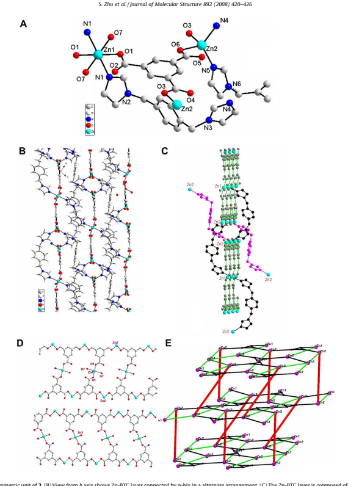

Contents lists available at ScienceDirect

# Journal Of Molecular Structure

journal homepage: www.elsevier.com/locate/molstruc Synthesis, structures and luminescence of three coordination polymers

constructed from rigid 1,3,5-benzenetricarboxylic acid and flexible bis(imidazol-1-ylmethyl)-benzene Shourong Zhu a,*, Hui Zhang a, Yongmei Zhao a, Min Shao b, Zhaoxi Wang a, Mingxing Li a aDepartment of Chemistry, College of Science, Shanghai University, Shanghai 200444, China b Instrumental Analysis and Research Center, Shanghai University, Shanghai 200444, China article info Article history: Received 14 April 2008 Received in revised form 4 June 2008 Accepted 9 June 2008 Available online 17 June 2008 Keywords:
1,3,5-Benzenetricarboxylic acid Bis(imidazol-1-ylmethyl)-benzene Coordination polymer Crystal structure Luminescence

## 1. Introduction Abstract

Three coordination polymers, [Cd3(BTC)2(m-bix)3]n4nH2O (1), {[Cd(HBTC)(H2O)](p-bix)1/2(H2O)2}n (2)
and [Zn3(BTC)2(p-bix)3(H2O)2]n4nH2O (3) (H3BTC = 1,3,5-benzenetricarboxylic acid, bix = bis(imidazol1-ylmethyl)-benzene), have been synthesized under hydrothermal conditions and structurally characterized. In 1, three Cd(II) ions are all in a highly distorted octahedral coordination environment, and m-bix plays a bidentate bridging ligand. In 2, Cd(II) ion is also in a highly distorted octahedral geometry, but pbix is not coordinated with Cd(II) ions. p-Bix acts as a guest molecule filling in the Cd-HBTC rectangular channel. The structure of 3 contains two kinds of unique Zn(II) ions, one is in tetrahedral geometry and the other is in ideal octahedral environment. All the three compounds are three-dimensional metalorganic frameworks. Their TG, IR and fluorescent spectra are also reported. Additionally, a new parameter r is proposed to quantify the distortion of an octahedral environment.

- 2008 Elsevier B.V. All rights reserved.

## 2. Experimental

Coordination polymers, especially metal-organic frameworks
(MOFs) with various intriguing architectures, have wide applications as functional solid materials. These topics have been attained much attention recently although rational design and synthesis of MOFs with unique structure and function still remains a long-term challenge [1]. Rigid ligand such as 1,3,5-benzenetricarboxylic acid
(H3BTB), can provide thermal stability for the framework. While flexible ligands can induce subtle environmental changes that may change the resulting structures. Therefore, many desirable interpenetrated MOFs have been constructed using these ligands or their mixture with other organic ligands [1]. We are also interested in the coordination polymers constructed from the flexible and rigid ligands and metal ions. The rigid H3BTC and flexible para- and meta-bis(imidazol-1-ylmethyl)-benzene (p-bix and m-bix) ligands were used in the synthesis of a variety of coordination polymers [2–15]. In this paper, three new coordination polymers [Cd3(BTC)2(m-bix)3]n4nH2O (1), {[Cd(HBTC)(H2O)](p-bix)1/2
(H2O)2}n (2) and [Zn3(BTC)2(p-bix)3(H2O)2]n4nH2O (3) have been reported. Additionally, the distorted octahedral geometry around metal centers is often formed in many cases, but there is still no criterion to quantify the distortion. Here we propose a new parameter r to quantify this distortion.

* Corresponding author. Tel.: +86 21 66132403; fax: +86 21 66132797.

E-mail address: shourongzhu@shu.edu.cn (S. Zhu).

0022-2860/$ - see front matter - 2008 Elsevier B.V. All rights reserved.

doi:10.1016/j.molstruc.2008.06.007
2.1. Materials and methods The flexible m- and p-bis(imidazol-1-ylmethyl)-benzene ligand were prepared by reacting 1,4-bis(bromomethyl)benzene/1,3bis(bromomethyl)benzene with imidazole in dry CH3CN following a similar procedure using K2CO3 as a base instead of KOH [16].

Other chemicals were of reagent grade and used as received without further purification. Elemental analyses were performed on a Vario EL III elemental analyzer. Infrared spectra were recorded with a Nicolet A370 FT-IR spectrometer by KBr pellets in the range 400–4000 cm1. Thermogravimetric analyses were completed on a Netzsch STA 449C thermal analyzer at a heating rate of 10 C min1 in air. Fluorescent spectra were recorded on a Shimadzu RF-5301 spectrophotometer.

## 2.2. Synthesis Of The Complexes

[Cd3(BTC)2(m-bix)3]n4nH2O (1). A mixture of CdCl2-5H2O
(4.6 mg, 0.02 mmol), H3BTC (4.2 mg, 0.02 mmol), m-bix (4.8 mg, 0.02 mmol), NaOH (2.4 mg, 0.06 mmol) and water (8 mL) was placed in a 15 mL Teflon-lined stainless steel vessel and heated at 120 C for 3 days. Upon cooling to room temperature at a rate of 10 C h1, colorless crystals of 1 were obtained with yield 42%
based on m-bix. Anal. Calcd (%) for C60H56Cd3N12O16: C, 46.84; H,
3.67; N, 10.93. Found: C, 46.68; H, 3.77; N, 10.87. FT-IR data
(KBr, cm1): 3429m, 3119w, 1612s, 1699s, 1566s, 1516m, 1437s, 1370s, 1232m, 1108m, 1085m, 769m, 727s, 655m.

{[Cd(HBTC)(H2O)]-(p-bix)1/2(H2O)2}n (2). A mixture of CdCl25H2O
(4.6 mg, 0.02 mmol), H3BTC (4.2 mg, 0.02 mmol), p-bix (4.8 mg, 0.02 mmol), NaOH (1.6 mg, 0.04 mmol) and water (8 mL) was placed in a 15 mL Teflon-lined stainless steel vessel and heated at 120 C for 3 days. Upon cooling to room temperature at a rate of 10 C h1, colorless crystals of 2 were obtained with yield 56%
based on p-bix. Anal. Calcd (%) for C16H17CdN2O9: C, 38.92; H,
3.47; N, 5.67. Found: C, 38.76; H, 3.71; N, 5.57. FT-IR data (KBr, cm1): 3428m, 3147w, 1615s, 1576s, 1553s, 1439s, 1373s, 1281w, 1109w, 766m, 732s, 630w.

[Zn3(BTC)2(p-bix)3(H2O)2]n4nH2O (3). The synthesis is similar to that described for 1 except using ZnSO46H2O (5.9 mg, 0.02 mmol)
instead of CdCl2-5H2O. Colorless crystals of 3 were obtained with yield 41% based on p-bix. Anal. Calcd (%) for C60H52N12O18Zn3: C,
50.56; H, 3.68; N, 11.79. Found: C, 50.41; H, 3.65; N, 11.82. FT-IR
data (KBr, cm1): 3444m, 3132w, 1628s, 1579s, 1523m, 1430m, 1344s, 1109m, 1094m, 767m, 727s, 655w.

## 2.3. X-Ray Crystallography

Single crystal diffraction data for complexes 1–3 were collected on a Bruker Smart Apex-II CCD diffractometer with graphite monochromatic Mo-Ka radiation (k = 0.71073 Å) at room temperature.

Empirical absorption corrections were applied using SADABS program. The structures were solved by direct method with SHELXS97 program and refined by full-matrix least squares on F2 with SHELXL-97 program [17]. All non-hydrogen atoms were refined anisotropically and hydrogen atoms were placed geometrically.

The crystal data and refinement results are given in Table 1. The selected bond distances and angles are presented in Table 2.

## 3. Results And Discussion 3.1. Description Of Crystal Structures

| Crystallographic data for complexes 1–3 1   | 2               | 3              |                 |
|---------------------------------------------|-----------------|----------------|-----------------|
| Formula                                     | C60H56Cd3N12O16 | C16H17CdN2O9   | C60H60N12O18Zn3 |
| Mr                                          | 1538.37         | 493.72         | 1433.25         |
| Crystal system                              | Monoclinic      | Monoclinic     | Monoclinic      |
| Space group                                 | P2(1)/c         | P2(1)/c        | P2(1)/c         |
| a (Å)                                       | 16.655(3)       | 10.1561(11)    | 14.346(5)       |
| b (Å)                                       | 12.245(2)       | 12.2843(13)    | 10.127(3)       |
| c (Å)                                       | 30.400(6)       | 14.6867(16)    | 21.105(7)       |
| b ()                                             | 92.057(2)       | 102.999(10)    | 99.672(5)       |
| V (Å3 )                                     | 6196(2)         | 1785.4(3)      | 3022.6(16)      |
| Z                                           | 4               | 4              | 2               |
| Dc (Mg m3 )                                             | 1.649           | 1.837          | 1.566           |
| Absorption coeff.                           | 1.099           | 1.278          | 1.265           |
| (mm1 )                                             |                 |                |                 |
| F (0 0 0)                                   | 3088            | 988            | 1460            |
| Measured collections                        | 31,616          | 9784           | 16,449          |
| Unique reflections                          | 10,942          | 3490           | 5900            |
| Parameters                                  | 820             | 255            | 439             |
| GOF on F2                                   | 1.032           | 1.055          | 0.922           |
| R1, wR2 [I > 2r(I)]                         | 0.0424, 0.0861  | 0.0392, 0.1008 | 0.0717, 0.2067  |
| R1, wR2 (all data)                          | 0.0701, 0.0991  | 0.0464, 0.1052 | 0.1267, 0.2464  |
| Largest diff. peak                          | 1.140 and       | 2.326 and      | 0.588 and       |
| and hole (e Å3 )                                             | 0.595                 | 0.634                | 0.655                 |

## 3.1.1. [Cd3(Btc)2(M-Bix)3]N-4Nh2O (1)

X-ray structural analysis reveals that the fundamental unit of 1 contains three distinctive Cd(II) ions, two BTC3 anions, three mbix ligands and four lattice water molecules. The three Cd(II) ions are all coordinated by four carboxylic oxygen atoms from BTC3 anions and two nitrogen atoms from m-bix ligand, showing a highly distorted octahedral environment as illustrated in Fig. 1A. The Cd–O distances fall in the range 2.273–2.477 Å, while the Cd–N distances range from 2.247 to 2.262 Å. The Cd–N distances is quite similar to literature data [6,12,15]. Cd–N distances are slightly shorter than that of Cd–O lengths, which is quite different from that in complex [Zn3(BTC)2(m-bix)3] [1], where Zn–N distances longer than Zn–O distances.

One BTC3 anion acts as a hexadentate ligand. Amongst three carboxylates, two carboxylates chelate to Cd1 and Cd2, while the third carboxylate bridges another Cd2 and Cd3 via 1,3-coordination mode. The other BTC3 acts as a heptadentate ligand as shown in Chart 1. Cd(II) centers are bridged by BTC3 anions to form a 3D
Cd-BTC polymeric network (Fig. 1B and C). The Cd-BTC wall shown in Fig. 1B is composed of Cd-BTC 1D ladders (Fig. 1C), and the distance between adjacent Cd-BTC walls is 8.23 Å. Cd2 and Cd3 ions located in the ladder side and Cd1 ions located in the outside as a decoration (Fig. 1C). The Cd1...Cd1 distance in a ladder is 10.091(1) Å. As shown in Fig. 1C, Cd1 atom in a ladder is shared with other ladder that is perpendicular to it.

Interestingly, all the three m-bix ligands form rings via coordination to Cd(II) ions (Fig. 1D). Two symmetrically identical m-bix ligands in c-shape (cis conformation) form inner ring via two Cd3 atoms and N9, N12 atoms from different imidazole rings (Fig. 1D,
purple one). Two other m-bix ligands coordinate to Cd1 and Cd2 ions in an alternate arrangement to form a much larger (outer) ring
(Fig. 1D, black one). The Cd1...Cd2 distance in the outer ring is

| Selected bond distances (Å) and angles () Complex 1 Cd(1)–N(8)#1 2.247(4) Cd(2)–O(4)                     |            | 2.365(3)             |            |
|---------------------|------------|----------------------|------------|
| Cd(1)–N(4)#2        | 2.262(4)   | Cd(2)–O(5)#4         | 2.387(3)   |
| Cd(1)–O(2)          | 2.273(3)   | Cd(2)–O(3)           | 2.512(3)   |
| Cd(1)–O(7)          | 2.339(3)   | Cd(3)–N(12)#5        | 2.252(4)   |
| Cd(1)–O(8)          | 2.361(3)   | Cd(3)–N(9)           | 2.259(4)   |
| Cd(1)–O(1)          | 2.477(3)   | Cd(3)–O(6)#6         | 2.298(3)   |
| Cd(2)–N(1)          | 2.259(4)   | Cd(3)–O(11)#5        | 2.336(3)   |
| Cd(2)–N(5)          | 2.260(4)   | Cd(3)–O(9)           | 2.363(3)   |
| Cd(2)–O(12)#3       | 2.276(3)   | Cd(3)–O(10)          | 2.483(3)   |
| N(8)#1–Cd(1)–N(4)#2 | 101.10(15) | O(4)–Cd(2)–O(3)      | 53.66(10)  |
| N(8)#1–Cd(1)–O(2)   | 87.84(13)  | O(5)#4–Cd(2)–O(3)    | 93.32(11)  |
| N(4)#2–Cd(1)–O(7)   | 139.13(13) | N(12)#5–Cd(3)–N(9)   | 170.09(16) |
| O(2)–Cd(1)–O(7)     | 111.08(12) | N(12)#5–Cd(3)–O(6)#6 | 96.84(14)  |
| O(2)–Cd(1)–O(8)     | 163.81(12) | O(11)#5–Cd(3)–O(9)   | 144.79(12) |
| O(2)–Cd(1)–O(1)     | 54.34(11)  | O(11)#5–Cd(3)–O(10)  | 91.29(11)  |
| O(4)–Cd(2)–O(5)#4   | 146.97(11) | O(9)–Cd(3)–O(10)     | 53.51(11)  |
| N(1)–Cd(2)–O(3)     | 85.92(13)  |                      |            |
| Symmetry codes: (i) x, y, 1z; (ii) 1+x, y, z; (iii) x, 0.5+y, 0.5z; (iv) x, 1y, 1z; (v) 1x, 1y, z; (vi) 1x, 0.5+y, 0.5z; (vii) 1+x, y, z; (viii) 1x, 0.5+y, 0.5z; (ix) x, 0.5+y, 0.5z. Complex 2 Cd(1)–O(4D) 2.283(3) Cd(1)–O(3C) 2.224(3) Cd(1)–O(1) 2.330(3) Cd(1)–O(7) 2.303(4) Cd(1)–O(6E) 2.424(3) Cd(1)–O(5E) 2.338(3) O(3C)–Cd(1)–O(4D) 116.12(12) O(3C)–Cd(1)–O(7) 89.71(16) O(3C)–Cd(1)–O(5E) 134.54(11) O(7)–Cd(1)–O(1) 156.16(17) O(5E)–Cd(1)–O(6E) 54.95(10) Symmetry codes: (i) 1x, 0.5+y, 0.5z; (ii) 1x, 2y, 1z; (iii) x, 0.5+y, 0.5z; (iv) x, 1.5y, 0.5+z; (v) 1x, 0.5+y, 0.5z; (vi) x, 0.5+y, 0.5z; (vii) x, 1.5y, 0.5+z. Compound 3 Zn(1)–N(1) 2.158(5) Zn(2)–N(5) 2.016(5) Zn(1)–O(1) 2.060(4) Zn(2)–O(3) 2.006(4) Zn(1)–O(7) 2.188(5) Zn(2)–O(6) 2.012(4) Zn(2)–N(4) 2.028(5) O(1)–Zn(1)–O(1) 179.998(1) O(6)–Zn(2)–N(5) 110.20(17) O(1)–Zn(1)–N(1) 93.39(18) N(5)–Zn(2)–N(4) 118.06(19) O(1)–Zn(1)–O(7) 90.77(18) Symmetry codes: (i) 1x, 1y, z; (ii) 1x, 0.5+y, 0.5z; (iii) x, 1+y, z; (iv) x, y, 1z; (v) x, 1+y, z; (vi) 1x, 0.5+y, 0.5z.                     |            |                      |            |

Fig. 1. (A) The coordination environments for Cd ions in 1. (B) 3D structure from ac plane shows rectangular framework, m-bix is omitted for clarity. (C) Structure of the rectangular Cd-BTC wall. (D) Coordination mode of m-bix-Cd. (E) Topology of the structure. Black triangles are BTC3 ligands m-bix that links Cd3 is shown in purple, other mbixs are in green. (For interpretation of the references to color in this figure legend, the reader is referred to the web version of this article.)
10.874(3) and 11.931(11) Å, respectively, which are obviously longer than Cd3...Cd3 distance in the inner ring (7.830(3) Å). The Cd1...Cd1 and Cd2...Cd2 distances in the outer larger ring are 18.234(15) and 13.737(4) Å, respectively. All these Cd...Cd distances within a m-bix ring are much longer than the Cd...Cd distances between inner and outer rings (Cd2...Cd3, 4.090(4) Å).

The outer and inner ring linked through a Cd–O–C–O–Cd in the same Cd-BTC ladder (Fig. 1D). Inner ring links Cd ions of a ladder

Chart 1. Coordination fashions of BTC3/HBTC2 anions in 1–3.
and the outer ring links adjacent ladders. m-Bix fills in the Cd-BTC grid channel with simultaneously bind to Cd(II) ions to form a 3D polymeric structure (Fig. 1B). The topology of the complex is shown in Fig. 2E, where BTC3 anions are represented by a black triangle. Cd(II) ions and BTC3 anions form layers. The two Cd3 ions
(in purple color) are linked by two m-bix ligands to form a smaller ring (overlapped purple stick). While Cd1 and Cd2 are linked by mbix (in green lines) to form much larger macrocycles.

## 3.1.2. {[Cd(Hbtc)(H2O)]-(P-Bix)1/2(H2O)2}N (2)

As shown in Fig. 2, the fundamental unit of complex 2 is composed of one Cd(II) ion, one HBTC2 ligand, half of p-bix ligand and two water molecules. The Cd(II) center is coordinated by five carboxylic oxygen atoms from HBTC2 anions and a oxygen atoms from H2O to form a highly distorted octahedral environment. The Cd–O distances fall in the range 2.224(3) (Cd–O1) to 2.425(3) (Cd–O6) Å, which are similar to that in complex 1 and agree well with the reported values [18]. In complex 2, the HBTC2 anion acts as a pentadentate ligand (Chart 1). The Cd(II) centers are bridged by HBTC2 anions to form a 3D rectangular porous structure
(Fig. 2D). p-Bix is not coordinated to Cd(II) ions but fills the cavity of the rectangular channel (Fig. 2B). The structure of side wall shown in Fig. 2B is a Cd2+-HBTC2 ladder (Fig. 2C). Each Cd is intersected with other Cd2+-HBTC2 walls as shown in Fig. 2B.

The reasons that we think the proton binds to BTC3 rather than imidazole are : (1) p-bix is central symmetrical. If one imidazole nitrogen protonated, the other imidazole should also protonated. But there is only one proton. (2) Imidazole is a very weak base with a pKb 7.0 [19]. (3) The nearest N2...N2 distance within a channel is 5.658(6) Å (Fig. 2B), which is beyond the distance of H-bond interaction. (4) One monodentate carboxylate is clearly different from other two bidentate (chelating or bridging) carboxylates. (5) Partially deprotonated Cd-BTC complex has been reported previously
[18], bond distances and angles are comparable with our complex.

A simplified structure is shown in Fig 2D, where HBTC2 are presented in black triangles. These black triangles (HBTC2) link Cd2+ ions (in green balls) to form a porous metal-organic framework. The framework is filled with free p-bix as shown in Fig. 2B.

## 3.1.3. [Zn3(Btc)2(P-Bix)3(H2O)2]N4Nh2O (3)

Enantiomers have identical cell parameters have been reported
[20]. It is beyond our expectation that complex 3 has identical cell parameters to that of [Co3(BTC)2(p-bix)3(H2O)3]n2nH2O [21].

Although it is uncommon, but different compounds have identical cell parameters have precedents [22,23].

Crystal structure of 3 is shown in Fig. 3. There are two kinds of unique Zn(II) ions in 3 and exhibit two different coordination geometries. Zn1 lies at an inversion center and is coordinated by

Fig. 2. (A) Asymmetric unit of 2. (B) 3D view from a-axis shows porous channel where the cavity was filled with m-bix. (C) Structure of a Cd-HBTC side wall. Each Cd is intersected with other Cd2+-HBTC2 walls. (D) Topology of the 3D porous structure, m-bix was omitted for clarity. Small black triangles are HBTC2. Green balls are Cd2+ ions.

(For interpretation of the references to color in this figure legend, the reader is referred to the web version of this article.)

Fig. 3. (A) Asymmetric unit of 3. (B) View from b axis shows Zn-BTC layer connected by p-bix in a alternate arrangement. (C) The Zn-BTC layer is composed of Zn-BTC ladders.

(D) Zn-BTC ladders in a layer linked by p-bix. (E) Topology of the 3D structure. Red lines are p-bix that link Zn-BTC3 layers. Green lines are p-bix that link Zn1 and Zn2 in a ZnBTC3 layer. (For interpretation of the references to color in this figure legend, the reader is referred to the web version of this article.)
two carboxylate oxygen atoms, two nitrogen atoms from different p-bix and two H2O molecules, showing a octahedral geometry. Zn2 is coordinated to two carboxylate oxygen atoms and two p-bix nitrogen atoms to give a tetrahedral geometry. The Zn–O distances fall in the range from 2.006(4) to 2.060(4) Å, and Zn–N bond lengths range from 2.016(5) to 2.158(5) Å, which are comparable with that observed in similar Co-based complexes [21].

Unlike in complex 2, all carboxylates of BTC3 anions are monodentately coordinated to Zn(II) as illustrated in Chart 1. The Zn(II)
ions are bridged by BTC3 to form a network shown in Fig. 3B. The Zn-BTC layer is composed of 1D Zn-BTC ladders as shown in Fig. 3C and D. The distance between adjacent layers is 7.804 Å. The Zn1 centers with octahedral geometry locate in the middle of the ladder and Zn2 centers with tetrahedral geometry arrange evenly at ladder sides. The step distance in the ladder is 10.127(3) Å and the ladder width is about 13.5 Å. One p-bix in c-shape links one Zn2 ion (at the ladder side) and the Zn1 ion (at the other ladder center) with a distance of 11.849(24) Å (Fig. 3C, black ones). These Zn1 and Zn2 ions are in the same Zn-BTC layer. While another p-bix in sshape (purple ones in Fig. 3C) links Zn2 ions between adjacent layers. The Zn2...Zn2 distance is 14.441(14) Å. These links give rise to the complicated 3D framework as shown in topological Fig. 3E. In Fig. 3E, the red lines are p-bix that link Zn2 of adjacent Zn-BTC3 layers. While the green lines are p-bix that link Zn1 and Zn2 in a Zn-BTC3 layer.

All Cd(II) ions in 1 and 2 are in a distorted octahedral environment although one can hardly recognize octahedron from Fig. 1.

There is still no criteria to quantify distortion of an octahedral geometry. Addison and Reedijk proposed a parameter called s to discern square-pyramidal from triangle-bipyramidal of a five-coordinated complex [24]. Here we propose a parameter r to quantify how distort an octahedral geometry is. For ideal octahedron, the min and max angles are 90 and 180, respectively. In distorted complex, the maximum and/or minimum bond angle will decrease
(Chart 2). In extreme case, if the maximum or minimum angles decrease 90 will totally lost octahedral environment. Then we define r = [amin + amax  180]/90. For ideal octahedral complex, r is 1, or 100% octahedron. For distorted octahedral complex, r is expected less than 1. One can simply compare the relative distortions by comparing r values of different six-coordinated species. For
[Cd3(BTC)2(m-bix)3]n-4nH2O (1), r values for Cd1, Cd2 and Cd3 ions are 0.42, 0.41 and 0.48, respectively. Therefore, Cd2 ion adopts the most distorted octahedral geometry and has only 41% pure octahedron. While r value for Zn1 is 0.97 in complex 3, which indicates the Zn1 locates in an ideal octahedral environment amax.

## 3.2. Thermal Analysis

For 1, the weight loss of 4.65% below 192 C corresponds to the loss of four lattice water molecules (calcd 4.68%). Then the compound begins to decompose. For 2, the first weight loss of 11.1% below 131 C is assigned to the liberation of three water molecules, which is in agreement with the calculated value (10.7%). The second weight loss occurs in the range 131 to 400 C, which is attributed to the elimination of the uncoordinated p-bix ligand (obsd 24.5%, calcd 24.1%). Then to 679 C, a brown residue of ZnO left
(obsd 26.4%, calcd 26.0%). Although complex 3 has almost identical structure as that of [Co3(BTC)2(p-bix)3(H2O)3]n2nH2O [21], their thermal stabilities are different. The above Co-based complex lost the lattice and coordinated water at 60–160 C (6.4%). While 3 lost six water molecules (obsd 7.50%, calcd 7.53%) up to 346 C (Fig. S1).

There is no significant difference between crystalline water and coordinated water in TG curve.

## 3.3. Ir And Fluorescent Spectra

The IR spectra of free p-bix and m-bix are similar as shown in Fig. S2, and the 15111431 cm1 come from C@N and C@C vibration in the imidazole rings. For complex 1, the 1613 and 1371 cm1 are mas(OCO) and ms(OCO) stretch vibration, respectively. The differ-

Chart 2. Distortation of octahedronal complexes.
ence between C@N and C@C vibration increases from 63 cm1 in free m-bix to 79 cm1 in the complex, indicating that coordination environment can shift IR peaks. The 1230 and 1083 cm1 peak in m-bix shift slightly to higher wave-number in complex 1. The IR data agree well with their crystal structures. For complex 2, there is a shoulder peak at 1651 cm1, which indicates that there is a undeprotonated carboxyl group in the complex. Compared with other protonated carboxyl group at 17201680 cm1, this peak shifts to lower wave-number, which can be explained by the weaken of O–H bond upon carboxyl oxygen atom coordination or Hbond interaction. The absorption bands at 1617, 1373 cm1 can be also assigned to mas(OCO) and ms(OCO) vibrations, respectively.

1554 and 1438 cm1 peaks are the vibrations of C@N and C@C in the imidazole rings. Compared with that in free bix ligand, both shifted to higher wave-numbers. The difference between C@N
and C@C vibration increases from 80 cm1 in free ligand to 116 cm1 in the complex. Possibly there are some interaction between bix and the complex framework, especially the imidazole nitrogen. The relative intensities of 1106 and 1076 cm1 peaks in free bix reverse in the complex where the bix as a guest molecule locates in the channel of Cd-BTC. The 1236 cm1 peak of free p-bix disappeared in the host–guest complex. For 3, the absorption bands at 1628 and 1344 cm1 correspond to mas(OCO) and ms(OCO),
respectively. The absorption bands at 1579 and 1430 cm1 can be assigned to the vibrations of the C@N and C@C in the imidazole rings.

The emission spectra of complexes 1–3 in the solid state at room temperature are investigated. All the three complexes have emission peak at 425 nm when excited at 325 nm (Fig. S3). Zn(II)
and Cd(II) are d10 configuration. Both ions are not easy to be oxidized or reduced. Therefore, the 425 nm emission of 1, 2 and 3 are probably due to p*–p transitions of neutral bix ligands, because similar peaks also appear for the free bis(imidazole) ligands and their complexes, respectively [1].

## 4. Conclusions

In conclusion, three new coordination polymers based on rigid 1,3,5-benzenetricarboxylate and flexible bix ligands were synthesized. All the three complexes form 3D networks. All Cd(II) ions in 1 and 2 adopt highly distorted octahedral geometry. While Zn(II) ions existing in 3 are in tetrahedral and octahedral environment. The results show that if the structure of bix is slightly changed, the MOFs may differ greatly. p-Bix in complex 2 acts as a guest molecule filling in the Cd-HBTC rectangular channel, while m-bix in 1 coordinates to Cd ions. In complex 3, the Zn centers were bridged by BTC3 to form 1D ladders, one p-bix links two Zn ions in different ladders, while the other p-bix links Zn ions in adjacent Zn-BTC3 layers. Additionally, we propose a new parameter r to characterize the distortion of an octahedral complex.

## Acknowledgements

This work was supported by the Development Foundation of Shanghai Municipal Education Committee (06AZ098) and the Excellent Youth Teachers Foundation of Shanghai Municipal Education Committee, China.

## Appendix A. Supplementary Data

Crystallographic data for the structural analyses have been deposited with the Cambridge Crystallographic Data Center, CCDC-663448 for 1, CCDC-663449 for 2 and CCDC-667738 for 3. Copies of the data can be obtained free of charge from CCDC, 12 Union Road, Cambridge, CB2IEZ, UK. E-mail: deposit@ccdc.cam.a426 c.uk. Supplementary data associated with this article can be found, in the online version, at doi:10.1016/j.molstruc.2008.06.007.

## References

[1] Y.Y. Liu, J.F. Ma, J. Yang, Z.M. Su, Inorg. Chem. 46 (2007) 3027. [2] J.D. Lin, Z.H. Li, J.R. Li, S.W. Du, Polyhedron 26 (2007) 107. [3] J. Fan, C. Slebodnick, D. Troya, R. Angel, B.E. Hanson, Inorg. Chem. 44 (2005)
2719.

[4] J. Fan, G.T. Yee, G. Wang, B.E. Hanson, Inorg. Chem. 45 (2006) 599. [5] Z. Lu, L. Wen, Z. Ni, Y. Li, H. Zhu, Q. Meng, Cryst. Growth Des. 7 (2007) 268.

[6] C. Liu, Y. Yin, X. Shi, D. Zhang, M. Hu, Inorg. Chem. Commun. 10 (2007) 37.

[7] L. Wen, Z. Lu, J. Lin, Z. Tian, H. Zhu, Q. Meng, Cryst. Growth Des. 7 (2007) 93.

[8] T. Li, H. Zhou, P. Lin, S.W. Du, Inorg. Chem. Commun. 9 (2006) 1263. [9] L. Song, J. Li, P. Lin, Z. Li, T. Li, S. Du, X. Wu, Inorg. Chem. 45 (2006) 10155.

[10] T. Li, Z.H. Li, S.M. Hu, S.W. Du, J. Coord. Chem. 59 (2006) 945. [11] J.D. Lin, Z.H. Li, T. Li, J.R. Li, S.W. Du, Inorg. Chem. Commun. 9 (2006) 675.

[12] L. Wen, Y. Li, Z. Lu, J. Lin, C. Duan, Q. Meng, Cryst. Growth Des. 6 (2006) 530. [13] L.L. Wen, D.B. Dang, C.Y. Duan, Y.Z. Li, Z.F. Tian, Q.J. Meng, Inorg. Chem. 44
(2005) 7161.

[14] L. Carlucci, G. Ciani, D.M. Proserpio, Cryst. Growth Des. 5 (2005) 37.

[15] B.F. Abrahams, B.F. Hoskins, R. Robson, D.A. Slizys, CrystEngComm 4 (2002)
478.

[16] E. Alcalde, N. Mesquida, L. Perez-Garcia, Eur. J. Org. Chem. (2006) 3988.

[17] G.M. Sheldrick, SHELXTL, Version 6.1, Bruker AXS Inc., WI, USA, 2000. [18] J.C. Dai, X.T. Wu, Z.Y. Fu, C.P. Cui, S.M. Hu, W.X. Du, L.M. Wu, H.H. Zhang, R.Q.

Sun, Inorg. Chem. 41 (2002) 1391.

[19] S. Sjoberg, Pure Appl. Chem. 69 (1997) 1549. [20] K. Marthi, S. Larsen, M. Acs, J. Balint, E. Fogassy, Acta Cryst. B50 (1994) 762.

[21] Y. Qi, F. Luo, Y. Che, J. Zheng, Cryst. Growth Des. 8 (2008) 606. [22] R.S. Rarig, J. Zubieta, J. Chem. Soc., Dalton Trans. (2001) 3446.

[23] D. Wiedenfeld, M.A. Minton, V.N. Nesterov, D.R. Glass, C.L. Montoya, Tetrahedron Lett. 45 (2004) 4023.

[24] A.W. Addison, T.N. Rao, J. Reedijk, J.V. Rijn, G.C. Verschoor, J. Chem. Soc., Dalton Trans. (1984) 1349.