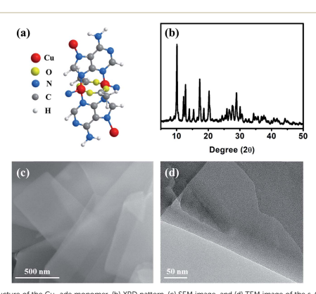
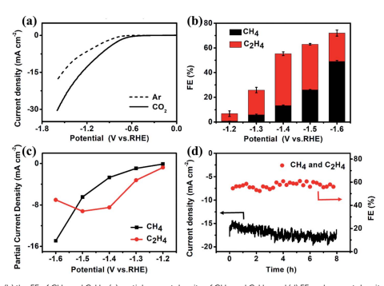
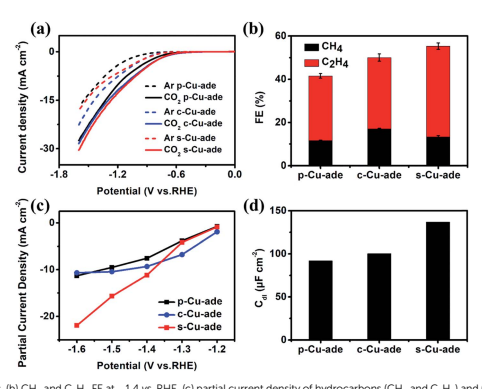
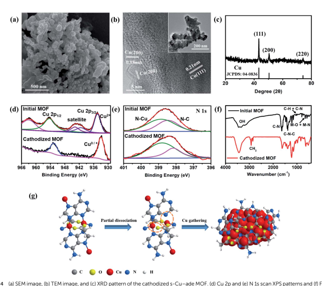

# Edge Article

Cite this: Chem. Sci., 2019, 10, 7975 All publication charges for this article have been paid for by the Royal Society of Chemistry

# Highly Efficient Electroconversion Of Carbon Dioxide Into Hydrocarbons By Cathodized Copper– Organic Frameworks†

Fan Yang, Aling Chen, Pei Lin Deng, Yinzheng Zhou, Zaman Shahid, Hongfang Liu and Bao Yu Xia *
Highly selective conversion of carbon dioxide (CO2) into valuable hydrocarbons is promising yet challenging in developing effective electrocatalysts. Herein, CuII/adeninato/carboxylato metal–biomolecule frameworks (CuII/ade-MOFs) are employed for efficient CO2 electro-conversion towards hydrocarbon generation. The cathodized CuII/ade-MOF nanosheets demonstrate excellent catalytic performance for CO2 conversion into valuable hydrocarbons with a total hydrocarbon faradaic efficiency (FE) of over 73%.

Ethylene (C2H4) is produced with a maximum FE of 45% and a current density of 8.5 mA cm2 at 1.4 V vs. RHE, while methane (CH4) is produced with a FE of 50% and current density of 15 mA cm2 at 1.6 V vs. RHE. These investigations reveal that the reconstruction of cathodized CuII/ade-MOFs and the formed Cu nanoparticles functionalized by nitrogen-containing ligands contribute to the excellent CO2 conversion performance. Furthermore, this work would provide valuable insights and opportunities for the rational design of Cu-based MOF catalysts for highly efficient conversion of CO2 towards hydrocarbon generation.

Received 29th May 2019 Accepted 2nd July 2019 DOI: 10.1039/c9sc02605c rsc.li/chemical-science The rapid growth of global population and industrial development require high consumption of energy and fuels that leads to signicant emission and accumulation of carbon dioxide
(CO2), one of the main reasons for severe global warming and climate change.1,2 Natural photosynthesis is the only means to balance the CO2 level, however, it has limited capability in CO2 utilization and conversion to maintain the crucial carbon cycle.3 Therefore, developing efficient articial CO2 xation technologies are imperative to balance the carbon footprint and reduce excessive CO2 emissions for a sustainable human society.4 Except for the physical storage, chemical conversion of CO2 to valuable chemicals has been investigated extensively.5 Contrary to the thermochemical and photochemical approaches, electrochemical reduction of CO2 powered by renewable energy sources (solar, wind, etc.) is a useful possibility due to its mild reaction conditions/systems and various valuable products.6,7 Extensive research studies reveal that carbon monoxide (CO)
and formic acid (HCOOH) are the main products of electrochemical CO2 conversion.8–10 However, high energy density and value-added hydrocarbons, including methane (CH4) and Key Laboratory of Material Chemistry for Energy Conversion and Storage (Ministry of Education), Key Laboratory of Material Chemistry and Service Failure, School of Chemistry and Chemical Engineering, Wuhan National Laboratory for Optoelectronics, Huazhong University of Science and Technology (HUST), 1037 Luoyu Road, Wuhan 430074, PR China. E-mail: byxia@hust.edu.cn
† Electronic supplementary information (ESI) available. See DOI:
10.1039/c9sc02605c ethylene (C2H4) are more desirable for further industrial practices.11,12 Copper (Cu) based nanomaterials show the potential capability to generate various hydrocarbons.13–16 Nevertheless, these inorganic Cu compounds suffer from low efficiency and selectivity for CO2 conversion towards hydrocarbon production.17–20 Recently, porous metal–organic frameworks (MOFs) constructed from the coordination bonds of organic ligands and metal ions have attracted extensive interest.21 The adjustable molecular structures and metal categories make MOFs emerging alternatives for multidisciplinary catalysis applications.22,23 Especially, the atomic level periodicity of Cu complexes allows the design of Cu active sites for potential CO2 electrolysis.24–26 For example, Cu porphyrin molecules can convert CO2 to CH4 with a faradaic efficiency (FE) of 30% at 0.98 V vs. RHE,23 while Cu phthalocyanine shows an FE for CH4 of 66% at 1.06 V (vs. RHE).25 Nevertheless, crystalline CuMOFs themselves show a limited efficiency for electrochemical conversion of CO2 to C2 products. For example, the Cu(II)
benzene-1,3,5-tricarboxylate (btc) MOF (HKUST-1) facilitates the production of CH4 with a maximum faradaic efficiency of 27%
and a partial current density of 4.4 mA cm2 at 1.16 V (vs.

RHE),25 while the Cu2(CuTCPP) MOF facilitates the formation of formate and acetate with a total current density of 4.5 mA cm2 and total faradaic efficiency of 85%.26 Another type of Cu MOF,
named [Cu2(ade)2(CH3COO)2], facilitates the formation of a little amount of CH3OH with 0.7% FE and C2H5OH with 0.5%
 

FE for CO2 conversion at 1.55 V vs. RHE.27 Moreover, these Cubased active materials oen exhibit structural evolution under the cathodic reductive environment but are rarely reported.25,28 Therefore, developing suitable Cu-MOF nanocatalysts and investigating their structural evolution would be signicant for further understanding MOF-based catalysts in highly selective CO2 conversion towards valuable hydrocarbon chemical production.

In this work, Cu–ade MOFs are employed to investigate their structure and performance for the selective conversion of CO2.

Interestingly, the Cu–ade nanosheets demonstrate an excellent catalytic performance towards hydrocarbon production with a total hydrocarbon faradaic efficiency (FE) of over 73%.

Predominantly, ethylene (C2H4) with a maximum FE of 45% is mainly produced at 1.4 V vs. RHE with a current density of 8.5 mA cm2, while methane (CH4) is mainly produced at 1.6 V vs.

RHE with an FE of 50% and a current density of 15 mA cm2.

Characterization results and electrochemical analysis reveal the reconstruction of cathodized Cu-MOFs accompanied by the formation of Cu nanocrystals. Along with the residual ligands, these active Cu crystals would be responsible for the excellent CO2 conversion towards hydrocarbon production. The contemporary approach towards structural evolution of CuMOFs for CO2 conversion to hydrocarbons would provide valuable understanding in developing efficient Cu-MOF catalysts for selective CO2 electrolysis and beyond.

The Cu–ade MOF nanosheets are constructed by coordinating Cu2+ ions with adenine and acetic acid (Fig. 1a).29–31 The biomolecular adeninato/carboxylato ligands not only scaffold the abundant pores of Cu–ade MOFs but may also contribute protons to enhance the CO2 electroreduction process due to the presence of N-containing functional groups.32–35 Three Cu–ade MOFs with different thicknesses, named Cu–ade nanosheets (sCu–ade), nanoplates (p-Cu–ade) and nanocuboids (c-Cu–ade),
are prepared by tuning the volume ratio of methanol and water
(Fig. S1†). X-ray powder diffraction (XRD) patterns of MOF
products are consistent with metal–adeninate frameworks, which reveals the successful formation of crystalline Cu–ade MOFs (Fig. 1b and S1†).36 Scanning electron microscopy (SEM)
demonstrates that the Cu–ade MOFs have a width of 500 nm and a length of several micrometers (Fig. 1c). Notably, the transparent property suggests the thin nanosheet structure of Cu–ade MOFs. The transmission electron microscopy (TEM)
image further conrms the thin two-dimensional structure, and the transparent Cu–ade MOF nanosheet shows a porous structure with a smooth surface (Fig. 1d).

The CO2 electroreduction measurements of Cu–ade MOFs are performed in CO2-saturated 0.1 M KHCO3 electrolyte at the potential ranging from 1.2 V to 1.6 V vs. RHE. Fig. 2a demonstrates the potential-dependent current response in Ar-/
CO2-saturated KHCO3 solution. Compared with the current response in Ar-saturated electrolyte, the signicant enhancement of current density in the CO2-saturated electrolyte implies that the Cu–ade MOF catalysts may have potential catalytic activity for CO2 reduction. The gaseous products are monitored by using two online gas chromatography (GC) systems (Fig. S2†), and the liquid products are analyzed using the nuclear magnetic resonance (NMR) technique (Fig. S3†). When
 

Fig. 1 (a) Molecular structure of the Cu–ade monomer, (b) XRD pattern, (c) SEM image, and (d) TEM image of the s-Cu–ade MOF.

 

Fig. 2 (a) LSV curves, (b) the FE of CH4 and C2H4, (c) partial current density of CH4 and C2H4, and (d) FE and current density test at 1.4 V vs. RHE
for the s-Cu–ade MOF.
the Cu–ade catalysts are used in Ar-saturated 0.1 M KHCO3 solution, only the H2 product is detected without any carboncontaining gaseous and liquid products such as CO and CH4.

However in the CO2-saturated 0.1 M KHCO3 solution, the major hydrocarbon products including CH4 and C2H4 are detected by GC measurements and few liquid products such as HCOOH and CH3CH2OH are characterized by NMR analysis (Fig. S3†). These results suggest that Cu-MOFs are effective for CO2 electrochemical reduction, whereas the reduction products are from CO2 rather than the carbon-containing Cu–ade catalyst system.

The constant potential test method is used to investigate the CO2 reduction over three Cu–ade MOF catalysts (Fig. S4†). The detailed analysis of CO2 electrochemical reduction shows that the main products of CO2 reduction are hydrocarbons and hydrogen (Fig. S5†). The faradaic efficiencies (FEs) of CH4 and C2H4 products over nanosheet structured Cu–ade MOFs are shown in Fig. 2b. C2H4 is rst produced at a more positive potential than CH4, which means that the electrochemical reduction of CO2 preferentially generates the C2H4 product at a lower potential. The total FE of hydrocarbons (CH4 and C2H4)
keeps increasing with more negative cathodic potentials and achieves the highest value of over 73% at a potential of 1.6 V
vs. RHE. Among them, the FE of C2H4 increases rstly and then decreases while the FE of CH4 keeps increasing along with the increasing cathodic potentials. The maximum FE of C2H4 can reach 45% at 1.4 V vs. RHE, and the maximum FE of CH4 is over 50% at 1.6 V vs. RHE. This phenomenon is similar to other Cu-based electrocatalysts for hydrocarbon production by CO2 electrolysis, as larger potentials induce more difficult C–C
coupling, thus resulting in decreased C2 products and increased C1 products.37–39 The partial current densities of CH4 and C2H4 at different potentials are shown in Fig. 2c. The partial current density of C2H4 is 9.2 mA cm2 at 1.5 V vs. RHE, and the high current density is rare for MOF-derived catalysts for converting CO2 to C2H4.

23,25–27 At a potential of 1.6 V vs. RHE,
the partial current density of C2H4 is 15.0 mA cm2 accompanied by a total FE of 73% for hydrocarbons (CH4 and C2H4).

Compared to the reported Cu-complexes, these cathodized CuMOFs show excellent efficiency for the electrochemical conversion of CO2 to C2 products (Table S1†).

The electrolysis stability of Cu–ade MOF nanosheet catalysts is further investigated at 1.4 V vs. RHE for 8 hours (Fig. 2d).

The total FE of CH4 and C2H4 is stable at 60% during the whole stability test. However, the total current density increases slightly, which might be due to some side reactions, such as hydrogen evolution and the gradual reduction of Cu–ade MOF
nanosheets. The detailed FE evolution of CH4 and C2H4 is demonstrated in Fig. S7d.† With prolonged electrolysis, the FE
of the C2H4 product decreases and the FE of CH4 increases as time goes on. A similar trend is observed when electrolysis is performed at relatively negative electrode potentials; the FE of C2H4 decreases, and the FE of CH4 increases.

Among the three Cu–ade MOFs, s-Cu–ade MOF nanosheets demonstrate the most signicant partial current density and the highest FE for hydrocarbons. However, linear scan curves of CO2 reduction over the three Cu–ade MOFs are similar (Fig. 3a).

Very interestingly, the LSV curve of the s-Cu–ade in the Arsaturated electrolyte is in the middle, which implies that the hydrogen evolution side reaction over the s-Cu–ade MOF may be inhibited. The lower FE of H2 also indicates this phenomenon
(Fig. S5†). The FE of both CH4 and C2H4 is more than 50% at 1.4 V vs. RHE (Fig. 3b), and the partial hydrocarbon (CH4 and

Fig. 3 (a) LSV curves, (b) CH4 and C2H4 FE at 1.4 vs. RHE, (c) partial current density of hydrocarbons (CH4 and C2H4) and (d) Cdl comparison of the three Cu–ade MOFs.
C2H4) current density of s-Cu–ade is also higher at a relatively negative potential (Fig. 3c). The other two Cu–ade materials show the same change rules in the FE of CH4 and C2H4. The FE
of C2H4 rst increases to 35% at 1.4 V vs. RHE and then declines, and the FE of CH4 always increases with the increased potentials (Fig. S6 and S7†). Among the three Cu–ade MOFs, the performance of CO2 reduction to the hydrocarbons (CH4 and C2H4) is dependent on the thickness of Cu–ade MOFs, and the sCu–ade nanosheets demonstrate the best CO2 reduction performance (Fig. 3 and S5†). Considering the same molecular structure and similar CO2 reduction behaviors in the activity and selectivity (Fig. S7†), the electrochemically active surface area (ECSA) and electrochemical impedance spectroscopy (EIS)
measurements are further performed. To a certain extent, the ECSA represents the number of active sites determined by the electrochemical double layer capacitance (Fig. S8†). The capacitance is calculated by plotting current density differences against scan rates and the capacitance values of p-Cu–ade, cCu–ade and s-Cu–ade are 92 mF cm2, 100 mF cm2 and 138 mF cm2, respectively, (Fig. 3d) and the roughness factors
(Rf) are 4.6, 5.0 and 6.9, respectively. Thus, ECSAs for p-Cu–ade, c-Cu–ade and s-Cu–ade are 0.9 cm2, 0.98 cm2, and 1.34 cm2, respectively. The area-based activities of three samples demonstrate a similar trend in the CO2 reduction activity
(Fig. S9†), indicating that the enhanced CO2 reduction activity of Cu–ade MOF nanosheets is mainly ascribed to improved ECSAs, which provide more active sites that are exposed to the reactant.

Furthermore, the electrochemical impedance spectroscopy
(EIS) measurement results and the equivalent circuit for the Nyquist plots are displayed in Fig. S9b.† The EIS data are tted by the internal resistance (R1), the charge transfer resistance
(Rs), and the constant phase elements (CPE 1 and 2). Cu–ade MOF nanosheets exhibit the smallest transfer resistance (Rct),
which indicates fast charge transfer during the electrochemical reaction process. The thin structure could contribute to sufficient contact of the reactant on nanosheets, which will result in fast charge transfer over the Cu–ade nanosheet catalyst to promote the hydrocarbon generation. Although the distribution of the reduction product mainly depends on the microstructure and intrinsic active Cu-complex sites, obviously, the different morphology of Cu–ade MOFs determines the activity of CO2 reduction. Moreover, the thinner nanosheets with more active sites exposed would lead to the enhanced activity for hydrocarbon generation.

The excellent performance in hydrocarbon generation attracts our attention to investigate the real active surface of Cu–
ade MOFs. Aer the CO2 electrolysis, the morphology of Cu–ade MOFs demonstrates signicant changes (Fig. 4 and S10†). SEM
observations show that the morphology of initial Cu–ade MOF
nanosheets is destroyed (Fig. 4a). Only the interconnected nanoparticles are present in the nal cathodized MOFs. The corresponding TEM images of cathodized Cu–ade MOFs aer the CO2RR also indicate nanoparticle aggregation (Fig. 4b inset). High-resolution (HR) TEM images show the inter-planar spacings of 0.18 nm and 0.21 nm, which are related to the Cu(200) and Cu(111) facets, respectively (Fig. 4b). The XRD
pattern of Cu–ade MOFs aer the electrolysis also demonstrates that the crystalline structure is completely changed (Fig. 4c),
due to the missing peaks for Cu–ade MOFs and the emergence
 

Edge Article Chemical Science

 spectra of the initial and cathodized Cu–ade MOFs. (g) Proposed Cu–ade MOF evolution.
of Cu crystals (JCPDS: 85-1326). The diffraction peaks located at 43.3, 50.4 and 74.1 are attributed to Cu(111), Cu(200) and Cu(220), respectively (Fig. 4c), which is consistent with the electron microscopy observations (Fig. 4b). Obviously, metallic Cu nanoparticles are formed in situ by the reduction of Cu–ade MOFs during the CO2 electroreduction process. The other two Cu–ade MOFs also exhibit similar morphologies and structural evolution (Fig. S10†).

Elemental distribution indicates that the cathodized MOFs demonstrate two distinct element distributions, one is the copper enrichment region with Cu nanoparticles (Fig. S11a and b†), and another is the carbon enrichment region along with homogenous Cu element distribution (Fig. S11c and d†). For the Cu-rich area, it can be inferred that the Cu–ade coordination bond is broken from the Cu–ade MOF, and some Cu ion species are reduced to Cu clusters following the consequent segregation into copper nanoparticles. While for the C-rich area, it would be the organic ligands along with the residual Cu species. Nevertheless, the elemental mapping shows that other elements (C,
O, and N) are uniformly distributed on the area of the entire cathodized sample including the Cu-rich area (Fig. S12†). The surface of Cu–ade MOFs is characterized using the XPS technique (Fig. S13†). The Cu 2p XPS spectra of initial Cu–ade MOFs conrm the presence of Cu(II) species (Fig. 4d). Aer the cathodized CO2 electrolysis, the Cu(II) satellite peaks disappear
(Fig. 4d), while the Cu 2p3/2 and Cu 2p1/2 belonging to Cu(0)/
Cu(I) appear at 932.5 and 952.3 eV (Fig. 4d). Further Cu LMM
Auger peaks at 570.2 eV and 567.7 eV indicate the existence of Cu(I) and Cu(0) (Fig. S13†). Moreover, the C 1s and O 1s XPS
patterns of the initial and cathodized s-Cu–ade MOFs show that the ratio of the C–N peak decreases and the O–Cu peak disappears, which indicates the formation of metallic Cu in the cathodized Cu–ade MOF nanosheets. The coordination environment of N species was analyzed using the XPS results
(Fig. 4e). In the initial Cu-MOFs, N binds with C and Cu to form stable MOFs (Fig. 4e). Aer the electrolysis, the N–C binding demonstrates a slight decrease, while the N–Cu binding increases accordingly (Fig. 4e). This transformation suggests the splitting of N–C ligands and the enhancement of N-containing ligands on the resultant Cu nanocrystals, which agrees well with the similar structural evolution in the microscopy observation (Fig. S12†). Moreover, the Fourier-transform infrared spectroscopy (FTIR) pattern also indicates the MOF
structure evolution and the residual N–Cu and N–C bonds
(Fig. 4f).31 The peak at 2900 cm1 is related to H–C–H, and the enhanced peak at 550 cm1 suggests the partial broken N–C
and formed N–C in the cathodized Cu–ade MOF. Besides, the CuO nanosheet derived from s-Cu–ade is used to catalyze CO2 reduction. As observed from the SEM and XRD results
(Fig. S14†), the surface of inorganic CuO becomes rough aer annealing Cu-MOFs. The primary product of CO2 reduction is CH4 at a relatively negative potential. The maximum FE of CH4 reaches 32% at 1.6 V vs. RHE. Therefore, this result, to a certain extent, proves that the as-formed Cu functionalized by the nitrogen containing organic ligands in the cathodized CuMOFs is essential for converting CO2 toward hydrocarbon generation.

CH4 and C2H4 are the major products of cathodized Cu-MOF
catalyzed CO2 reduction. In the cathodized MOFs, the derived Cu nanoparticles demonstrate the formation of Cu clusters with abundant (111) and (100) facets. The low-index Cu(100) plane favors the production of C2H4 while the Cu(111) facets are mainly responsible for the CH4 yield.40 Moreover, from the full potential FE of C2H4 and CH4 (Fig. 2b) and the stability test (Fig. S7d†), the FE of C2H4 product decreases and the FE of CH4 increases with enhancing the potential or prolonging the electrolysis time. It is evident that the formation of CH4 and C2H4 is competitive in the reaction kinetics to some extent, the pathway of C2H4 would be inhibited, and then the generation of CH4 could be promoted along with the increased potential or electrolysis time. The CO* dimerization pathway is sluggish, yet this can't be omitted from the reaction pathway for C2 (C2H4) species under highly negative potentials,41 consequently, the reaction for CH4 and C2H4 products undergo the hydrogenation and dimerization of the intermediate (COH* or CHO*).41 Aer the formation of the CO* intermediate, the COH* or CHO* is the next critical intermediate for further hydrogenation to form CH4 or dimerization to produce C2 species on Cu(111) and Cu(100).42,43 Compared to the formation of C2H4 by the dimerization process with a higher barrier, the intermediates (COH*
and CHO*) prefer to couple with protons and undergo hydrogenation to form CH4. Furthermore, the N 1s XPS spectra show the decreased N–C proportion and enhanced N–Cu in the cathodized Cu-MOFs (Fig. 4 and S13†). The presence of N-containing groups would activate the protons and stabilize the intermediates CO*/CHO* of CO2 reduction to promote further hydrogenation to form hydrocarbons.32 Therefore, the higher ratio of N–Cu in the cathodized Cu-MOFs would probably determine the efficient electrochemical reduction of CO2 towards hydrocarbons. Based on the experimental observation and analysis results, the CO2 reduction process over the cathodized Cu-MOFs could be proposed. Under the reductive environment, the bond between Cu and ade ligands could be broken and the organic N-containing ligands mostly cover the formed Cu nanoparticles. Benetting from the presence of N–
Cu, the hydrogenation and dimerization of CHO*/COH* could more easily occur to form hydrocarbons.

In summary, cathodized Cu–ade-MOFs have been investigated for efficient electrochemical CO2 reduction towards hydrocarbon generation. The cathodized CuII/ade-MOF nanosheets demonstrate excellent catalytic conversion towards hydrocarbon production with a total hydrocarbon faradaic efficiency (FE) of over 73%. Primarily, ethylene (C2H4) is mainly produced at 1.4 V vs. RHE with a maximum FE of 45% and a partial current density of 8.5 mA cm2, while methane (CH4) is mainly produced at 1.6 V vs. RHE with a FE of 50% and partial current density of 15 mA cm2. It is found that Cu–ade MOFs exhibit in situ structural evolution under the reductive CO2 environment. The reconstruction of cathodized CuII/ade-MOFs and the formed Cu nanoparticles functionalized by the nitrogen containing ligands would contribute to the excellent CO2 conversion performance. This work would provide valuable insights and opportunities for the rational design of Cu-based MOF catalysts for highly efficient conversion of CO2 towards hydrocarbon generation.

## Conflicts Of Interest

There are no conicts to declare.

## Acknowledgements

This work is funded by the National Natural Science Foundation of China (21802048, 21805103, 21805104), the Fundamental Research Funds for the Central Universities (2018KFYXKJC044, 2018KFYYXJJ121, 2017KFXKJC002) and the National 1000 Young Talents Program of China. The authors also acknowledge the support of the Analytical and Testing Center of Huazhong University of Science and Technology for XRD, XPS, NMR, SEM, and TEM measurements.

## References

1 N. Abas and N. Khan, J. CO2 Util., 2014, 8, 39.

2 S. Kagawa, S. Suh, K. Hubacek, T. Wiedmann, K. Nansai and J. Minx, Glob. Environ. Change, 2015, 35, 486.

3 K. Li, B. Peng and T. Peng, ACS Catal., 2016, 6, 7485.

4 M. Liu, Y. Pang, B. Zhang, P. De Luna, O. Voznyy, J. Xu, X. Zheng, C. T. Dinh, F. Fan, C. Cao, F. P. G. de Arquer, T. S. Safaei, A. Mepham, A. Klinkova, E. Kumacheva, T. Filleter, D. Sinton, S. O. Kelley and E. H. Sargent, Nature, 2016, 537, 382.

5 G. Centi, E. A. Quadrelli and S. Perathoner, Energy Environ.

Sci., 2013, 6, 1711.

6 L. Zhang, Z.-J. Zhao and J. Gong, Angew. Chem., Int. Ed., 2017, 56, 11326.

7 C. S. Diercks, Y. Liu, K. E. Cordova and O. M. Yaghi, Nat.

Mater., 2018, 1.

8 Q. Li, J. Fu, W. Zhu, Z. Chen, B. Shen, L. Wu, Z. Xi, T. Wang, G. Lu, J. j. Zhu and S. Sun, J. Am. Chem. Soc., 2017, 139, 4290.

9 J. Pan, Y. Sun, P. Deng, F. Yang, S. Chen, Q. Zhou, H. S. Park, H. Liu and B. Yu Xia, Appl. Catal., B, 2019, 255, 117736.

10 S. Liu, J. Xiao, X. F. Lu, J. Wang, X. Wang and X. W. Lou, Angew. Chem., Int. Ed., 2019, 58, 8499.

11 Y. Wang, J. Chen, G. Wang, Y. Li and Z. Wen, Angew. Chem.,
Int. Ed., 2018, 130, 13304.

12 K. Tran and Z. W. Ulissi, Nat. Catal., 2018, 1, 696.

13 J. Qiao, Y. Liu, F. Hong and J. Zhang, Chem. Soc. Rev., 2014, 43, 631.

14 H. Xie, T. Wang, J. Liang, Q. Li and S. Sun, Nano Today, 2018, 21, 41.

15 Z. Gu, H. Shen, L. Shang, X. Lv, L. Qian and G. Zheng, Small Methods, 2018, 2, 1800121.

16 A. Vasileff, C. Xu, Y. Jiao, Y. Zheng and S.-Z. Qiao, Chem, 2018, 4, 1809.

17 W. Tang, A. A. Peterson, A. S. Varela, Z. P. Jovanov, L. Bech, W. J. Durand, S. Dahl, J. K. Nørskov and I. Chorkendorff, Phys. Chem. Chem. Phys., 2012, 14, 76.

18 R. Reske, H. Mistry, F. Behafarid, B. Roldan Cuenya and P. Strasser, J. Am. Chem. Soc., 2014, 136, 6978.

19 R. Kas, R. Kortlever, A. Milbrat, M. T. M. Koper, G. Mul and J. Baltrusaitis, Phys. Chem. Chem. Phys., 2014, 16, 12194.

20 D. Ren, Y. Deng, A. D. Handoko, C. S. Chen, S. Malkhandi and B. S. Yeo, ACS Catal., 2015, 5, 2814.

21 Y. Yan, T. He, B. Zhao, K. Qi, H. Liu and B. Y. Xia, J. Mater.

Chem. A, 2018, 6, 15905.

22 R. Hinogami, S. Yotsuhashi, M. Deguchi, Y. Zenitani, H. Hashiba and Y. J. E. E. L. Yamada, ECS Electrochem.

Lett., 2012, 1, H17.

23 Z. Weng, J. Jiang, Y. Wu, Z. Wu, X. Guo, K. L. Materna, W. Liu, V. S. Batista, G. W. Brudvig and H. Wang, J. Am.

Chem. Soc., 2016, 138, 8076.

24 S. Lin, C. S. Diercks, Y.-B. Zhang, N. Kornienko, E. M. Nichols, Y. Zhao, A. R. Paris, D. Kim, P. Yang, O. M. Yaghi and C. J. Chang, Science, 2015, 349, 1208.

25 Z. Weng, Y. Wu, M. Wang, J. Jiang, K. Yang, S. Huo, X.-F. Wang, Q. Ma, G. W. Brudvig, V. S. Batista, Y. Liang, Z. Feng and H. Wang, Nat. Commun., 2018, 9, 415.

26 J.-X. Wu, S.-Z. Hou, X.-D. Zhang, M. Xu, H.-F. Yang, P.-S. Cao and Z.-Y. Gu, Chem. Sci., 2019, 10, 2199.

27 J. Albo, D. Vallejo, G. Beobide, O. Castillo, P. Castano and ˜
A. Irabien, ChemSusChem, 2017, 10, 1100.

28 L. Su, X. Cui, T. He, L. Zeng, H. Tian, Y. Song, K. Qi and B. Y. Xia, Chem. Sci., 2019, 10, 2019.

29 S. P´erez-Y´anez, G. Beobide, O. Castillo, J. Cepeda, A. Luque, ˜
A. T. Aguayo and P. Rom´an, Inorg. Chem., 2011, 50, 5330.

30 S. P´erez-Y´anez, G. Beobide, O. Castillo, M. Fischer, ˜
F. Hoffmann, M. Fr¨oba, J. Cepeda and A. Luque, Eur. J.

Inorg. Chem., 2012, 2012, 5921.

31 S. P´erez-Y´anez, G. Beobide, O. Castillo, J. Cepeda, A. Luque ˜
and P. Rom´an, Cryst. Growth Des., 2012, 12, 3324.

32 M. S. Xie, B. Y. Xia, Y. Li, Y. Yan, Y. Yang, Q. Sun, S. H. Chan, A. Fisher and X. Wang, Energy Environ. Sci., 2016, 9, 1687.

33 Y. Fang and J. C. Flake, J. Am. Chem. Soc., 2017, 139, 3399.

34 S. Ahn, K. Klyukin, R. J. Wakeham, J. A. Rudd, A. R. Lewis, S. Alexander, F. Carla, V. Alexandrov and E. Andreoli, ACS
Catal., 2018, 8, 4132.

35 Y. Qiu, H. Zhong, W. Xu, T. Zhang, X. Li and H. Zhang, J.

Mater. Chem. A, 2019, 7, 5453.

36 I. Burneo, K. C. Stylianou, S. Rodriguez-Hermida, J. Juanhuix, X. Fontrodona, I. Imaz and D. Maspoch, Cryst.

Growth Des., 2015, 15, 3182.

37 K. P. Kuhl, E. R. Cave, D. N. Abram and T. F. Jaramillo, Energy Environ. Sci., 2012, 5, 7050.

38 D. Ren, J. Fong and B. S. Yeo, Nat. Commun., 2018, 9, 925.

39 K. Jiang, R. B. Sandberg, A. J. Akey, X. Liu, D. C. Bell, J. K. Nørskov, K. Chan and H. Wang, Nat. Catal., 2018, 1, 111.

40 Y. Hori, I. Takahashi, O. Koga and N. Hoshi, J. Mol. Catal. A:
Chem., 2003, 199, 39.

41 W. Luo, X. Nie, M. J. Janik and A. Asthagiri, ACS Catal., 2015, 6, 219.

42 F. Calle-Vallejo and M. T. Koper, Angew. Chem., Int. Ed., 2013, 52, 7282.

43 J. H. Montoya, C. Shi, K. Chan and J. K. Nørskov, J. Phys.

Chem. Lett., 2015, 6, 2032.

 